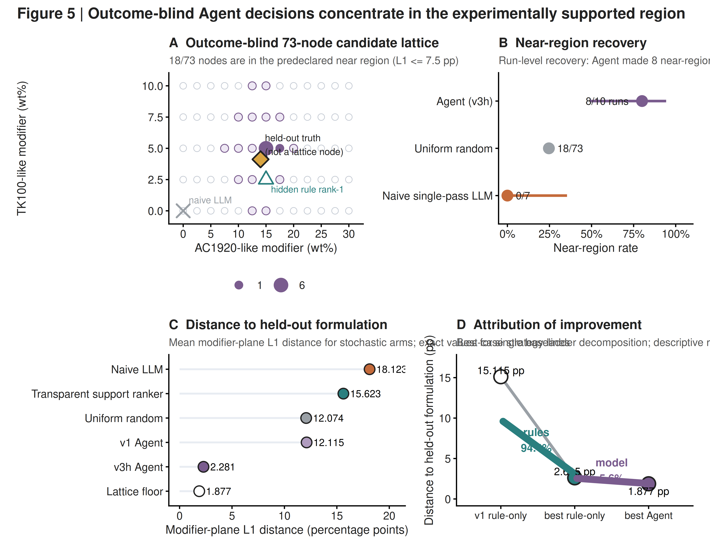

# State-Conditioned Rheology Enables Experiment Selection in Reactive Polyurethane Hot-Melt Adhesives

**Junbo Tong¹, Jianming Zhao²\***

¹ Department of Chemistry, Faculty of Science, National University of Singapore, 3 Science Drive 3, Singapore 117543, Singapore  
² Ningbo Yinjun Technology, Ningbo, Zhejiang, China  

\*Corresponding author: Jianming Zhao

## Abstract

Reactive polyurethane hot-melt adhesives (PURs) are commonly formulated from nominal composition and processing temperature, although practical melt rheology also reflects the state realized during preparation and thermal residence. Here, six chemistry-audited realizations (36 temperature–viscosity measurements) from a local PPG2000/STEPANPOL PDP-70/4,4′-MDI family reveal a low-dimensional, experimentally calibratable state dependence. Nominally identical E2 realizations differed by 2.80–3.57-fold across 80–130 °C, yet a realization-specific viscosity scale combined with a shared quadratic inverse-temperature response explained 99.77% of log-viscosity variation versus 85.53% for a formulation-only model using the same thermal-response form, reducing held-temperature multiplicative error from 1.423× to 1.058×. In leave-one-formulation-out tests, one 110 °C anchor predicted 120–130 °C viscosity with a pooled multiplicative RMSE of 1.088×. At 120 °C, the apparent log-viscosity drift differed 4.29-fold between two original formulations, while a resin-modified validation formulation reduced mean absolute 15–60 min drift to 1.60% versus 9.51% for the best original local reference. These physical coordinates were combined with curated PUR evidence in a retrospective outcome-blind Agent reconstruction. The held-out formulation was absent from the 73-node candidate lattice; 8 of 10 runs committed to a candidate and all 8 committed decisions fell within the predeclared near region. A strategy-ladder decomposition assigned approximately 94% of the best-case distance reduction to deterministic scientific policy, with the language model operating inside the evidence-bounded decision space. The resulting framework separates viscosity level, thermal response and thermal-hold trajectory, using AI to select bounded experiments rather than replace physical characterization.

**Keywords:** reactive polyurethane hot-melt adhesive; rheology; process state; viscosity stability; state-aware modeling; formulation design; scientific Agent

---

---

## 1. Introduction

Reactive polyurethane hot-melt adhesives combine melt processing with subsequent chemical curing, so the rheology experienced during application is inseparable from the material history that precedes it. During melting, pumping, coating or dispensing, the adhesive must remain sufficiently fluid for processing while preserving the reactivity required for later cure and bond development [@Cui2002CrystallineStructure; @Cui2003CureKinetics; @OrgilesCalpena2016CO2HMPUR; @Blasco2022VegetablePolyols; @MoyanoVallejo2024GreenStrength]. A useful processing window is therefore defined not by a single viscosity value, but by how viscosity responds to both temperature and time at temperature.

Polyurethane-prepolymer viscosity depends on soft-segment chemistry, molecular weight, stoichiometry, temperature and reaction progress [@Sebenik2007SoftSegment; @ParutaTuarez2014SystemicRheology; @Ruan2019BioPolyols; @Liu2020PPCPUR; @Pugar2025PURViscosityML]. Reaction temperature can alter molecular-weight distributions and side reactions, while reactive-blend miscibility can evolve as conversion proceeds [@Heintz2003ReactionTemperature; @Duffy2005ReactiveBlendMiscibility]. In formulation datasets, however, nominal composition is usually recorded more completely than reaction history, thermal residence, sample age, moisture exposure or mixing trajectory. Separate preparations of the same recipe may therefore be assigned one composition label even when they occupy different rheological states.

This distinction matters because repeated preparations can differ in two fundamentally different ways. Their viscosity-temperature curves may change shape, implying a change in thermal response, or they may remain nearly parallel while shifting in viscosity level, implying a lower-dimensional realization effect. The latter case is experimentally useful: instead of treating preparation-to-preparation variation only as noise, the displacement can be represented as a state coordinate and calibrated directly. Recent work on polyurethane prepolymers has shown that temperature-dependent viscosity can be captured with physically interpretable curve representations and chemistry-aware machine-learning models, while also emphasizing that extrapolation is strongest within represented chemical domains [@Pugar2025PURViscosityML]. What remains unresolved is whether a narrow reactive-PUR family contains a transferable local thermal shape once realization state is separated from nominal formulation.

A second challenge is that temperature response does not determine stability during thermal residence. A formulation may exhibit an acceptable instantaneous viscosity and still undergo substantial viscosity growth while held at processing temperature. Previous HMPUR studies show that changes in soft-segment chemistry and polymeric modifiers can alter melt viscosity, viscoelastic response, open time, green strength and thermal performance by different amounts [@Jung2008AcrylicModification; @Sun2016PEDA; @Sun2022PolycarbonatePolyester; @Sun2022PolycarbonateSebacicPUR; @MoyanoVallejo2024GreenStrength]. This suggests that temperature sensitivity and thermal-hold stability should be treated as distinct, differently tunable rheological coordinates rather than collapsed into one scalar target.

The sparse-data regime also changes the appropriate role of artificial intelligence. Five local formulations are sufficient to expose strong physical structure, but not to support a credible black-box predictor for untested modifier chemistry. In this setting, the useful computational task is experiment selection under explicit evidence and uncertainty. Self-driving laboratories and tool-grounded chemistry agents have shown how computation, literature knowledge and algorithmic decision-making can be combined to guide experiments [@Hase2019SelfDrivingLabs; @Roch2018ChemOS; @Burger2020MobileRoboticChemist; @MacLeod2020SelfDrivingLab; @Kusne2020ClosedLoopMaterials; @Stach2021AutonomousExperimentation; @Szymanski2023AutonomousLab; @Boiko2023Coscientist; @Bran2024ChemCrow]. For formulation science, however, the decision layer should remain downstream of experimentally established material structure.

Here we develop a discovery-to-decision framework for a local reactive-PUR chemistry family. We first show that large preparation-to-preparation viscosity differences are dominated by a realization-specific scale superimposed on a shared local thermal response. We then test whether one viscosity measurement is sufficient to calibrate an unseen realization, including a stricter formulation-and-temperature holdout. Thermal-hold measurements identify a separate temporal coordinate that varies much more strongly across the measured formulation contrast, and a resin-modified follow-up formulation substantially suppresses this drift. Finally, we combine the experimentally derived rheological representation with curated external PUR evidence in a retrospective outcome-blind scientific Agent reconstruction. The objective is not to predict an unsupported optimum, but to determine whether physical structure and traceable evidence can constrain the next formulation experiment to a scientifically useful region.

---

---

## 2. Results and Discussion

### 2.1 Repeated preparations shift viscosity level within the same nominal formulation

The local design comprised five PUR formulations based on PPG2000, STEPANPOL PDP-70 and 4,4'-MDI. E1–E3 used a 50/50 PPG2000/PDP-70 polyol ratio while varying the reported NCO:OH ratio from 1.70 to 1.90. E4 and E5 retained NCO:OH = 1.80 and changed the PPG2000/PDP-70 ratio to 60/40 and 40/60, respectively. Complete 80–130 °C temperature sweeps were available for E1–E3 across multiple experimental realizations.

Nominal formulation identity did not uniquely determine absolute viscosity. Three E2 realizations gave viscosity values of 9462, 18780 and 27350 at 80 °C, and 1955, 4017 and 6977 at 120 °C. The corresponding maximum-to-minimum ratios were 2.89× and 3.57×, with the spread remaining approximately 2.80–3.57× across the full measured temperature range.

The persistence of this separation across temperature is inconsistent with an isolated measurement outlier. Instead, the E2 curves are displaced systematically in viscosity level. Nominal composition therefore identifies the chemical recipe but does not fully identify the rheological state realized in a particular preparation.

### 2.2 A latent viscosity-scale coordinate captures most realization variability

We next tested whether the realization dependence reflected arbitrary curve changes or a lower-dimensional displacement. To compare formulation-only and state-conditioned descriptions on the same thermal basis, temperature was represented by the centered inverse-temperature coordinate

$$
z(T)=10^3\left(\frac{1}{T}-\frac{1}{T_{\mathrm{ref}}}\right),
\qquad
T_{\mathrm{ref}}=393.15~\mathrm{K},
$$

with $T$ expressed in kelvin. The formulation-only model used a formulation-specific intercept and a shared quadratic thermal response,

$$
\ln \eta_{fr}(T)
=
\mu_f
+
\beta_1 z(T)
+
\beta_2 z(T)^2
+
\varepsilon_{frT},
$$

whereas the state-conditioned model replaced the formulation intercept with a realization-specific viscosity-scale intercept,

$$
\ln \eta_{fr}(T)
=
a_{fr}
+
\beta_1 z(T)
+
\beta_2 z(T)^2
+
\varepsilon_{frT}.
$$

Here $f$ denotes nominal formulation and $r$ a measured realization within that formulation. The fitted $a_{fr}$ locates the realized viscosity level directly; conceptually it contains both the formulation baseline and the realization-specific displacement, $a_{fr}=\mu_f+\delta_{fr}$.

After chemistry-aware curation, the primary dataset contained six complete realizations of E1–E3 measured at six temperatures per realization (80, 90, 100, 110, 120 and 130 °C), giving 36 temperature–viscosity observations in total. One E1 curve carrying phosphoric-acid context was excluded from the primary model because the additive condition was not encoded in the compact formulation definition and was retained only for sensitivity analysis.

With the same quadratic inverse-temperature response in both models, the formulation-only representation explained 85.53% of the variation in log viscosity, whereas the state-conditioned representation explained 99.77%. The same advantage was observed in prediction: leave-one-temperature-out multiplicative error decreased from 1.423× to 1.058×. The state effect was not created by the quadratic term: with a linear thermal response in both models, $R^2$ increased from 0.8519 to 0.9943.

A model-free singular-value decomposition gave the same geometric result. After centering the log-viscosity matrix by temperature, the first between-realization mode explained 99.63% of the variance. Its loading vector had a cosine similarity of 0.9998 to a constant vector, showing that the dominant mode is almost indistinguishable from a uniform vertical displacement in log-viscosity space.

Together, the regression and decomposition results establish a simple local representation: realizations share a similar thermal-response shape but occupy different viscosity levels. We therefore treat the fitted intercept $a_{fr}$ as a realized viscosity-scale coordinate: it places each measured preparation on the shared thermal-response shape while leaving the underlying contribution of reaction time, moisture, mixing history, sample age and related preparation variables unresolved.

**Figure 2. Realization-dependent viscosity variation is dominated by a calibratable state shift.** (A) Temperature-dependent viscosity of four E2 realizations, showing persistent preparation-to-preparation offsets across 80–130 °C. (B) Removal of the realization-specific viscosity-scale intercept $a_{fr}$ collapses the E2 curves onto the shared thermal response. (C) The first between-realization singular mode explains 99.63% of the variance and has a cosine similarity of 0.9998 to an ideal constant vertical shift. (D) Using the same quadratic inverse-temperature response in both models, state conditioning increases fitted $R^2$ from 85.53% to 99.77% and reduces leave-one-temperature-out multiplicative error from 1.423× to 1.058×.

### 2.3 One viscosity anchor calibrates an unseen local realization

A useful state coordinate should reduce characterization burden. We therefore asked whether a shared thermal-response shape learned from other nominal formulations could be transferred to an unseen formulation using only one viscosity measurement.

In leave-one-formulation-out analysis, all realizations of one formulation were removed before fitting the shared response $g(T)=\beta_1z(T)+\beta_2z(T)^2$. For each held realization, a single viscosity value at anchor temperature $T_0$ was then used to estimate

$$
\hat a_{fr}=\ln \eta_{fr}(T_0)-\hat g(T_0),
$$

after which the remaining temperatures were reconstructed from $\widehat{\ln\eta}_{fr}(T)=\hat a_{fr}+\hat g(T)$.

Using 120 °C as the anchor, multiplicative reconstruction errors were approximately 1.028× for held E1, 1.119× for held E2 and 1.049× for held E3. The pooled error was 1.099×, and pooled performance across the available anchor temperatures remained approximately 1.06–1.10×.

We then withheld both the target formulation and the high-temperature prediction region. The shared response was fitted only to the other formulations at temperatures up to 110 °C; one 110 °C measurement located each unseen realization, and the model predicted 120 and 130 °C. Across 12 held predictions from six realizations, pooled multiplicative RMSE was 1.088×, with errors of 1.087× at 120 °C and 1.089× at 130 °C. Median absolute percentage error was 5.68%, and a 10,000-replicate realization-level cluster bootstrap gave a 95% interval of 1.043–1.126× for the pooled multiplicative RMSE.

This test is deliberately local. The extrapolation spans only 10–20 °C beyond the fitting range and remains inside the audited E1–E3 chemistry neighborhood. Within that boundary, however, the result establishes an experimentally useful separation between learning a family-level thermal response and locating the state of a new preparation. Once the local shape has been established, one viscosity measurement can provide the state calibration needed to reconstruct the remaining temperature response.

### 2.4 Thermal response and thermal-hold stability form distinct design coordinates

State calibration does not capture viscosity evolution at fixed temperature. To compare these two responses, we first summarized the local temperature dependence by regressing $\ln \eta$ against $1/T$. The apparent temperature-response descriptor $E_\eta$ had a mean of approximately 42.05 kJ mol$^{-1}$, a standard deviation of 2.43 kJ mol$^{-1}$ and a coefficient of variation of 5.77% across the chemistry-audited sweeps. This quantity is used only as a rheological descriptor and is not interpreted as a chemical reaction activation energy.

The 120 °C thermal-hold response varied much more strongly across the measured formulation contrast. E1 increased from 708.7 at 15 min to 776.1 at 60 min and 828.1 at 90 min, whereas E5 increased from 2210 to 3349 and 4267 over the same times. The directly observed 15–60 min viscosity increases were 9.51% for E1 and 51.54% for E5. A descriptive model,

$$
\ln \eta(t)=\ln \eta_0+k_{\mathrm{drift}}t,
$$

gave $k_{\mathrm{drift}}\approx0.125~\mathrm{h}^{-1}$ for E1 and $0.537~\mathrm{h}^{-1}$ for E5, a 4.29-fold difference.

The E1–E5 contrast is interpreted at the formulation level because composition and stoichiometry change together. Temperature-sweep and thermal-hold measurements are therefore used as complementary rheological coordinates rather than as a matched covariance design. Across the measured design, temporal viscosity evolution spans a much wider contrast than the local temperature-response descriptor. The measured rheological state is therefore usefully represented by three coordinates,

$$
\mathbf{R}_{\mathrm{rheo}}=
\{\eta_{\mathrm{ref}},S_T,S_t\},
$$

where $\eta_{\mathrm{ref}}$ locates the realized viscosity level, $S_T$ describes local temperature response and $S_t$ describes the isothermal time trajectory. These coordinates are not claimed to be universally independent or orthogonal; they are experimentally distinguishable and differently sensitive within the present formulation space.

### 2.5 External evidence bounds the local model and defines new intervention directions

The state-conditioned thermal response defines a family-level relation within the validated local chemistry domain. The external evidence base contains 39 dense polyurethane-prepolymer temperature-viscosity curves comprising 4559 measurements. Reanalysis gave a median $R^2$ of approximately 0.9967 for $\ln \eta$ versus $1/T$, with 37 of 39 curves at $R^2\geq0.98$, but the corresponding apparent temperature-response descriptors span approximately 34.7–94.2 kJ mol$^{-1}$. The local value near 42 kJ mol$^{-1}$ therefore lies inside a much broader chemistry-dependent range [@Pugar2025PURViscosityML].

The same evidence base provides chemical directions beyond the original E1–E5 design. Because the original design does not include a resin-modification axis, external PUR evidence supplies intervention priors for acrylic-like resins, tackifier-like components and related modifiers. Published PUR studies show that acrylic, organoclay-containing and related polymeric modifiers can alter melt viscosity, viscoelastic response, set behavior, green strength and adhesive performance [@Jeong2007Organoclay; @Jung2008AcrylicModification; @Kim2008AcrylicCopolymerMMT; @Cho2009AcrylicNanocomposite; @Kim2009MolecularWeightOrganoclay; @Ruan2021PolyacrylatePURHMA]. Broader studies further show that modifier loading and soft-segment chemistry redistribute trade-offs among rheology, open time, mechanical response, hydrolytic resistance and thermal behavior [@Ruan2019BioPolyols; @Liu2020PPCPUR; @OrgilesCalpena2016CO2HMPUR; @Blasco2022VegetablePolyols; @Sun2016PEDA; @Sun2022PolycarbonatePolyester; @Sun2022PolycarbonateSebacicPUR; @MoyanoVallejo2024GreenStrength; @Xiao2025HighTemperaturePUR; @Fang2026FDCAPURHMA].

These external records are used as formulation priors rather than as direct predictors of local performance. Modifier fractions are treated quantitatively only when their denominator basis is sufficiently clear; ambiguous records remain directional evidence. This separation preserves the role of the local experiment as the source of the physical diagnosis while using external chemistry to bound plausible intervention families.

### 2.6 Sparse rheology is better posed as an experiment-selection problem than as black-box property prediction

The local dataset contains five nominal formulations, six chemistry-audited complete temperature realizations and two original thermal-hold trajectories. This evidence resolves the state structure and an actionable failure mode; for new modifier chemistry, the computational task is therefore posed as experiment selection rather than composition-to-drift regression.

We therefore formulated the next step as an experiment-selection problem rather than as direct numerical optimization of an unsupported surrogate. This distinction is consistent with broader work on extracting value from sparse and failed experiments and on allocating experiments efficiently under uncertainty [@Raccuglia2016FailedExperiments; @Shields2021BayesianReactionOptimization].

The scientific Agent operates downstream of the material analysis. Deterministic tools expose the formulation-only versus state-conditioned comparison, the singular-value result, one-point calibration, the apparent temperature-response descriptor, the E1/E5 thermal-hold contrast, formulation composition, process uncertainty and external analogue evidence. The decision sequence is Planner → Evidence/Tool Layer → Proposer → Skeptic → Robustness Adjudicator → Judge → Freeze. The stages separate problem definition, evidence retrieval, candidate proposal, criticism, uncertainty analysis and final commitment; abstention remains available when the evidence is insufficient.

The purpose of this architecture is not to claim that each software stage is intrinsically necessary. It is to make the transition from material evidence to an experimental decision inspectable, while keeping language-model judgment downstream of explicit scientific constraints.

### 2.7 Retrospective outcome-blind reconstruction tests recoverability of the experimental region

The original contemporaneous machine-readable recommendation artifact was not retained. The present Agent framework was therefore formalized retrospectively and is not presented as a historical replay or as evidence that the current ranking existed before the wet-lab validation. Instead, we test a narrower question: can the later validated formulation region be recovered when the Agent runtime is restricted to evidence that does not include the validation formulation or outcome?

The benchmark uses a 73-node formulation lattice. The held-out validation composition is not a node, so exact recovery is impossible by construction; the nearest lattice point lies 1.877 percentage points away in the modifier plane. A structural firewall removes the validation formulation identity, follow-up thermal-hold measurements, post-result statistics and adjudication labels from runtime payloads, and direct action requests targeting the blinded formulation are blocked. Benchmark decisions are frozen and hashed before the held-out truth is loaded for scoring. This design evaluates an outcome-blind runtime reconstruction, not contemporaneous preregistration of the later-developed method.

In the frozen evaluation series, 10 runs were attempted. The Agent committed to a candidate in 8 runs and abstained in 2. All 8 committed decisions fell within the near region specified before unblinding within that series. Their mean modifier-plane $L_1$ distance to the held-out formulation was 2.281 percentage points and the median was 1.877 percentage points, equal to the lattice construction floor.

The near-region result is non-trivial relative to the candidate space. Eighteen of 73 nodes, or 24.66%, lie inside the near region, whereas 48 of 73 merely contain non-zero values on both modifier axes. Uniform random selection therefore has a 24.66% near-region probability and a mean modifier-plane $L_1$ distance of 12.074 percentage points. A naive single-pass LLM baseline produced 0/7 near-region selections and repeatedly returned to a reactive-core-only candidate.

Attribution analysis separated the deterministic scientific policy from the language-model decision. The rule layer moved the best rule-based candidate from 15.115 to 2.615 percentage points from the held-out formulation; along the reported strategy ladder, this corresponds to approximately 94% of the observed best-case distance reduction before the final model-level selection step. During the frozen evaluation, the precomputed rank ordering was withheld from the language model; 7 of 8 committed decisions nevertheless departed from the hidden deterministic rank-1 while remaining inside the evidence-supported region. The result therefore does not support a claim that an unconstrained LLM discovered the experimental recipe. Rather, explicit scientific structure defines most of the useful decision geometry, and the Agent performs evidence integration and final selection inside that bounded space.

### 2.8 Resin modification suppresses thermal-hold viscosity drift

After the outcome-blind decision series was closed, the completed wet-lab validation was used for physical adjudication. The validation formulation contained PPG2000, PDP-70, AC1920, TK100 and MDI at source-reported parts of 39.60, 39.60, 17.00, 5.00 and 20.19, respectively.

Two 120 °C thermal-hold repeat runs were measured from 15 to 60 min. Repeat 1 changed from 1230 at 15 min to 1228 at 60 min, corresponding to a drift of -0.16%. Repeat 2 changed from 1281 to 1320, corresponding to +3.04%. Across the two repeats, the mean absolute 15–60 min viscosity drift was 1.60%, while the replicate-mean trajectory showed a net change of +1.47%.

The original local references were substantially less stable over the same interval. E1 increased by 9.51% and E5 by 51.54% from 15 to 60 min. Relative to E1, the best original local reference, the mean absolute drift of the resin-modified validation formulation was reduced by approximately 83%. The experiment therefore validates a low-drift formulation region rather than merely reproducing a static viscosity target.

The validation formulation establishes rheological stabilization through a formulation-level mechanism consistent with dilution of the original reactive polyol-rich fraction by resin-like components. This lowers the effective concentration of reaction-capable material during thermal holding and suppresses time-dependent viscosity growth. The present evidence establishes this formulation-level mechanism, while molecularly resolved reaction pathways can be treated separately from the rheological mechanism examined here.

**Figure 4. Temperature response is locally concentrated while thermal-hold trajectory is formulation-sensitive.** (A) Apparent temperature-response descriptor $E_\eta$ across six chemistry-audited realizations (mean 42.05 ± 2.43 kJ mol⁻¹; CV 5.77%). (B) Normalized 120 °C thermal-hold trajectories for E1, E5 and two resin-modified validation repeats. (C) Matched 15–60 min viscosity changes show 9.51% drift for E1, 51.54% for E5 and a mean absolute drift of 1.60% across the two validation repeats. (D) Native descriptors are shown side-by-side to emphasize the contrast between concentrated temperature response and the 4.29-fold E5/E1 drift-rate difference; no common effect-size scale is implied.

**Figure 5. Outcome-blind Agent decisions concentrate in the experimentally supported region.** (A) Seventy-three-node modifier lattice with the predeclared near region, held-out validation formulation, Agent-selected nodes, naive-LLM baseline and hidden deterministic rank-1 reference. The held-out formulation is not a lattice node. (B) Near-region recovery across the frozen 10-run Agent series, the exact random-lattice baseline and the naive single-pass LLM baseline. (C) Modifier-plane $L_1$ distance to the held-out formulation for the reported baselines and Agent variants; the lattice floor is 1.877 percentage points. (D) Strategy-ladder decomposition of the best-case distance reduction, assigning approximately 94.4% to deterministic scientific policy before the final model-level selection step.

### 2.9 State calibration and trajectory assessment define a practical formulation workflow

The combined results suggest a formulation strategy that separates where a sample is in rheological space from how that state evolves. Within the present chemistry family, the realized viscosity-scale intercept $a_{fr}$ behaves as a calibratable state coordinate rather than unstructured nuisance variance. Once the shared local thermal response has been established, one viscosity anchor can locate a new realization without repeating a complete temperature sweep.

Thermal-hold measurements remain necessary because state calibration and trajectory assessment answer different questions. A sample can be positioned accurately on the local temperature-response surface and still exhibit unacceptable viscosity growth during residence at processing temperature. Reactive-PUR formulation should therefore consider both the instantaneous state and the path followed by that state during processing.

This separation also defines a bounded role for AI. Experimentally derived coordinates determine what should be measured, external PUR evidence defines plausible intervention families, deterministic rules define admissible decision geometry, and the language model integrates evidence and commits to an experiment within that space. The workflow is therefore better described as evidence-grounded experimental decision-making than as black-box formulation prediction.

For formulation development within the validated chemistry domain, one-point calibration can reduce repeated full-curve characterization after a shared response has been established, while explicit thermal-hold measurements concentrate experimental effort on the dynamic coordinate that static viscosity does not capture. The Agent adds an auditable mechanism for choosing which evidence-supported formulation region to test next and for abstaining when the available evidence is insufficient.

---

---

## 3. Materials and Methods

### 3.1 Local formulation design

The original formulation space contained five reactive PUR compositions based on PPG2000, STEPANPOL PDP-70 and 4,4'-MDI. E1–E3 used a 50/50 PPG2000/PDP-70 polyol ratio with reported NCO:OH values of 1.70, 1.80 and 1.90. E4 and E5 retained NCO:OH = 1.80 while using PPG2000/PDP-70 ratios of 60/40 and 40/60. Formulation records are stored in the versioned repository data tables.

The validation formulation contained PPG2000, PDP-70, AC1920, TK100 and MDI on a source-reported parts basis. Because the source record did not provide a verified NCO:OH value for this formulation, no stoichiometric ratio was reconstructed.

### 3.2 Temperature-sweep data and chemistry audit

Temperature-sweep viscosity was recorded from 80 to 130 °C in 10 °C increments.

Run identifiers were retained for provenance. Project metadata confirms that GJJ, ZYX and CHH are realization labels associated with the same operator rather than different operator identities. Here, a realization denotes a complete measured temperature–viscosity curve/run; day-1 retests are retained as separately observed rheological states but are not assumed to be independent synthesis batches because their parent-sample relationships are not established in the compact source record.

One E1 temperature curve was labelled with phosphoric-acid context. Because the additive condition was not represented in the compact formulation table and its exact amount was not encoded, this curve was excluded from the chemistry-audited primary state analysis and retained for sensitivity analysis. The primary temperature-sweep dataset therefore contained 36 observations from six complete realizations of three nominal formulations.

### 3.3 State-conditioned temperature-response models

Viscosity was log-transformed before model fitting. Temperature was encoded as

$$
z(T)=10^3\left(\frac{1}{T}-\frac{1}{T_{\mathrm{ref}}}\right),
\qquad
T_{\mathrm{ref}}=393.15~\mathrm{K},
$$

where $T$ is absolute temperature. The factor $10^3$ is a numerical scaling convention and does not change the fitted thermal shape.

For the primary same-order comparison, the formulation-only model was

$$
\ln \eta_{fr}(T)
=
\mu_f
+
\beta_1 z(T)
+
\beta_2 z(T)^2
+
\varepsilon_{frT},
$$

and the state-conditioned model was

$$
\ln \eta_{fr}(T)
=
a_{fr}
+
\beta_1 z(T)
+
\beta_2 z(T)^2
+
\varepsilon_{frT}.
$$

The state-conditioned model estimates one intercept $a_{fr}$ for each measured realization. This intercept is the directly fitted realized viscosity-scale coordinate; conceptually, $a_{fr}=\mu_f+\delta_{fr}$ separates the nominal formulation baseline $\mu_f$ from a realization-specific displacement $\delta_{fr}$ without requiring the two contributions to be estimated separately.

Prediction error was evaluated in log-viscosity space,

$$
\mathrm{RMSE}_{\log}
=
\sqrt{
\frac{1}{N}
\sum_{i=1}^{N}
\left(\ln\hat\eta_i-\ln\eta_i\right)^2
},
$$

and reported as a multiplicative error factor,

$$
\mathrm{RMSE}_{\times}
=
\exp\left(\mathrm{RMSE}_{\log}\right).
$$

Held-temperature validation removed all observations at one temperature, fitted the model on the remaining temperatures and predicted the held temperature. The headline formulation-only and state-conditioned comparison used the same quadratic thermal-response basis in both models.

### 3.4 Model-free dimensionality analysis

For the six chemistry-audited complete curves, a matrix of log viscosity was assembled with realizations as rows and temperatures as columns. Each temperature column was centered across realizations before singular-value decomposition.

The fraction of between-realization variance explained by the first singular mode was calculated from the corresponding singular value. To test whether this mode represented a uniform log-viscosity displacement, its loading vector was compared with a constant vector using cosine similarity.

### 3.5 One-point state calibration

Transfer across nominal formulations was evaluated by leave-one-formulation-out analysis. For each fold, all realizations of one formulation were excluded from fitting the shared thermal shape. The remaining formulations were used to estimate $g(T)$. One viscosity value from each held realization at anchor temperature $T_0$ was then used to estimate

$$
\hat a_{fr}=\ln \eta_{fr}(T_0)-\hat g(T_0).
$$

For the quadratic shared response used here,

$$
\widehat{\ln\eta}_{fr}(T)
=
\ln\eta_{fr}(T_0)
+
\hat\beta_1\left[z(T)-z(T_0)\right]
+
\hat\beta_2\left[z(T)^2-z(T_0)^2\right].
$$

The remaining temperatures were reconstructed from this calibrated response and performance was summarized in multiplicative-error space.

A stricter formulation-and-temperature holdout removed one formulation entirely and fitted the shared thermal response only on the other formulations at temperatures $\leq110~^\circ\mathrm{C}$. A single 110 °C anchor was provided for each unseen realization, and predictions were generated at 120 and 130 °C. Pooled log-RMSE, multiplicative RMSE, absolute percentage error and a 10,000-replicate realization-level cluster bootstrap were calculated.

### 3.6 Thermal-hold measurements

Original E1 and E5 samples were held at 120 °C and measured at 15, 30, 60 and 90 min. The validation formulation was measured in two repeat runs at 15, 30, 45 and 60 min.

The primary matched stability comparison used the common 15–60 min interval,

$$
SI_{15\rightarrow60}
=
\frac{\eta_{60}-\eta_{15}}{\eta_{15}}.
$$

No 90 min validation value was extrapolated or imputed. For E1 and E5, an apparent logarithmic drift descriptor was estimated from

$$
k_{\mathrm{drift}}=\frac{d\ln\eta}{dt}.
$$

This value is an operational rheological descriptor and is not interpreted as a chemical kinetic rate constant.

### 3.7 Apparent temperature-response descriptor

For each chemistry-audited complete realization, $\ln \eta$ was regressed against $1/T$ with $T$ in kelvin. The apparent temperature-response descriptor was calculated as

$$
E_\eta
=
R\frac{\mathrm{d}\ln\eta}{\mathrm{d}(1/T)},
$$

using $R=8.314462618~\mathrm{J\,mol^{-1}\,K^{-1}}$. $E_\eta$ is reported only as a descriptor of the local temperature-viscosity response and is not interpreted as a chemical reaction activation energy.

### 3.8 External PUR evidence base

The external evidence layer contains literature, patent, material, formulation, measurement and dense viscosity-curve records with explicit provenance. The dense prepolymer set comprises 39 temperature-viscosity curves and 4559 individual measurements.

External formulation records containing acrylic-like or tackifier-like components were used to define chemically plausible candidate regions. Numeric modifier fractions were treated as anchors only when the denominator basis was sufficiently clear. Records with unresolved fraction definitions were retained as directional evidence. External records were not used as direct predictors of local validation performance.

### 3.9 Scientific Agent

The scientific Agent operates downstream of the physical analysis. Its canonical decision sequence is Planner → Evidence/Tool Layer → Proposer → Skeptic → Robustness Adjudicator → Judge → Freeze.

The Evidence/Tool Layer exposes deterministic summaries of the local state-conditioned rheology, one-point calibration, thermal-response descriptor, thermal-hold contrast, candidate evidence, formulation composition, process uncertainty and external analogue support. The Proposer identifies scientifically useful candidates. The Skeptic checks for evidence misuse, unsupported mechanism claims, process-state ambiguity and leakage. The Robustness Adjudicator tests whether the proposal remains useful under plausible uncertainty and alternative evidence priorities. The Judge commits to a performance candidate, robustness probe, uncertainty probe or abstention.

Freeze is programmatic. Each frozen record stores candidate identity, rationale, uncertainty decomposition, acceptance criterion, timestamps, model identifiers and cryptographic hashes of relevant inputs and prompts.

### 3.10 Retrospective outcome-blind decision reconstruction

The current Agent framework was formalized retrospectively because the original contemporaneous machine-readable recommendation artifact was not retained. The benchmark therefore does not claim that the present software, candidate ranking or decision policy existed before the wet-lab validation. It tests whether the later validated formulation region is recoverable when the runtime is denied access to the validation formulation and outcome.

The scored runtime profile removes the held-out validation formulation, follow-up measurements, derived post-result statistics and adjudication labels before model payloads are assembled. Action calls targeting the blinded formulation are blocked by the evidence firewall.

The candidate space contains 73 nodes. The held-out validation composition is not a candidate node. Eighteen of 73 candidates lie within the near region used for post-unblinding adjudication. Within each frozen benchmark series, the near-region definition and all decision artifacts are fixed before the held-out truth is loaded for scoring.

Recommendations are frozen and hashed, a blind-phase closure record is written, and the adjudicator verifies the frozen recommendation hash before scoring. The reported frozen evaluation series contained 10 attempted runs under an identical runtime evidence contract.

The naive single-pass LLM baseline used the same pre-result evidence payload but not the full structured decision workflow. Uniform random selection over the same 73-node lattice provided an exact search-space baseline.

### 3.11 Statistical scope

Statistical inference is defined at the level of the five-formulation local design and six chemistry-audited complete realizations. The primary conclusions are supported by convergent evidence: chemistry-aware curation, held-temperature prediction, model-free dimensionality analysis, leave-one-formulation calibration, bounded formulation-and-temperature holdout and matched-window thermal-hold measurements.

Claims about the shared thermal-response shape are stated for the local formulation family, while broader chemistry dependence is evaluated against the external evidence base.

---

---

## 4. Conclusions

Reactive-PUR rheology within the studied local chemistry family is not uniquely specified by nominal formulation. Nominally identical preparations differed by up to approximately threefold in absolute viscosity, but the disagreement was highly structured: a realization-specific viscosity-scale coordinate superimposed on a shared local thermal response explained 99.77% of the log-viscosity variation, and model-free decomposition assigned 99.63% of between-realization variance to a near-uniform vertical shift.

This low-dimensional structure enables one-point rheological state calibration. After withholding an entire nominal formulation, one viscosity anchor reconstructed the remaining local temperature response with approximately 1.06–1.10× pooled multiplicative error. In the stricter formulation-and-temperature holdout, a single 110 °C anchor predicted 120–130 °C viscosity with a pooled multiplicative RMSE of 1.088×. The result supports reduced repeat characterization within a validated chemistry neighborhood; broader chemistry families require their own shared-response calibration.

Thermal holding revealed a second design problem that static temperature response cannot resolve. The apparent 120 °C log-viscosity drift differed 4.29-fold between two original formulations, and the resin-modified validation formulation reduced the mean absolute 15–60 min drift to 1.60%, compared with 9.51% for the best original local reference. Reactive-PUR formulation should therefore distinguish realized viscosity level, local thermal response and time-dependent thermal-hold trajectory.

The physical representation also defines an appropriate role for AI under sparse data. The present Agent is not a black-box property predictor and the retrospective reconstruction is not presented as a contemporaneous pre-experimental ranking. Instead, local experiments establish the failure mode and rheological coordinates, external evidence defines chemically plausible intervention regions, deterministic policy constrains the admissible decision space, and the language model integrates evidence and selects within that space. In the frozen outcome-blind runtime series, all 8 committed decisions fell within the predeclared near region even though the true validation composition was absent from the candidate lattice. Along the reported strategy ladder, approximately 94% of the observed best-case distance reduction occurred at the deterministic-policy stage before final model-level selection, making explicit scientific structure the dominant source of the useful decision geometry.

The resulting workflow links state calibration, trajectory-aware formulation design and evidence-grounded experiment selection. Its broader implication is methodological: when data are sparse, explicit physical structure and provenance should define the geometry of the scientific decision, while AI should be used to navigate that geometry rather than to substitute for it.

---

---

## 5. Competing Interests

The authors declare no competing interests.

---

## 6. Data and Code Availability

Versioned local formulation tables, chemistry-audited temperature-sweep data, thermal-hold records, statistical analysis scripts, blindness-audit code, candidate-space generation, and scientific-Agent workflows are available in the public project repository at https://github.com/stloendays/PUR-NEW. The manuscript analyses should be associated with a frozen release or archived commit at submission. External data with separate licensing or provenance constraints should be redistributed only in accordance with their source terms.

---

## Author notes for the next revision

- **Main Figure 1:** conceptual state model and discovery-to-decision workflow: nominal chemistry → realized state → (eta_{mathrm{ref}},S_T,S_t) → external evidence → Agent decision → physical adjudication.
- **Main Figure 2:** E2 same-recipe realization spread; curve collapse after subtracting the realization-specific scale intercept (a_fr); SVD mode; formulation-only versus state-conditioned held-temperature error.
- **Main Figure 3:** leave-one-formulation one-point calibration and the strict 110 °C anchor → 120/130 °C prediction test.
- **Main Figure 4:** local apparent (E_eta), E1/E5 thermal-hold trajectories, then validation repeats and matched 15–60 min drift.
- **Main Figure 5:** 73-node target-blind candidate plane, near region, Agent/direct-LLM/random comparison, and deterministic-rule versus model contribution.
- Keep the old 928-candidate PUR-FRONTIER/PUR-RECOVER material outside the main Results of this paper. Only its transferable design ideas—independent rheological coordinates, robustness/abstention, and explicit scientific ontology/tools—should inform the present narrative.
