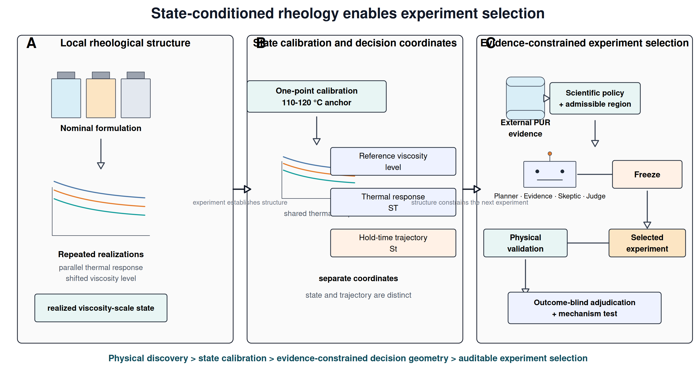
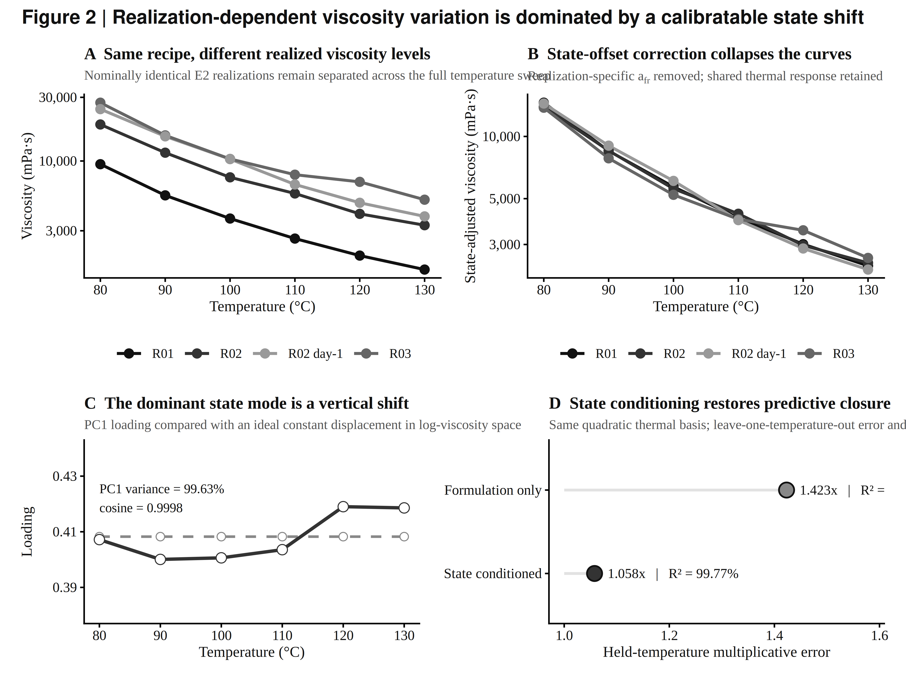
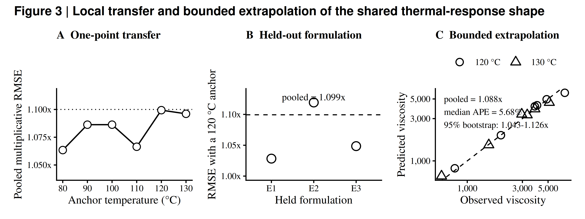
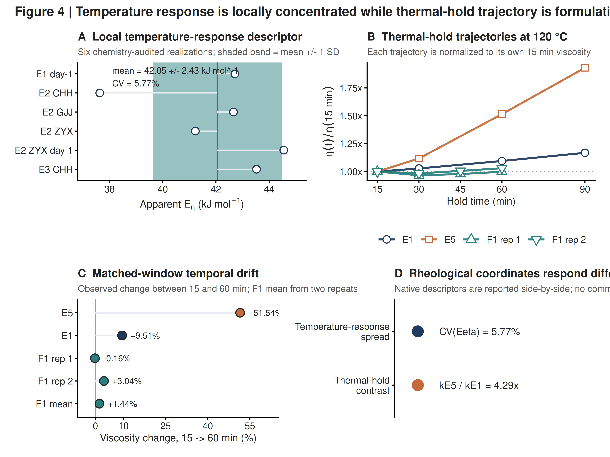

# State-Conditioned Rheology and Explicit Decision Rules Guide Reactive Polyurethane Formulation Experiments

**Junbo Tong¹, Jianming Zhao²\***

¹ Department of Chemistry, Faculty of Science, National University of Singapore, 3 Science Drive 3, Singapore 117543, Singapore  
² Ningbo Yinjun Technology, Ningbo, Zhejiang, China  

\*Corresponding author: Jianming Zhao

## Abstract

Reactive polyurethane hot-melt adhesives (PURs) are commonly formulated from nominal composition and processing temperature, although practical melt rheology also depends on the state realized during preparation and thermal residence. Here, six chemistry-audited realizations (36 temperature-viscosity measurements) from a local PPG2000/STEPANPOL PDP-70/4,4'-MDI family reveal a low-dimensional, experimentally calibratable state dependence. Nominally identical E2 realizations differed by 2.80-3.57-fold across 80-130 °C, yet a realization-specific viscosity scale combined with a shared quadratic inverse-temperature response explained 99.77% of log-viscosity variation and reduced held-temperature multiplicative error from 1.423× to 1.058×. One 110 °C anchor predicted 120-130 °C viscosity for held formulations with a pooled multiplicative RMSE of 1.088×. Thermal-hold measurements exposed a second design coordinate: the apparent 120 °C log-viscosity drift differed 4.29-fold between two original formulations, whereas a resin-modified validation formulation reduced mean absolute 15-60 min drift to 1.60%. We then converted the experimentally identified failure mode into a frozen experiment-selection problem over 292 formulation-measurement cards. In a predeclared N=10 confirmatory series, all runs selected the matched-window 120 °C hold measurement and 9/10 selected an evidence-supported dual-axis formulation family. Withholding only the deterministic value-of-information score reduced evidence-supported family selection to 0/5 and produced three zero-discrimination experiments. Inverting the order of otherwise valid decision rules produced zero-discrimination selections in 10/10 runs, even though the Skeptic identified the defect at high severity in all ten. Post-freeze adjudication against the held-out wet-lab result measured 1.60% drift against a 7.79% proportional-dilution prediction, falsifying the reactive-core-only hypothesis. The results show that sparse formulation science can support reliable AI-assisted experimentation when physical coordinates, falsifiable hypotheses, rule content and rule order are explicit and independently auditable.

**Keywords:** reactive polyurethane hot-melt adhesive; rheology; process state; viscosity stability; experiment selection; value of information; scientific Agent; decision rules

---

## 1. Introduction

Reactive polyurethane hot-melt adhesives combine melt processing with subsequent chemical curing, so the rheology experienced during application is inseparable from the material history that precedes it. During melting, pumping, coating or dispensing, the adhesive must remain sufficiently fluid for processing while preserving the reactivity required for later cure and bond development [@Cui2002CrystallineStructure; @Cui2003CureKinetics; @OrgilesCalpena2016CO2HMPUR; @Blasco2022VegetablePolyols; @MoyanoVallejo2024GreenStrength]. A useful processing window is therefore defined not by a single viscosity value, but by how viscosity responds to both temperature and time at temperature.

Polyurethane-prepolymer viscosity depends on soft-segment chemistry, molecular weight, stoichiometry, temperature and reaction progress [@Sebenik2007SoftSegment; @ParutaTuarez2014SystemicRheology; @Ruan2019BioPolyols; @Liu2020PPCPUR; @Pugar2025PURViscosityML]. Reaction temperature can alter molecular-weight distributions and side reactions, while reactive-blend miscibility can evolve as conversion proceeds [@Heintz2003ReactionTemperature; @Duffy2005ReactiveBlendMiscibility]. In formulation datasets, however, nominal composition is usually recorded more completely than reaction history, thermal residence, sample age, moisture exposure or mixing trajectory. Separate preparations of the same recipe may therefore be assigned one composition label even when they occupy different rheological states.

This distinction matters because repeated preparations can differ in two fundamentally different ways. Their viscosity-temperature curves may change shape, implying a change in thermal response, or they may remain nearly parallel while shifting in viscosity level, implying a lower-dimensional realization effect. The latter case is experimentally useful: instead of treating preparation-to-preparation variation only as noise, the displacement can be represented as a state coordinate and calibrated directly. Recent work on polyurethane prepolymers has shown that temperature-dependent viscosity can be captured with physically interpretable curve representations and chemistry-aware machine-learning models, while also emphasizing that extrapolation is strongest within represented chemical domains [@Pugar2025PURViscosityML]. What remains unresolved is whether a narrow reactive-PUR family contains a transferable local thermal shape once realization state is separated from nominal formulation.

A second challenge is that temperature response does not determine stability during thermal residence. A formulation may exhibit an acceptable instantaneous viscosity and still undergo substantial viscosity growth while held at processing temperature. Previous HMPUR studies show that changes in soft-segment chemistry and polymeric modifiers can alter melt viscosity, viscoelastic response, open time, green strength and thermal performance by different amounts [@Jung2008AcrylicModification; @Sun2016PEDA; @Sun2022PolycarbonatePolyester; @Sun2022PolycarbonateSebacicPUR; @MoyanoVallejo2024GreenStrength]. This suggests that temperature sensitivity and thermal-hold stability should be treated as distinct, differently tunable rheological coordinates rather than collapsed into one scalar target.

The sparse-data regime also changes the appropriate role of artificial intelligence. Five local formulations are sufficient to expose strong physical structure, but not to support a credible black-box predictor for untested modifier chemistry. In this setting, the useful computational task is experiment selection under explicit evidence and uncertainty. Self-driving laboratories and tool-grounded chemistry agents have shown how computation, literature knowledge and algorithmic decision-making can be combined to guide experiments [@Hase2019SelfDrivingLabs; @Roch2018ChemOS; @Burger2020MobileRoboticChemist; @MacLeod2020SelfDrivingLab; @Kusne2020ClosedLoopMaterials; @Stach2021AutonomousExperimentation; @Szymanski2023AutonomousLab; @Boiko2023Coscientist; @Bran2024ChemCrow]. For formulation science, however, the decision layer should remain downstream of experimentally established material structure.

Here we develop a discovery-to-decision study in which the material physics and the decision architecture are tested separately. We first resolve realization-dependent viscosity scale, transferable local thermal response and thermal-hold trajectory in a reactive-PUR family, and show that a resin-modified formulation strongly suppresses the experimentally identified temporal failure mode. We then register competing formulation-level hypotheses before Agent adjudication, cross the 73-node formulation lattice with four measurement plans to create 292 experiment cards, and rank them with an explicit deterministic value-of-information rule. A frozen confirmatory series tests whether the resulting architecture selects experiments that can distinguish the registered hypotheses, while controlled ablations withhold the score or invert rule order without changing the model, prompts, evidence contract or candidate space. The objective is therefore not to assign discovery credit to a language model, but to determine which explicit scientific structures make sparse-data experiment selection reliable and physically adjudicable.

**Figure 1. State-conditioned discovery-to-decision workflow for reactive PUR formulation.** Local experiments resolve realization-dependent viscosity scale, transferable thermal response and thermal-hold trajectory; one-point calibration locates a new realization on the shared thermal profile. Curated external PUR evidence and deterministic scientific policy then define an admissible formulation region in which the scientific Agent selects and freezes the next experiment before outcome-blind physical adjudication.

---

## 2. Results and Discussion

### 2.1 Repeated rheological realizations shift viscosity level within the same nominal formulation

The local design comprised five PUR formulations based on PPG2000, STEPANPOL PDP-70 and 4,4'-MDI. E1–E3 used a 50/50 PPG2000/PDP-70 polyol ratio while varying the reported NCO:OH ratio from 1.70 to 1.90. E4 and E5 retained NCO:OH = 1.80 and changed the PPG2000/PDP-70 ratio to 60/40 and 40/60, respectively. Complete 80–130 °C temperature sweeps were available for E1–E3 across multiple experimental realizations.

Nominal formulation identity did not uniquely determine absolute viscosity. Three E2 realizations gave viscosity values of 9462, 18780 and 27350 mPa·s at 80 °C, and 1955, 4017 and 6977 mPa·s at 120 °C. The corresponding maximum-to-minimum ratios were 2.89× and 3.57×, with the spread remaining approximately 2.80–3.57× across the full measured temperature range.

The persistence of this separation across temperature is inconsistent with an isolated measurement outlier. Instead, the E2 curves are displaced systematically in viscosity level. Nominal composition therefore identifies the chemical recipe but does not fully identify the rheological state represented by a particular measurement realization.

### 2.2 A latent viscosity-scale coordinate captures most realization variability

We next tested whether the realization dependence reflected arbitrary curve changes or a lower-dimensional displacement. To compare formulation-only and state-conditioned descriptions on the same thermal basis, temperature was represented by the centered inverse-temperature coordinate

$$
z(T)=10^3\left(\frac{1}{T}-\frac{1}{T_{\mathrm{ref}}}\right),
\qquad
T_{\mathrm{ref}}=393.15~\mathrm{K},
$$

with $T$ expressed in kelvin. The formulation-only model used a formulation-specific intercept and a shared quadratic thermal response,

$$
\ln \eta_{fr}(T)
=
\mu_f
+
\beta_1 z(T)
+
\beta_2 z(T)^2
+
\varepsilon_{frT},
$$

whereas the state-conditioned model replaced the formulation intercept with a realization-specific viscosity-scale intercept,

$$
\ln \eta_{fr}(T)
=
a_{fr}
+
\beta_1 z(T)
+
\beta_2 z(T)^2
+
\varepsilon_{frT}.
$$

Here $f$ denotes nominal formulation and $r$ a measured realization within that formulation. The fitted $a_{fr}$ locates the realized viscosity level directly; conceptually it contains both the formulation baseline and the realization-specific displacement, $a_{fr}=\mu_f+\delta_{fr}$.

After chemistry-aware curation, the primary dataset contained six complete realizations of E1–E3 measured at six temperatures per realization (80, 90, 100, 110, 120 and 130 °C), giving 36 temperature–viscosity observations in total. One E1 curve carrying phosphoric-acid context was excluded from the primary model because the additive condition was not encoded in the compact formulation definition and was retained only for sensitivity analysis.

With the same quadratic inverse-temperature response in both models, the formulation-only representation explained 85.53% of the variation in log viscosity, whereas the state-conditioned representation explained 99.77%. The same advantage was observed in prediction: leave-one-temperature-out multiplicative error decreased from 1.423× to 1.058×. The state effect was not created by the quadratic term: with a linear thermal response in both models, $R^2$ increased from 0.8519 to 0.9943.

A model-free singular-value decomposition gave the same geometric result. After centering the log-viscosity matrix by temperature, the first between-realization mode explained 99.63% of the variance. Its loading vector had a cosine similarity of 0.9998 to a constant vector, showing that the dominant mode is almost indistinguishable from a uniform vertical displacement in log-viscosity space.

Together, the regression and decomposition results establish a simple local representation: realizations share a similar thermal-response shape but occupy different viscosity levels. We therefore treat the fitted intercept $a_{fr}$ as a realized viscosity-scale coordinate: it places each measured realization on the shared thermal-response shape while leaving the underlying contribution of reaction time, moisture, mixing history, sample age and related process-state variables unresolved.

**Figure 2. Realization-dependent viscosity variation is dominated by a calibratable state shift.** (A) Temperature-dependent viscosity of four E2 realizations, showing persistent realization-to-realization offsets across 80–130 °C. (B) Removal of the realization-specific viscosity-scale intercept $a_{fr}$ collapses the E2 curves onto the shared thermal response. (C) The first between-realization singular mode explains 99.63% of the variance and has a cosine similarity of 0.9998 to an ideal constant vertical shift. (D) Using the same quadratic inverse-temperature response in both models, state conditioning increases fitted $R^2$ from 85.53% to 99.77% and reduces leave-one-temperature-out multiplicative error from 1.423× to 1.058×.

### 2.3 One viscosity anchor calibrates an unseen local realization

A useful state coordinate should reduce characterization burden. We therefore asked whether a shared thermal-response shape learned from other nominal formulations could be transferred to an unseen formulation using only one viscosity measurement.

In leave-one-formulation-out analysis, all realizations of one formulation were removed before fitting the shared response $g(T)=\beta_1z(T)+\beta_2z(T)^2$. For each held realization, a single viscosity value at anchor temperature $T_0$ was then used to estimate

$$
\hat a_{fr}=\ln \eta_{fr}(T_0)-\hat g(T_0),
$$

after which the remaining temperatures were reconstructed from $\widehat{\ln\eta}_{fr}(T)=\hat a_{fr}+\hat g(T)$.

Using 120 °C as the anchor, multiplicative reconstruction errors were approximately 1.028× for held E1, 1.119× for held E2 and 1.049× for held E3. The pooled error was 1.099×, and pooled performance across the available anchor temperatures remained approximately 1.06–1.10×.

We then withheld both the target formulation and the high-temperature prediction region. The shared response was fitted only to the other formulations at temperatures up to 110 °C; one 110 °C measurement located each unseen realization, and the model predicted 120 and 130 °C. Across 12 held predictions from six realizations, pooled multiplicative RMSE was 1.088×, with errors of 1.087× at 120 °C and 1.089× at 130 °C. Median absolute percentage error was 5.68%, and a 10,000-replicate realization-level cluster bootstrap gave a 95% interval of 1.043–1.126× for the pooled multiplicative RMSE.

This test is deliberately local. The extrapolation spans only 10–20 °C beyond the fitting range and remains inside the audited E1–E3 chemistry neighborhood. Within that boundary, however, the result establishes an experimentally useful separation between learning a family-level thermal response and locating the state of a newly measured realization. Once the local shape has been established, one viscosity measurement can provide the state calibration needed to reconstruct the remaining temperature response.

**Figure 3. One-point rheological state calibration transfers the shared local thermal response.** (A) Pooled leave-one-formulation-out reconstruction error across anchor temperatures. (B) Formulation-specific reconstruction error using a 120 °C anchor, with pooled error of 1.099×. (C) Strict formulation-and-temperature holdout in which the shared response is fitted only to other formulations at temperatures up to 110 °C and one 110 °C measurement is used to predict 120 and 130 °C; pooled multiplicative RMSE is 1.088×, median absolute percentage error is 5.68%, and the 10,000-replicate realization-level cluster bootstrap gives a 95% interval of 1.043–1.126×.

### 2.4 Thermal response and thermal-hold stability form distinct design coordinates

State calibration does not capture viscosity evolution at fixed temperature. To compare these two responses, we first summarized the local temperature dependence by regressing $\ln \eta$ against $1/T$. The apparent temperature-response descriptor $E_\eta$ had a mean of approximately 42.05 kJ mol$^{-1}$, a standard deviation of 2.43 kJ mol$^{-1}$ and a coefficient of variation of 5.77% across the chemistry-audited sweeps. This quantity is used only as a rheological descriptor and is not interpreted as a chemical reaction activation energy.

The 120 °C thermal-hold response varied much more strongly across the measured formulation contrast. E1 increased from 708.7 mPa·s at 15 min to 776.1 mPa·s at 60 min and 828.1 mPa·s at 90 min, whereas E5 increased from 2210 to 3349 and 4267 mPa·s over the same times. The directly observed 15–60 min viscosity increases were 9.51% for E1 and 51.54% for E5. A descriptive model,

$$
\ln \eta(t)=\ln \eta_0+k_{\mathrm{drift}}t,
$$

gave $k_{\mathrm{drift}}\approx0.125~\mathrm{h}^{-1}$ for E1 and $0.537~\mathrm{h}^{-1}$ for E5, a 4.29-fold difference.

The E1–E5 contrast is interpreted at the formulation level because composition and stoichiometry change together. Temperature-sweep and thermal-hold measurements are therefore used as complementary rheological coordinates rather than as a matched covariance design. Across the measured design, temporal viscosity evolution spans a much wider contrast than the local temperature-response descriptor. The measured rheological state is therefore usefully represented by three coordinates,

$$
\mathbf{R}_{\mathrm{rheo}}=
\{\eta_{\mathrm{ref}},S_T,S_t\},
$$

where $\eta_{\mathrm{ref}}$ locates the realized viscosity level, $S_T$ describes local temperature response and $S_t$ describes the isothermal time trajectory. These coordinates are not claimed to be universally independent or orthogonal; they are experimentally distinguishable and differently sensitive within the present formulation space.

### 2.5 External evidence bounds the local model and defines new intervention directions

The state-conditioned thermal response defines a family-level relation within the validated local chemistry domain. The external evidence base contains 39 dense polyurethane-prepolymer temperature-viscosity curves comprising 4559 measurements. Reanalysis gave a median $R^2$ of approximately 0.9967 for $\ln \eta$ versus $1/T$, with 37 of 39 curves at $R^2\geq0.98$, but the corresponding apparent temperature-response descriptors span approximately 34.7–94.2 kJ mol$^{-1}$. The local value near 42 kJ mol$^{-1}$ therefore lies inside a much broader chemistry-dependent range [@Pugar2025PURViscosityML].

The same evidence base provides chemical directions beyond the original E1–E5 design. Because the original design does not include a resin-modification axis, external PUR evidence supplies intervention priors for acrylic-like resins, tackifier-like components and related modifiers. Published PUR studies show that acrylic, organoclay-containing and related polymeric modifiers can alter melt viscosity, viscoelastic response, set behavior, green strength and adhesive performance [@Jeong2007Organoclay; @Jung2008AcrylicModification; @Kim2008AcrylicCopolymerMMT; @Cho2009AcrylicNanocomposite; @Kim2009MolecularWeightOrganoclay; @Ruan2021PolyacrylatePURHMA]. Broader studies further show that modifier loading and soft-segment chemistry redistribute trade-offs among rheology, open time, mechanical response, hydrolytic resistance and thermal behavior [@Ruan2019BioPolyols; @Liu2020PPCPUR; @OrgilesCalpena2016CO2HMPUR; @Blasco2022VegetablePolyols; @Sun2016PEDA; @Sun2022PolycarbonatePolyester; @Sun2022PolycarbonateSebacicPUR; @MoyanoVallejo2024GreenStrength; @Xiao2025HighTemperaturePUR; @Fang2026FDCAPURHMA].

These external records are used as formulation priors rather than as direct predictors of local performance. Modifier fractions are treated quantitatively only when their denominator basis is sufficiently clear; ambiguous records remain directional evidence. This separation preserves the role of the local experiment as the source of the physical diagnosis while using external chemistry to bound plausible intervention families.

### 2.6 The rheological failure mode defines a falsifiable experiment-selection problem

The local evidence is sufficient to identify what the next experiment must resolve, but not to support a credible black-box composition-to-drift predictor for untested modifier chemistry. We therefore formalized the decision target as reduction of uncertainty among competing formulation-level explanations of thermal-hold stabilization rather than numerical optimization of an unsupported surrogate.

Three hypotheses were registered before V4 Agent runs. H-CORE attributes drift to the reactive core alone and predicts proportional dilution of the E1 reference drift. H-RESIN predicts that resin modification suppresses drift beyond dilution. H-DUAL assigns different roles to the acrylic and tackifier axes and predicts that low drift requires the tackifier-containing dual-axis intervention. These hypotheses are deliberately formulation-level: none asserts a chain-resolved molecular pathway.

The 73-node formulation lattice inherited from the outcome-blind V3 reconstruction was crossed with four measurement plans, giving 292 experiment cards. The measurement plans comprised a matched-window 120 °C thermal hold, a repeatability check, a one-point anchor and a temperature sweep. Only the matched-window hold directly observes the registered mechanism contrast, so it is the only plan with non-zero hypothesis discrimination under the frozen registry.

The deterministic value-of-information (VOI) tool scores each card from six explicit components,

$$
\mathrm{VOI}
=
w_{\mathrm{hyp}}D_{\mathrm{hyp}}
+w_{\mathrm{unc}}R_{\mathrm{unc}}
+w_{\mathrm{dec}}R_{\mathrm{dec}}
+w_{\mathrm{int}}I_{\mathrm{meas}}
-w_{\mathrm{ext}}X_{\mathrm{risk}}
-w_{\mathrm{proc}}P_{\mathrm{risk}},
$$

where the terms represent hypothesis discrimination, uncertainty reduction, decision relevance, measurement interpretability, extrapolation risk and process-state risk. The score is a deterministic decision rule, not a posterior probability. No held-out validation composition or outcome enters any component, weight or tie-break. Weight perturbation over each term from 0.5× to 1.5× preserved the same five-card top set, the intervention family and the 120 °C hold measurement.

### 2.7 A frozen confirmatory series selects discriminating experiments rather than merely plausible formulations

A confirmatory V4 series of 10 runs was declared before the first run under a fixed model, endpoint, evidence contract, candidate lattice, hypothesis registry, measurement catalog, prompts and deterministic VOI implementation. All 10 runs completed, with zero abstentions and zero Judge output-contract repairs.

The measurement decision was unanimous: 10/10 runs selected the matched-window 120 °C hold. Nine of ten runs selected a dual-axis resin-modified composition from the deterministic tied top set, and one selected an acrylic-only discriminating probe outside that set. Thus, 9/10 selections belonged to the evidence-supported dual-axis family, with a two-sided 95% Wilson interval of [0.596, 0.982]. Mean selected post-hoc VOI was 0.6850, and no run selected an experiment with zero registered-hypothesis discrimination.

The deterministic layer was genuinely indifferent among five top-scoring dual-axis cards spanning 15-25 wt% acrylic at 5 wt% tackifier. A coded minimum-burden tie-break baseline selected the same card as the Agent in 9/10 confirmatory runs. The remaining run gave up 0.075 of VOI to choose an acrylic-only probe that separated a hypothesis pair left entangled by the dual-axis hold. This result defines a narrow model-layer contribution while leaving the dominant decision geometry attributable to explicit scientific policy.

### 2.8 Controlled ablation identifies rule content and rule order as causal decision levers

We next tested whether the confirmatory behavior depended on the deterministic rule layer rather than on the language model alone. In the score-withheld arm, the model, endpoint, all five stage prompts, hypothesis registry, measurement catalog, evidence profile, structural firewall, 73-node lattice and 292-card inventory were held fixed; only the deterministic VOI score, component vector, ranking, stability sweep and tool-generated acceptance/falsification criteria were removed.

The measurement plan survived this ablation: all 5/5 score-withheld runs still selected the 120 °C hold, because the registered failure mode remained visible. The composition choice did not. This robustness is specific to withholding the score: under the inverted rule order described below, the matched-window hold was retained in only 7 of 10 runs, so the two manipulations damage different parts of the decision. Evidence-supported dual-axis selection fell from 9/10 in full V4 to 0/5, with non-overlapping 95% Wilson intervals [0.596, 0.982] and [0.000, 0.435]. Three of five runs reverted to reactive-core-only compositions that by construction separate no registered hypothesis, and mean hypothesis discrimination fell from 0.667 to 0.267.

A second arm changed only the lexicographic order applied to the same rule components. The canonical sufficiency-first order prioritized intervention coverage, hypothesis discrimination, decision relevance and then modifier burden. The inverted minimality-first order prioritized burden before sufficiency. This change was enough to make the deterministic rank-1 card a reactive-core-only hold with zero hypothesis discrimination. Across ten runs, 10/10 selected the reactive-core family and 10/10 therefore selected zero-discrimination experiments; mean hypothesis discrimination was 0.000 and evidence-supported family selection was 0/10 (95% Wilson [0.000, 0.278]). The first five runs were predeclared and the remaining five were added afterwards as a recorded extension; both blocks gave 5/5 zero-discrimination, so the extension confirmed rather than altered the predeclared block.

The critique stages did not rescue the inverted policy. In all ten order-inverted runs, the Skeptic raised a high-severity objection identifying that the selected composition contained no modifiers, collapsed the three registered predictions to the same 9.51% reference response and could not discriminate the hypotheses. The Proposer also stated the defect, and the Robustness Adjudicator recommended changing the experiment in five runs. All ten runs nevertheless committed to the rule-prioritized experiment. A working critic therefore diagnosed the scientific failure but did not override the upstream decision order.

**Table 1. Controlled V4 decision-rule ablation under fixed evidence and model contracts.**

| Decision condition | Declared runs | Evidence-supported family | Zero-discrimination selections | Mean hypothesis discrimination |
|---|---:|---:|---:|---:|
| Full V4 | 10 | 9/10 | 0/10 | 0.667 |
| VOI score withheld | 5 | 0/5 | 3/5 | 0.267 |
| Rule order inverted | 10 | 0/10 | 10/10 | 0.000 |

**Figure 5. Scientific decision quality depends on both rule content and rule order.** (A) Evidence-supported intervention-family recovery falls from 9/10 in full V4 to 0/5 when the VOI score is withheld and 0/10 when rule order is inverted; error bars are two-sided 95% Wilson intervals. (B) Mean hypothesis discrimination of the frozen selected experiment decreases from 0.667 to 0.267 and then 0.000, while zero-discrimination selections increase from 0/10 to 3/5 and 10/10. (C) Composition choice and measurement choice are damaged differently by the two manipulations: the matched-window 120 °C hold is selected in 10/10 full-V4 runs and 5/5 score-withheld runs, but in only 7/10 order-inverted runs, so withholding the score leaves the measurement intact whereas inverting the order does not. (D) In the minimality-first arm, the Skeptic raised a high-severity objection in 10/10 runs and the Robustness Adjudicator recommended changing the experiment in 5/10, yet all 10/10 frozen decisions committed and all ten selected zero-discrimination experiments.

These controlled comparisons change the interpretation of the Agent result. The main methodological finding is not that multi-agent deliberation alone improves scientific judgment. Under a fixed evidence contract, explicit rule content determines whether the composition can answer the open question, and rule order determines whether a formally valid rule is applied in a scientifically useful sequence. Critique remains diagnostic unless the architecture gives it authority to alter the decision.

### 2.9 Wet-lab adjudication rejects reactive-core dilution as the dominant stabilization explanation

The completed validation formulation contained PPG2000, PDP-70, AC1920, TK100 and MDI at source-reported parts of 39.60, 39.60, 17.00, 5.00 and 20.19, respectively. Two 120 °C thermal-hold repeat runs changed from 1230 to 1228 mPa·s and from 1281 to 1320 mPa·s between 15 and 60 min, corresponding to -0.16% and +3.04% drift. The mean absolute drift was therefore 1.60%, while the replicate-mean trajectory changed by +1.47%.

The original E1 and E5 references changed by +9.51% and +51.54% over the same matched interval. Relative to E1, the best original local reference, the validation formulation reduced mean absolute drift by approximately 83%.

The V4 hypothesis registry enables a direct null-model adjudication. The source-reported reactive-core components account for 99.39 of 121.39 parts in the validation formulation, giving a reactive mass fraction of approximately 0.819. H-CORE therefore predicts a 15-60 min drift of approximately $9.51\%\times0.819=7.79\%$ under proportional dilution. The measured 1.60% lies far below this prediction. H-CORE is therefore falsified by the frozen acceptance rule, while H-RESIN survives. H-DUAL remains unresolved by the dual-axis validation composition because distinguishing it from H-RESIN requires an acrylic-only measurement.

This result is stronger than simply showing that the validation formulation is stable. The experiment separates a measured formulation effect from a simple dilution null and closes one branch of the registered mechanism space without claiming a molecularly resolved pathway.

**Figure 4. Temperature response is locally concentrated while thermal-hold trajectory is formulation-sensitive.** (A) Apparent temperature-response descriptor $E_\eta$ across six chemistry-audited realizations (mean 42.05 ± 2.43 kJ mol⁻¹; CV 5.77%). (B) Normalized 120 °C thermal-hold trajectories for E1, E5 and two resin-modified validation repeats. (C) Matched 15-60 min viscosity changes show 9.51% drift for E1, 51.54% for E5 and a mean absolute drift of 1.60% across the two validation repeats. (D) Native descriptors are shown side-by-side to emphasize the contrast between concentrated temperature response and the 4.29-fold E5/E1 drift-rate difference; no common effect-size scale is implied.

### 2.10 State calibration, trajectory assessment and rule-grounded experiment selection define one workflow

The material and decision results form one hierarchy. Realization-dependent viscosity scale identifies where a measured sample lies on the local rheological surface. One-point calibration reduces repeated characterization once the shared temperature response has been established. Thermal-hold measurements then resolve a distinct trajectory coordinate that static viscosity does not capture.

The Agent is downstream of this physical diagnosis. External evidence defines chemically plausible intervention axes; the hypothesis registry specifies what remains scientifically unresolved; the measurement catalog specifies what each experiment can observe; deterministic rules define the admissible decision geometry; and the language model integrates evidence and selects within that geometry. The controlled ablations show that removing or misordering the rules degrades decision quality even when the model can verbally diagnose the resulting defect.

For sparse formulation problems, this division of labor is more defensible than black-box recipe prediction. Physical experiments define the scientific coordinates, explicit rules encode what counts as an informative next experiment, and the Agent provides an auditable decision process whose recommendation can be frozen before physical adjudication.

---

## 3. Materials and Methods

### 3.1 Local formulation design

The original formulation space contained five reactive PUR compositions based on PPG2000, STEPANPOL PDP-70 and 4,4'-MDI. E1–E3 used a 50/50 PPG2000/PDP-70 polyol ratio with reported NCO:OH values of 1.70, 1.80 and 1.90. E4 and E5 retained NCO:OH = 1.80 while using PPG2000/PDP-70 ratios of 60/40 and 40/60. Formulation records are stored in the versioned repository data tables.

The validation formulation contained PPG2000, PDP-70, AC1920, TK100 and MDI on a source-reported parts basis. Because the source record did not provide a verified NCO:OH value for this formulation, no stoichiometric ratio was reconstructed.

For sample preparation, the polyol components were charged first, stirred and vacuum-dehydrated at approximately 130 °C for 1 h. 4,4'-MDI was then added, followed by stirring under vacuum at approximately 120 °C for about 1 h 20 min.

### 3.2 Temperature-sweep data and chemistry audit

Temperature-sweep viscosity was measured from 80 to 130 °C in 10 °C increments using an RV-SSR-H high-temperature rotational viscometer (Shanghai Fangrui Instrument Co., Ltd.) equipped with an NKY-25 viscosity-heater unit and a No. 27 spindle. The instrument output was recorded in mPa·s. Rotation speed was not fixed; it was adjusted to maintain the instrument torque at approximately 40–60%. At each set temperature, the sample was equilibrated for 15 min before the viscosity value displayed by the instrument was recorded.

Viscosity measurements were performed on prepared sample material rather than by an in-reactor sensor. The repeatability protocol used the same mother sample across the temperatures within a sweep, so the temperature points do not represent independent resyntheses.

Run identifiers were retained for provenance. Project metadata confirms that GJJ, ZYX and CHH are realization labels associated with the same operator rather than different operator identities. Here, a realization denotes a complete measured temperature–viscosity curve/run. Distinct run labels are therefore treated as rheological measurement realizations; the available source record does not establish that they are independent synthesis batches. Day-1 retests are retained as separately observed rheological states without assigning an unverified batch relationship.

One E1 temperature curve was labelled with phosphoric-acid context. Because the additive condition was not represented in the compact formulation table and its exact amount was not encoded, this curve was excluded from the chemistry-audited primary state analysis and retained for sensitivity analysis. The primary temperature-sweep dataset therefore contained 36 observations from six complete realizations of three nominal formulations.

### 3.3 State-conditioned temperature-response models

Viscosity was log-transformed before model fitting. Temperature was encoded as

$$
z(T)=10^3\left(\frac{1}{T}-\frac{1}{T_{\mathrm{ref}}}\right),
\qquad
T_{\mathrm{ref}}=393.15~\mathrm{K},
$$

where $T$ is absolute temperature. The factor $10^3$ is a numerical scaling convention and does not change the fitted thermal shape.

For the primary same-order comparison, the formulation-only model was

$$
\ln \eta_{fr}(T)
=
\mu_f
+
\beta_1 z(T)
+
\beta_2 z(T)^2
+
\varepsilon_{frT},
$$

and the state-conditioned model was

$$
\ln \eta_{fr}(T)
=
a_{fr}
+
\beta_1 z(T)
+
\beta_2 z(T)^2
+
\varepsilon_{frT}.
$$

The state-conditioned model estimates one intercept $a_{fr}$ for each measured realization. This intercept is the directly fitted realized viscosity-scale coordinate; conceptually, $a_{fr}=\mu_f+\delta_{fr}$ separates the nominal formulation baseline $\mu_f$ from a realization-specific displacement $\delta_{fr}$ without requiring the two contributions to be estimated separately.

Prediction error was evaluated in log-viscosity space,

$$
\mathrm{RMSE}_{\log}
=
\sqrt{
\frac{1}{N}
\sum_{i=1}^{N}
\left(\ln\hat\eta_i-\ln\eta_i\right)^2
},
$$

and reported as a multiplicative error factor,

$$
\mathrm{RMSE}_{\times}
=
\exp\left(\mathrm{RMSE}_{\log}\right).
$$

Held-temperature validation removed all observations at one temperature, fitted the model on the remaining temperatures and predicted the held temperature. The headline formulation-only and state-conditioned comparison used the same quadratic thermal-response basis in both models.

### 3.4 Model-free dimensionality analysis

For the six chemistry-audited complete curves, a matrix of log viscosity was assembled with realizations as rows and temperatures as columns. Each temperature column was centered across realizations before singular-value decomposition.

The fraction of between-realization variance explained by the first singular mode was calculated from the corresponding singular value. To test whether this mode represented a uniform log-viscosity displacement, its loading vector was compared with a constant vector using cosine similarity.

### 3.5 One-point state calibration

Transfer across nominal formulations was evaluated by leave-one-formulation-out analysis. For each fold, all realizations of one formulation were excluded from fitting the shared thermal shape. The remaining formulations were used to estimate $g(T)$. One viscosity value from each held realization at anchor temperature $T_0$ was then used to estimate

$$
\hat a_{fr}=\ln \eta_{fr}(T_0)-\hat g(T_0).
$$

For the quadratic shared response used here,

$$
\widehat{\ln\eta}_{fr}(T)
=
\ln\eta_{fr}(T_0)
+
\hat\beta_1\left[z(T)-z(T_0)\right]
+
\hat\beta_2\left[z(T)^2-z(T_0)^2\right].
$$

The remaining temperatures were reconstructed from this calibrated response and performance was summarized in multiplicative-error space.

A stricter formulation-and-temperature holdout removed one formulation entirely and fitted the shared thermal response only on the other formulations at temperatures $\leq110~^\circ\mathrm{C}$. A single 110 °C anchor was provided for each unseen realization, and predictions were generated at 120 and 130 °C. Pooled log-RMSE, multiplicative RMSE, absolute percentage error and a 10,000-replicate realization-level cluster bootstrap were calculated.

### 3.6 Thermal-hold measurements

Original E1 and E5 samples were held at 120 °C and measured at 15, 30, 60 and 90 min. The validation formulation was measured in two repeat runs at 15, 30, 45 and 60 min. For the thermal-hold protocol, $t=0$ was defined as the time at which the sample reached 120 °C. The material was stirred during the hold and kept sealed under vacuum. Viscosity was determined by sampling the prepared material for viscometer measurement rather than by continuous in-situ sensing.

The primary matched stability comparison used the common 15–60 min interval,

$$
SI_{15\rightarrow60}
=
\frac{\eta_{60}-\eta_{15}}{\eta_{15}}.
$$

No 90 min validation value was extrapolated or imputed. For E1 and E5, an apparent logarithmic drift descriptor was estimated from

$$
k_{\mathrm{drift}}=\frac{d\ln\eta}{dt}.
$$

This value is an operational rheological descriptor and is not interpreted as a chemical kinetic rate constant.

### 3.7 Apparent temperature-response descriptor

For each chemistry-audited complete realization, $\ln \eta$ was regressed against $1/T$ with $T$ in kelvin. The apparent temperature-response descriptor was calculated as

$$
E_\eta
=
R\frac{\mathrm{d}\ln\eta}{\mathrm{d}(1/T)},
$$

using $R=8.314462618~\mathrm{J\,mol^{-1}\,K^{-1}}$. $E_\eta$ is reported only as a descriptor of the local temperature-viscosity response and is not interpreted as a chemical reaction activation energy.

### 3.8 External PUR evidence base

The external evidence layer contains literature, patent, material, formulation, measurement and dense viscosity-curve records with explicit provenance. The dense prepolymer set comprises 39 temperature-viscosity curves and 4559 individual measurements.

External formulation records containing acrylic-like or tackifier-like components were used to define chemically plausible candidate regions. Numeric modifier fractions were treated as anchors only when the denominator basis was sufficiently clear. Records with unresolved fraction definitions were retained as directional evidence. External records were not used as direct predictors of local validation performance.

### 3.9 Scientific Agent V4

The V4 scientific Agent operates downstream of the physical analysis and retains the V3 stage sequence: Planner → Evidence/Tool Layer → Proposer → Skeptic → Robustness Adjudicator → Judge → Freeze. No additional language-model role was introduced.

The decision object changed from a formulation candidate to an experiment card. The fixed 73-node formulation lattice was crossed with four measurement plans, generating 292 cards. The held-out validation formulation and outcome were excluded from the runtime payload. The Evidence/Tool Layer exposes the local rheological summaries, curated external evidence, the registered hypotheses, the measurement catalog, deterministic VOI components and the resulting weight-sensitivity analysis.

### 3.10 Hypothesis registry, measurement catalog and deterministic VOI

Three formulation-level hypotheses were frozen before V4 model runs. H-CORE predicts that matched-window drift scales with reactive mass fraction from the E1 reference. H-RESIN predicts suppression beyond proportional dilution. H-DUAL predicts that low drift requires the tackifier-containing dual-axis intervention and is therefore distinguishable from H-RESIN only with an acrylic-only composition.

The measurement catalog contained four plans: matched-window 120 °C thermal hold, repeatability assessment, one-point anchor and temperature sweep. Each plan carried a declared resolution and an interpretation role.

For every experiment card, the deterministic VOI score combined normalized hypothesis discrimination, uncertainty reduction, decision relevance, measurement interpretability, extrapolation risk and process-state risk. Base weights were 0.30, 0.20, 0.25, 0.10, 0.10 and 0.05, respectively. The score is not interpreted as a Bayesian posterior or calibrated expected information gain. Decision stability was assessed by independently scaling each component weight from 0.5× to 1.5× while holding all other inputs fixed.

### 3.11 Frozen confirmatory series and controlled ablations

The confirmatory V4 series contained 10 declared runs under one frozen contract. The model endpoint, five stage prompts, hypothesis registry, measurement catalog, evidence profile, structural firewall, formulation lattice, experiment-card inventory and deterministic VOI implementation were fixed before the first run. Attempted, completed, abstained, committed and normalized outputs were recorded separately.

The score-withheld ablation contained five declared runs. Relative to full V4, the deterministic VOI score, component vector, ranking, tied top set, decision-stability sweep and tool-generated acceptance/falsification criteria were withheld. The language model, prompts, evidence contract, hypothesis registry, measurement catalog and all 292 cards were unchanged.

The rule-order ablation contained five predeclared runs with the deterministic score retained, extended on the record to ten runs after the first block had been observed; the manifest stores the original declaration and the extension separately. Only the lexicographic ordering of rule components changed from sufficiency-first (coverage → discrimination → relevance → burden) to minimality-first (burden → coverage → discrimination → relevance).

Two-sided 95% Wilson score intervals were used for reported run proportions. The V4 arms are interpreted as controlled decision-architecture experiments, not as pooled replications across different model configurations.

### 3.12 Freeze and post-freeze adjudication

Each committed V4 decision stores the selected experiment card, rationale, identified hypothesis entanglement, uncertainty decomposition, numeric acceptance and falsification criteria, timestamps, model identifiers and cryptographic hashes of decision-defining inputs. After a recommendation is frozen, a blind-phase closure record is written and hashed.

The post-freeze adjudicator is the only V4 stage that reads the held-out formulation and completed validation measurements. It refuses to score a run without a frozen recommendation and re-verifies the recommendation hash before adjudication. For the dual-axis validation experiment, the primary mechanism comparison is the observed mean absolute 15-60 min drift against the H-CORE proportional-dilution prediction computed from the source-reported reactive mass fraction.

### 3.13 Statistical scope

Statistical inference for the rheological analysis is defined at the level of the five-formulation local design and six chemistry-audited complete realizations. The Agent-series intervals quantify run-level decision frequencies under fixed computational contracts rather than material-population frequencies.

The physical and computational evidence are therefore kept distinct: material claims come from the measured rheology and matched-window validation, whereas decision-architecture claims come from frozen confirmatory and ablation series.

---

## 4. Conclusions

Reactive-PUR rheology within the studied local chemistry family is not uniquely specified by nominal formulation. Nominally identical rheological realizations differed by up to approximately threefold in absolute viscosity, but a realization-specific viscosity-scale coordinate superimposed on a shared local thermal response explained 99.77% of log-viscosity variation. Model-free decomposition assigned 99.63% of between-realization variance to a near-uniform vertical shift, and one 110 °C anchor predicted 120-130 °C viscosity for held formulations with a pooled multiplicative RMSE of 1.088×.

Thermal holding exposed a second design coordinate. The apparent 120 °C log-viscosity drift differed 4.29-fold between two original formulations, and the resin-modified validation formulation reduced mean absolute 15-60 min drift to 1.60%. Against the proportional-dilution null frozen before V4 adjudication, the same composition was expected to drift by approximately 7.79%. The completed experiment therefore falsified the reactive-core-only explanation while preserving the resin-suppression hypothesis at the formulation level.

The V4 decision experiments show why the computational layer succeeded. Under a fixed evidence and model contract, full V4 selected the evidence-supported family in 9/10 confirmatory runs and never selected a zero-discrimination experiment. Withholding only the deterministic VOI score reduced evidence-supported family selection to 0/5 and produced three zero-discrimination selections. Inverting only the order of otherwise valid rules produced zero-discrimination experiments in 10/10 runs. The Skeptic identified that defect at high severity in all ten order-inverted runs, yet all ten recommendations still committed. Rule content and rule order are therefore causal parts of the scientific decision architecture, whereas critique without decision authority is diagnostic rather than corrective.

The combined workflow separates three responsibilities that are often conflated in sparse-data AI for science. Experiments establish the material coordinates and failure mode; explicit scientific rules define what constitutes an informative next experiment; and the language model integrates evidence and selects within that declared geometry. This division makes the decision auditable before the outcome is known and physically adjudicable afterward.

---

## 5. Competing Interests

The authors declare no competing interests.

---

## 6. Data and Code Availability

Versioned local formulation tables, chemistry-audited temperature-sweep data, thermal-hold records, statistical analysis scripts, hypothesis registry, measurement catalog, deterministic VOI implementation, frozen V4 confirmatory runs, controlled ablation runs and post-freeze adjudication artifacts are available in the public project repository at https://github.com/stloendays/PUR-NEW. The audited V3 manuscript state remains preserved under the Git ref `manuscript-v3-audited-20260919`; V4 decision artifacts are versioned under `results/agent_v4_voi/` and linked to their frozen input hashes. External data with separate licensing or provenance constraints should be redistributed only in accordance with their source terms.

