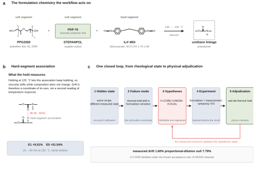
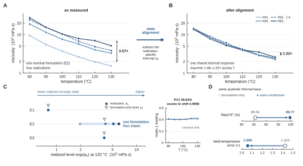
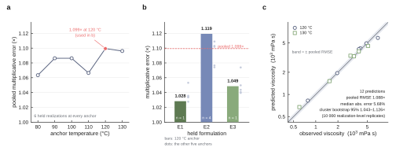
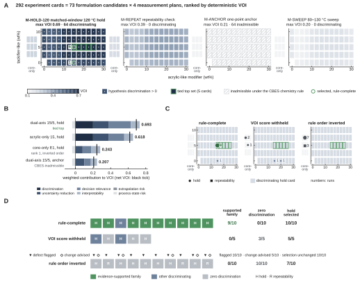
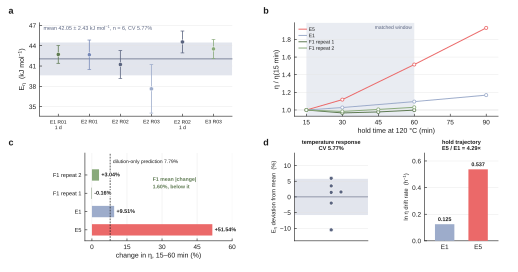

# Rheological State Identification Enables Hypothesis-Driven Experiment Selection in Reactive Polyurethane Hot-Melt Adhesives

**Junbo Tong¹, Jianming Zhao²\***

¹ Department of Chemistry, Faculty of Science, National University of Singapore, 3 Science Drive 3, Singapore 117543, Singapore  
² Ningbo Yinjun Technology, Ningbo, Zhejiang, China  

\*Corresponding author: Jianming Zhao

## Abstract

Reactive polyurethane hot-melt adhesives can occupy different rheological states even at the same nominal formulation, complicating the interpretation of sparse formulation data. Within the audited PPG2000/PDP70/MDI family, realization-to-realization differences were dominated by shifts in viscosity level that collapsed onto a common local thermal response after calibration of a single state coordinate, while thermal-hold drift remained strongly formulation dependent. Reanalysis of 39 public polyurethane-prepolymer curves showed that this transferability is chemistry bounded: family-held-out models transferred well across unseen isocyanate families but degraded sharply across unseen polyol families. A resin-modified validation formulation showed 1.60% mean absolute drift, far below the 7.79% proportional-dilution prediction and inconsistent with a reactive-core-only explanation. We translated these rheological regularities and their applicability limits into deterministic scientific tools that define and rank formulation-measurement experiments for discriminating competing stabilization hypotheses. Controlled ablations showed that rule content and rule order govern experiment informativeness, while chemistry-bounded decision tests separated conditions in which one-point calibration is justified from those requiring a direct thermal sweep. Together, the results establish a closed workflow from rheological-state identification and chemistry-domain testing to hypothesis-driven experiment selection and physical adjudication.

**Keywords:** reactive polyurethane hot-melt adhesive; state-conditioned rheology; thermal-hold stability; experiment selection; decision rules

---

## 1. Introduction

Reactive polyurethane hot-melt adhesives couple melt processing with subsequent chemical curing. During melting, pumping, coating and dispensing, the material must remain fluid enough to process while retaining the reactivity required for cure and bond development [@Cui2002CrystallineStructure; @Cui2003CureKinetics; @OrgilesCalpena2016CO2HMPUR; @Blasco2022VegetablePolyols; @MoyanoVallejo2024GreenStrength]. Their practical processing window is therefore governed not by a single viscosity value, but by how viscosity evolves with both temperature and thermal residence.

Polyurethane-prepolymer viscosity depends on soft-segment chemistry, molecular weight, stoichiometry, temperature and reaction progress [@Sebenik2007SoftSegment; @ParutaTuarez2014SystemicRheology; @Ruan2019BioPolyols; @Liu2020PPCPUR; @Pugar2025PURViscosityML]. Reaction temperature can alter molecular-weight distributions and side reactions, while miscibility in reactive blends can evolve with conversion [@Heintz2003ReactionTemperature; @Duffy2005ReactiveBlendMiscibility]. Formulation datasets, however, usually describe nominal composition more completely than preparation history, thermal residence, sample age, moisture exposure or mixing trajectory. As a result, two materials carrying the same formulation label can still occupy different rheological states.

This hidden state may appear either as a change in the shape of the viscosity-temperature curve or as a nearly uniform shift in viscosity level. The latter case is experimentally useful: if repeated realizations share a thermal-response shape but differ mainly by vertical displacement, preparation variability can be represented by a low-dimensional state coordinate rather than treated as unstructured noise. Recent work on polyurethane prepolymers has shown that temperature-dependent viscosity can be modeled with physically interpretable curve representations and chemistry-aware machine learning, with the strongest extrapolation remaining inside represented chemical domains [@Pugar2025PURViscosityML]. What remains unclear is whether a narrow reactive-PUR family retains such a transferable local thermal response once realization state is separated from nominal formulation.

Thermal residence introduces a second problem. A formulation can have an acceptable instantaneous viscosity yet continue to thicken while held at processing temperature. Previous HMPUR studies show that soft-segment chemistry and polymeric modifiers affect melt viscosity, viscoelastic response, open time, green strength and thermal performance to different extents [@Jung2008AcrylicModification; @Sun2016PEDA; @Sun2022PolycarbonatePolyester; @Sun2022PolycarbonateSebacicPUR; @MoyanoVallejo2024GreenStrength]. This suggests that temperature sensitivity and thermal-hold stability should be treated as distinct rheological coordinates rather than collapsed into a single scalar target.

Once thermal-hold drift is identified as the actionable failure mode, the sparse-data problem changes from recipe optimization to experiment design. A small local formulation set can reveal the relevant rheological structure, but it cannot support a black-box predictor for untested modifier chemistry. The more defensible question is therefore which experiment best separates plausible explanations for stabilization. Self-driving laboratories and tool-grounded chemistry agents provide a precedent for coupling computation, literature knowledge and experimental decisions [@Hase2019SelfDrivingLabs; @Roch2018ChemOS; @Burger2020MobileRoboticChemist; @MacLeod2020SelfDrivingLab; @Kusne2020ClosedLoopMaterials; @Stach2021AutonomousExperimentation; @Szymanski2023AutonomousLab; @Boiko2023Coscientist; @Bran2024ChemCrow]. Here, we make the scientific sequence explicit: first identify the unresolved material coordinate experimentally, then formulate competing explanations, and only then select the measurement most capable of distinguishing them.

We therefore frame sparse reactive-PUR formulation as a closed scientific loop. Repeated realizations first reveal a low-dimensional rheological state structure, while external family-held-out analysis defines the chemistry range over which that local structure can be transferred. Thermal-hold measurements then expose a separate formulation-sensitive failure coordinate. These physical findings are encoded as deterministic scientific rules, the unresolved stabilization problem is expressed as competing formulation-level hypotheses, and candidate formulations are paired with measurements according to the information each experiment can provide. Controlled ablations test the decision logic, and wet-lab measurements provide the final physical adjudication.

**Figure 1. One closed loop from rheological state identification to physical hypothesis adjudication.** (A) The formulation chemistry: PPG2000 and 4,4′-MDI are drawn atom for atom; STEPANPOL PDP-70, whose exact backbone is not public, is drawn as a labelled block. (B) Hard-segment N–H···O=C association between urethane linkages, with the matched 15–60 min drift of E1 and E5 at 120 °C. (C) Repeated experiments reveal a calibratable realization-dependent viscosity state and a separate thermal-hold failure coordinate. That failure mode is expressed as competing formulation-level hypotheses, which define what the next experiment must discriminate. Formulation candidates and measurement plans are paired into experiment cards, deterministic scientific rules rank their informativeness, and model-mediated selection operates within that decision geometry. Controlled ablations test the rule layer before the held-out wet-lab result physically adjudicates the surviving material hypothesis.

---

## 2. Results and Discussion

### 2.1 Repeated realizations reveal a hidden rheological state within one nominal formulation

The local design comprised five PUR formulations based on PPG2000, STEPANPOL PDP-70 and 4,4'-MDI. E1-E3 used a 50/50 PPG2000/PDP-70 polyol ratio and varied the reported NCO:OH ratio from 1.70 to 1.90, whereas E4 and E5 retained NCO:OH = 1.80 and shifted the PPG2000/PDP-70 ratio to 60/40 and 40/60. Complete 80-130 °C temperature sweeps were available for E1-E3 across multiple experimental realizations.

Nominal formulation did not uniquely determine viscosity. Across three same-day E2 realizations, viscosity ranged from 9462 to 27350 mPa·s at 80 °C and from 1955 to 6977 mPa·s at 120 °C. The corresponding maximum-to-minimum ratios were 2.89× and 3.57×, and a 2.80-3.57× spread persisted across the measured temperature range.

Because the separation remained systematic across temperature, it cannot be explained by an isolated measurement outlier. The E2 curves instead differ mainly in viscosity level. Nominal composition therefore specifies the recipe, but not the rheological state realized in a particular experiment.

### 2.2 A single state coordinate captures most realization variability

To determine whether realization dependence reflected arbitrary curve distortion or a lower-dimensional state shift, we compared formulation-only and state-conditioned models using the same thermal basis. Temperature was represented by the centered inverse-temperature coordinate

$$
z(T)=10^3\left(\frac{1}{T}-\frac{1}{T_{\mathrm{ref}}}\right),
\qquad
T_{\mathrm{ref}}=393.15~\mathrm{K},
$$

with $T$ expressed in kelvin. The formulation-only model used a formulation-specific intercept and a shared quadratic thermal response,

$$
\ln \eta_{fr}(T)
=
\mu_f
+
\beta_1 z(T)
+
\beta_2 z(T)^2
+
\varepsilon_{frT},
$$

whereas the state-conditioned model replaced the formulation intercept with a realization-specific viscosity-scale intercept,

$$
\ln \eta_{fr}(T)
=
a_{fr}
+
\beta_1 z(T)
+
\beta_2 z(T)^2
+
\varepsilon_{frT}.
$$

Here $f$ denotes nominal formulation and $r$ a measured realization within that formulation. The fitted $a_{fr}$ locates the realized viscosity level directly; conceptually it contains both the formulation baseline and the realization-specific displacement, $a_{fr}=\mu_f+\delta_{fr}$.

After chemistry-aware curation, the primary dataset contained six complete realizations of E1–E3 measured at six temperatures per realization (80, 90, 100, 110, 120 and 130 °C), giving 36 temperature–viscosity observations in total. A seventh E1 curve was a defined phosphoric-acid perturbation (0.025 mmol H3PO4 from a 0.1 mol L−1 standard solution, added during dehydration) and was therefore kept outside the same-composition primary fit.

With identical quadratic inverse-temperature responses, the formulation-only model explained 85.53% of log-viscosity variation, whereas the state-conditioned model explained 99.77%. Leave-one-temperature-out multiplicative error likewise fell from 1.423× to 1.058×. The improvement was not created by the quadratic basis: with linear thermal responses in both models, $R^2$ increased from 0.8519 to 0.9943. Within the state-conditioned representation itself, adding the quadratic term to the shared linear thermal response was strongly supported ($F=40.78$, $p=6.51\times10^{-7}$), whereas adding a cubic term was not ($F=0.43$, $p=0.518$). The quadratic form was therefore retained as the simplest flexible local thermal basis rather than selected solely for fit quality.

A model-free singular-value decomposition recovered the same geometry. After temperature-wise centering of the log-viscosity matrix, the first between-realization mode explained 99.63% of the variance. Its loading vector had a cosine similarity of 0.9998 to a constant vector, making the dominant mode nearly indistinguishable from a uniform vertical shift in log-viscosity space.

The defined E1 phosphoric-acid perturbation provided a separate check of this geometry. Its apparent temperature-response descriptor was 40.77 kJ mol−1 (R² = 0.9979), within the 42.05 ± 2.43 kJ mol−1 distribution of the six primary realizations. Holding the primary shared thermal shape fixed and fitting only a curve-specific intercept reproduced the perturbed curve with a multiplicative RMSE of 1.034×; using only the 120 °C perturbed viscosity as an anchor gave 1.039× error over the remaining temperatures. The perturbed chemistry therefore remained closely compatible with the same local thermal-response shape.

Taken together, the fitted and model-free analyses support a simple local picture: realizations share a common thermal-response shape but occupy different viscosity levels. We therefore use the fitted intercept $a_{fr}$ as a realized viscosity-scale coordinate that locates each experiment on the shared response, without assigning that displacement to any single process variable such as reaction time, moisture, mixing history or sample age.

**Figure 2. Realization-dependent viscosity variation is dominated by a calibratable state shift.** (A) Temperature-dependent viscosity of four E2 realizations, showing persistent realization-to-realization offsets across 80–130 °C. (B) Removal of the realization-specific viscosity-scale intercept $a_{fr}$ collapses the E2 curves onto the shared thermal response. (C) The first between-realization singular mode explains 99.63% of the variance and has a cosine similarity of 0.9998 to an ideal constant vertical shift. (D) Using the same quadratic inverse-temperature response in both models, state conditioning increases fitted $R^2$ from 85.53% to 99.77% and reduces leave-one-temperature-out multiplicative error from 1.423× to 1.058×.

### 2.3 One measurement locates an unseen realization on the shared thermal response

If the state coordinate is experimentally useful, one viscosity measurement should be sufficient to place a new realization on the shared thermal response. We tested this directly by learning the thermal shape from other nominal formulations and using a single measurement to calibrate the held realization.

In leave-one-formulation-out analysis, all realizations of one formulation were removed before fitting the shared response $g(T)=\beta_1z(T)+\beta_2z(T)^2$. For each held realization, a single viscosity value at anchor temperature $T_0$ was then used to estimate

$$
\hat a_{fr}=\ln \eta_{fr}(T_0)-\hat g(T_0),
$$

after which the remaining temperatures were reconstructed from $\widehat{\ln\eta}_{fr}(T)=\hat a_{fr}+\hat g(T)$.

Using 120 °C as the anchor, multiplicative reconstruction errors were approximately 1.028× for held E1, 1.119× for held E2 and 1.049× for held E3. The pooled error was 1.099×, and pooled performance across the available anchor temperatures remained approximately 1.06–1.10×.

We next isolated the information supplied by the state measurement itself, rather than by formulation identity. E2 was the only nominal formulation with multiple chemistry-audited realizations, allowing each realization to be held out while the formulation remained represented in training. A formulation-only quadratic model predicted the held realization at 120 and 130 °C with a pooled multiplicative RMSE of 1.824×. Supplying a single 110 °C viscosity anchor from that held realization and using the shared thermal shape reduced the error to 1.086×, corresponding to an 86.2% reduction in log-RMSE. A realization-level cluster bootstrap placed this reduction at approximately 75.0–97.3%. Thus the anchor is not merely another temperature point: within the validated local chemistry it carries direct information about the realized viscosity state that formulation identity alone does not provide.

A stricter test withheld both the target formulation and the high-temperature prediction region. The shared response was fitted only to the other formulations at temperatures up to 110 °C; one 110 °C measurement located each unseen realization, and the model predicted 120 and 130 °C. Across 12 held predictions from six realizations, pooled multiplicative RMSE was 1.088×, with errors of 1.087× at 120 °C and 1.089× at 130 °C. Median absolute percentage error was 5.68%, and a 10,000-replicate realization-level cluster bootstrap gave a 95% interval of 1.043–1.126× for the pooled multiplicative RMSE.

This transfer is intentionally local: the predictions extend only 10-20 °C beyond the fitting range and remain inside the audited E1-E3 chemistry neighborhood. Within that boundary, the analysis separates two tasks that are often conflated—learning the family-level thermal shape and locating the state of a new realization. Once the local shape is established, a single viscosity measurement can calibrate the remaining short-range temperature response. The shortcut is therefore justified only inside validated shared-shape support; after a chemistry shift, the thermal response must first be measured directly.

**Figure 3. One-point rheological state calibration transfers the shared local thermal response.** (A) Pooled leave-one-formulation-out reconstruction error across anchor temperatures. (B) Formulation-specific reconstruction error using a 120 °C anchor, with pooled error of 1.099×; points show the same error at the other five anchor temperatures. (C) Strict formulation-and-temperature holdout in which the shared response is fitted only to other formulations at temperatures up to 110 °C and one 110 °C measurement is used to predict 120 and 130 °C; pooled multiplicative RMSE is 1.088×, median absolute percentage error is 5.68%, and the 10,000-replicate realization-level cluster bootstrap gives a 95% interval of 1.043–1.126×; the shaded band is ± the pooled multiplicative RMSE.

### 2.4 Thermal-hold drift emerges as the actionable formulation coordinate

One-point calibration locates a realization on the temperature-response curve, but it does not describe how viscosity changes during thermal residence. We first summarized the local temperature response by regressing $\ln \eta$ against $1/T$. Across the chemistry-audited sweeps, the apparent temperature-response descriptor $E_\eta$ averaged 42.05 ± 2.43 kJ mol$^{-1}$ (CV 5.77%). A shared-slope model with realization-specific intercepts gave the same mean descriptor, with a 95% confidence interval of 40.21–43.90 kJ mol$^{-1}$. Allowing realization-specific linear thermal slopes did not improve the model ($F_{5,24}=1.26$, $p=0.314$), supporting the interpretation that realization primarily shifts viscosity level rather than the local thermal slope. $E_\eta$ is used here only as a rheological descriptor, not as a chemical reaction activation energy.

Thermal-hold behavior was far more sensitive to formulation. E1 increased from 708.7 mPa·s at 15 min to 776.1 mPa·s at 60 min and 828.1 mPa·s at 90 min, whereas E5 increased from 2210 to 3349 and 4267 mPa·s over the same interval. The directly observed 15–60 min increases were 9.51% for E1 and 51.54% for E5. A descriptive model,

$$
\ln \eta(t)=\ln \eta_0+k_{\mathrm{drift}}t,
$$

gave $k_{\mathrm{drift}}\approx0.125~\mathrm{h}^{-1}$ for E1 and $0.537~\mathrm{h}^{-1}$ for E5, a 4.29-fold difference.

Because composition and stoichiometry change together between E1 and E5, this contrast is interpreted at the formulation level rather than assigned to a single molecular cause. Temperature-sweep and thermal-hold measurements are therefore treated as complementary rheological coordinates, not as a matched covariance design. Across the measured formulation space, temporal viscosity evolution spans a much wider range than the local temperature-response descriptor. We represent the measured rheological state with three coordinates,

$$
\mathbf{R}_{\mathrm{rheo}}=
\{\eta_{\mathrm{ref}},S_T,S_t\},
$$

where $\eta_{\mathrm{ref}}$ locates the realized viscosity level, $S_T$ describes the local temperature response and $S_t$ describes the isothermal time trajectory. These coordinates are experimentally distinguishable and respond differently across the present formulation space. Their separation identifies the actionable failure mode for the remainder of the study: once viscosity level and local temperature response are accounted for, the key formulation problem is suppression of thermal-hold drift rather than optimization of static viscosity alone.

The concentrated local temperature response is chemistry bounded rather than universal. Across an external set of 39 dense polyurethane-prepolymer temperature-viscosity curves (4559 measurements), apparent temperature-response descriptors span approximately 34.7–94.2 kJ mol$^{-1}$ even though 37 of 39 curves retain $R^2\geq0.98$ for $\ln\eta$ versus $1/T$ [@Pugar2025PURViscosityML]. The local value near 42 kJ mol$^{-1}$ therefore characterizes a bounded chemistry neighborhood, not a global PUR invariant.

To test the boundary directly, we treated each complete external formulation curve as one sample and predicted its apparent $E_\eta$ using grouped family holdouts rather than splitting temperature points from the same curve. A ridge model using prepolymer molecular-weight, polyol polarity, isocyanate structural, NCO-content and polyol-$T_g$ descriptors transferred well when an entire isocyanate family was withheld ($R^2=0.910$, RMSE = 3.12 kJ mol$^{-1}$), but failed when an entire polyol family was withheld ($R^2=-1.456$, RMSE = 16.33 kJ mol$^{-1}$). A minimal $T_g$ + NCO-content model showed the same asymmetry ($R^2=0.851$ versus 0.033 for isocyanate- and polyol-family holdouts, respectively).

These grouped holdouts change how the local master response should be interpreted. Transferability is not simply a consequence of smooth or nearly linear temperature dependence; it depends strongly on whether the new chemistry remains within a represented soft-segment family. A change in polyol family is therefore an empirical boundary condition for reusing the shared thermal-response prior. The descriptor associations are treated as family-level structure rather than independent molecular mechanisms because several polyol features co-vary with chemistry class.

### 2.5 External evidence converts the failure mode into testable intervention hypotheses

The chemistry-domain analysis also defines where the local thermal-response shortcut can be used. One-point state calibration is supported within the audited unmodified PPG2000/PDP70/MDI neighborhood, but it cannot be assumed to transfer to resin-modified candidates. A chemistry-shifted formulation should first be characterized directly across temperature before the shared-shape shortcut is reused.

The original E1-E5 design identifies thermal-hold drift as the relevant formulation problem but does not sample a resin-modification axis. External PUR evidence was therefore used to define chemically plausible intervention directions beyond the local design. Acrylic-like resins, tackifier-like components and related modifiers provide such priors. Published studies show that these modifiers can alter melt viscosity, viscoelastic response, set behavior, green strength and adhesive performance [@Jeong2007Organoclay; @Jung2008AcrylicModification; @Kim2008AcrylicCopolymerMMT; @Cho2009AcrylicNanocomposite; @Kim2009MolecularWeightOrganoclay; @Ruan2021PolyacrylatePURHMA]. Broader studies further show that modifier loading and soft-segment chemistry redistribute trade-offs among rheology, open time, mechanical response, hydrolytic resistance and thermal behavior [@Ruan2019BioPolyols; @Liu2020PPCPUR; @OrgilesCalpena2016CO2HMPUR; @Blasco2022VegetablePolyols; @Sun2016PEDA; @Sun2022PolycarbonatePolyester; @Sun2022PolycarbonateSebacicPUR; @MoyanoVallejo2024GreenStrength; @Xiao2025HighTemperaturePUR; @Fang2026FDCAPURHMA].

These records serve as formulation priors, not direct predictors of local performance. Modifier fractions are used quantitatively only when their denominator basis is clear; ambiguous records remain directional evidence. Their purpose is to translate the observed failure mode into intervention hypotheses that can be distinguished experimentally.

### 2.6 Competing hypotheses define what the next experiment must discriminate

Once thermal-hold drift had been identified as the actionable coordinate and resin modification as a plausible intervention, the problem shifted from recipe search to hypothesis discrimination. The local data made the unresolved question clear, but they did not justify a black-box composition-to-drift predictor for untested modifier chemistry. We therefore designed the next experiment to distinguish competing formulation-level explanations of stabilization rather than to optimize an unsupported surrogate.

Three formulation-level hypotheses were registered before model-mediated experiment selection. H-CORE attributes drift to the reactive core alone and predicts proportional dilution of the E1 reference drift. H-RESIN predicts that resin modification suppresses drift beyond dilution. H-DUAL assigns different roles to the acrylic and tackifier axes and predicts that low drift requires the tackifier-containing dual-axis intervention. These are formulation-level hypotheses; none asserts a chain-resolved molecular pathway.

Crossing the 73-node formulation lattice with four measurement plans produced 292 experiment cards. The plans comprised a matched-window 120 °C thermal hold, a repeatability check, a one-point anchor and a temperature sweep. Only the matched-window hold directly observes the registered mechanism contrast and therefore carries non-zero hypothesis discrimination.

The deterministic value-of-information (VOI) tool scores each card from six explicit components,

$$
\mathrm{VOI}
=
w_{\mathrm{hyp}}D_{\mathrm{hyp}}
+w_{\mathrm{unc}}R_{\mathrm{unc}}
+w_{\mathrm{dec}}R_{\mathrm{dec}}
+w_{\mathrm{int}}I_{\mathrm{meas}}
-w_{\mathrm{ext}}X_{\mathrm{risk}}
-w_{\mathrm{proc}}P_{\mathrm{risk}},
$$

where the terms represent hypothesis discrimination, uncertainty reduction, decision relevance, measurement interpretability, extrapolation risk and process-state risk. The score is a deterministic decision rule, not a posterior probability. No held-out validation composition or outcome enters any component, weight or tie-break. Weight perturbation over each term from 0.5× to 1.5× preserved the same five-card top set, the intervention family and the 120 °C hold measurement.

### 2.7 Rule-Grounded Experiment Selection recovers discriminating experiments

Representing each option as a formulation-measurement pair made decision quality directly testable: a useful selection had to separate the open hypotheses, not merely nominate a plausible formulation. Under a fixed model and evidence contract, all 10 confirmatory runs produced a committed experiment selection.

All 10 runs selected the matched-window 120 °C hold. Nine selected a dual-axis resin-modified composition from the deterministic tied top set, whereas one selected an acrylic-only discriminating probe outside that set. Thus, 9/10 selections belonged to the evidence-supported dual-axis family (95% Wilson interval [0.596, 0.982]), and none had zero hypothesis discrimination.

The deterministic layer assigned equal top rank to five dual-axis cards spanning 15-25 wt% acrylic at 5 wt% tackifier. A coded minimum-burden tie-break matched the model-mediated selection in 9/10 runs. The remaining run accepted a 0.075 reduction in VOI to choose an acrylic-only probe that separated a hypothesis pair left entangled by the dual-axis hold. The model contribution was therefore narrow; most of the decision geometry was set by explicit scientific policy.

### 2.8 Rule content, rule order and applicability authority shape experiment selection

Controlled ablations isolated the contribution of the deterministic rule layer. In the score-withheld arm, the model, prompts, hypothesis registry, measurement catalog, evidence profile, 73-node lattice and 292-card inventory were held fixed; only the VOI score, component vector, ranking, stability sweep and tool-generated acceptance criteria were removed.

Withholding the score preserved the measurement choice but damaged the composition choice. All 5/5 runs still selected the 120 °C hold, yet evidence-supported dual-axis selection fell from 9/10 to 0/5, with non-overlapping 95% Wilson intervals [0.596, 0.982] and [0.000, 0.435]. Three runs reverted to reactive-core-only compositions that cannot separate the registered hypotheses, reducing mean hypothesis discrimination from 0.667 to 0.267.

A second arm changed only rule priority. The canonical sufficiency-first order ranked intervention coverage, hypothesis discrimination and decision relevance ahead of modifier burden; the inverted minimality-first order placed burden first. This single change moved the deterministic rank-1 choice to a reactive-core-only experiment with zero hypothesis discrimination. All 10 runs then selected the reactive-core family, giving 10/10 zero-discrimination experiments and 0/10 evidence-supported-family selections (95% Wilson interval [0.000, 0.278]).

Critique did not rescue the inverted policy. In all 10 runs, the critique stage identified the same high-severity defect: without a modifier intervention, the registered predictions collapsed to the same 9.51% reference response and the experiment could not discriminate the hypotheses. A downstream robustness check recommended changing the experiment in five runs, yet all 10 selections still followed the rule-prioritized choice. Correct diagnosis therefore did not compensate for incorrect decision priority.

**Table 1. Controlled decision-rule ablation under fixed evidence and model contracts.**

| Decision condition | Runs | Evidence-supported family | Zero-discrimination selections | Mean hypothesis discrimination |
|---|---:|---:|---:|---:|
| Rule-complete architecture | 10 | 9/10 | 0/10 | 0.667 |
| VOI score withheld | 5 | 0/5 | 3/5 | 0.267 |
| Rule order inverted | 10 | 0/10 | 10/10 | 0.000 |

**Figure 4. Scientific decision quality depends on both rule content and rule order.** (A) Evidence-supported intervention-family recovery falls from 9/10 in the rule-complete architecture to 0/5 when the VOI score is withheld and 0/10 when rule order is inverted; error bars are two-sided 95% Wilson intervals. (B) Hypothesis discrimination of the frozen selected experiment, one point per run; the mean decreases from 0.667 to 0.267 and then 0.000, while zero-discrimination selections increase from 0/10 to 3/5 and 10/10. (C) Composition choice and measurement choice are damaged differently by the two manipulations: the matched-window 120 °C hold is selected in 10/10 rule-complete runs and 5/5 score-withheld runs, but in only 7/10 order-inverted runs, so withholding the score leaves the measurement intact whereas inverting the order does not. (D) In the minimality-first arm, the critique stage identified the high-severity defect in 10/10 runs and the robustness check recommended changing the experiment in 5/10, yet all ten selections still committed to zero-discrimination experiments.

Together, the ablations locate the source of decision quality. Under a fixed evidence contract, rule content determines whether the selected experiment can answer the open question, while rule order determines whether those rules are applied in a scientifically useful sequence. Critique alone remains diagnostic unless it has authority to change the decision.

A separate matched-arm chemistry-domain test asked a complementary question: does hard applicability enforcement improve the decision when the registered failure mode is already observed directly? Both the advice-only and enforced arms completed 10/10 runs and selected the matched-window 120 °C hold in all 10 runs. Neither arm produced an unsupported shared-shape shortcut or chemistry-domain violation, and mean hypothesis discrimination was 0.667 in both. The enforced arm removed 64 inadmissible cards before ranking, but this did not change the selected measurement because the hold assay directly observed the thermal-hold coordinate, whereas the gated one-point anchor carried no hypothesis discrimination for the drift hypotheses. The applicability rule was therefore non-binding in this decision rather than generically performance-improving.

We then tested the same applicability rule in a processing-window decision where the shortcut was genuinely attractive. For a resin-modified candidate, the deterministic layer ranked one-point state calibration above a direct temperature sweep (VOI 0.7392 versus 0.6875), even though the shared thermal-response shape had not been verified for that chemistry. When the applicability audit was visible only as advice, the model-mediated selector rejected the higher-ranked anchor in all 10 runs and chose the direct 80–130 °C sweep instead, explicitly citing the unsupported chemistry transfer. Hard enforcement led to the same measurement choice in all 9 completed runs while removing 64 inadmissible cards; one of 10 declared runs failed because of malformed model output and was not replaced. In this setting, hard enforcement added a guarantee of admissibility rather than a measurable behavioral advantage. The practical consequence is direct: the first processing-window assessment of a resin-modified formulation should establish its temperature response experimentally before a one-point anchor shortcut is reused.

### 2.9 Wet-lab adjudication closes the hypothesis loop

The held-out validation experiment then closed the hypothesis loop. The formulation contained PPG2000, PDP-70, AC1920, TK100 and MDI at source-reported parts of 39.60, 39.60, 17.00, 5.00 and 20.19, respectively. Across two 120 °C thermal-hold repeats, viscosity changed from 1230 to 1228 mPa·s and from 1281 to 1320 mPa·s between 15 and 60 min, corresponding to -0.16% and +3.04% drift. The mean absolute drift was 1.60%, while the replicate-mean trajectory changed by +1.47%.

Over the same interval, E1 and E5 changed by +9.51% and +51.54%, respectively. Relative to E1, the more stable original reference, the validation formulation reduced mean absolute drift by approximately 83%.

The registered hypotheses provide a direct null-model test. The source-reported reactive-core components account for 99.39 of 121.39 parts in the validation formulation, giving a reactive mass fraction of approximately 0.819. H-CORE therefore predicts a 15-60 min drift of approximately $9.51\%\times0.819=7.79\%$ under proportional dilution. The measured 1.60% drift lies far below this prediction, falsifying H-CORE under the frozen acceptance rule while retaining H-RESIN. H-DUAL remains unresolved because separating it from H-RESIN requires an acrylic-only measurement.

This result does more than demonstrate thermal stability: it separates a genuine formulation effect from a simple dilution null and closes one branch of the registered hypothesis space without invoking a molecularly resolved pathway.

**Figure 5. Temperature response is locally concentrated while thermal-hold trajectory is formulation-sensitive.** (A) Apparent temperature-response descriptor $E_\eta$ across six chemistry-audited realizations (mean 42.05 ± 2.43 kJ mol⁻¹; CV 5.77%). (B) Normalized 120 °C thermal-hold trajectories for E1, E5 and two resin-modified validation repeats. (C) Matched 15-60 min viscosity changes show 9.51% drift for E1, 51.54% for E5 and a mean absolute drift of 1.60% across the two validation repeats; the dashed line is the 7.79% expected if the resin only diluted the reactive core. (D) The two native descriptors on separate axes: the deviation of each realization's $E_\eta$ from the mean (CV 5.77%), and the log-viscosity drift rates of E1 and E5 fitted over the full 15–90 min hold (4.29-fold).

### 2.10 Physical-state identification and experiment selection form one closed scientific workflow

The results therefore form one continuous sequence. Repeated realizations show that nominal formulation does not uniquely specify rheological state; one-point calibration resolves the dominant viscosity-level displacement; and thermal-hold measurements reveal a separate, more formulation-sensitive coordinate. The actionable failure mode is thus not static viscosity itself, but how viscosity evolves during processing.

That physical diagnosis determines what the computational layer should do. External formulation records provide plausible intervention directions, while family-held-out viscosity modeling defines where the local thermal-response representation can be transferred. For a resin-modified candidate, the resulting domain boundary becomes a concrete experimental choice: first measure the full 80–130 °C temperature response, then decide whether cheaper one-point calibration is justified for nearby follow-up states. The matched 120 °C hold addresses a different uncertainty—temporal stability. Experiment selection is therefore a continuation of the materials problem rather than a separate optimization exercise.

The controlled ablations show why this coupling matters. The rule-complete architecture avoided zero-discrimination selections, whereas score withholding and rule-order inversion progressively degraded experiment informativeness. The inverted policy failed even when the critique stage correctly identified the defect, demonstrating that useful scientific reasoning depends on decision authority as well as diagnostic quality.

The wet-lab result closes the loop: a mean absolute drift of 1.60% lies far below the 7.79% proportional-dilution prediction, rejecting the reactive-core-only explanation and retaining resin-associated stabilization at the formulation level. Taken together, the study links hidden-state identification, failure-mode isolation, hypothesis formulation, discriminating experiment selection and physical adjudication in a single workflow.
---

## 3. Materials and Methods

### 3.1 Local formulation design

The local formulation space contained five reactive PUR compositions based on PPG2000, STEPANPOL PDP-70 and 4,4'-MDI. E1–E3 used a 50/50 PPG2000/PDP-70 polyol ratio with reported NCO:OH values of 1.70, 1.80 and 1.90, whereas E4 and E5 retained NCO:OH = 1.80 and used PPG2000/PDP-70 ratios of 60/40 and 40/60. The resin-modified validation formulation contained PPG2000, PDP-70, AC1920, TK100 and MDI on a source-reported parts basis and had an NCO:OH equivalent ratio of 1.82.

For sample preparation, the polyol components were charged first, stirred and vacuum-dehydrated at approximately 130 °C for 1 h. 4,4'-MDI was then added, and the mixture was stirred under vacuum at approximately 120 °C for a further 1 h 20 min.

### 3.2 Temperature-sweep data and chemistry audit

Temperature-sweep viscosity was measured from 80 to 130 °C in 10 °C increments using an RV-SSR-H high-temperature rotational viscometer (Shanghai Fangrui Instrument Co., Ltd.) equipped with an NKY-25 heater unit and a No. 27 spindle. Viscosity was recorded in mPa·s. Rotation speed was adjusted as needed to maintain approximately 40–60% instrument torque, and each sample was equilibrated for 15 min at the target temperature before recording the displayed viscosity.

Measurements were made on prepared sample material rather than with an in-reactor sensor. Within a given sweep, the same mother sample was measured across temperatures; the individual temperature points therefore do not represent independent resyntheses.

R01, R02 and R03 are anonymized realization codes retained solely to distinguish observed rheological runs. They are treated as opaque identifiers and do not encode operator identity. Here, a realization denotes one observed temperature-viscosity curve arising from a nominal formulation under its particular preparation, storage and measurement history; distinct codes are not assumed to represent independent synthesis batches. Day-1 retests are retained as separately observed rheological states without assigning an unverified batch relationship.

One E1 temperature curve was prepared with 0.025 mmol H3PO4 delivered as a 0.1 mol L−1 standard solution (0.25 mL) during dehydration. Because this deliberately changed the chemical condition relative to nominal E1, the curve was excluded from the chemistry-audited same-composition analysis and evaluated separately as a perturbation check. The primary temperature-sweep dataset therefore comprised 36 observations from six complete realizations of three nominal formulations.

### 3.3 State-conditioned temperature-response models

Viscosity was log-transformed before model fitting. Temperature was encoded as

$$
z(T)=10^3\left(\frac{1}{T}-\frac{1}{T_{\mathrm{ref}}}\right),
\qquad
T_{\mathrm{ref}}=393.15~\mathrm{K},
$$

where $T$ is absolute temperature. The factor $10^3$ is a numerical scaling convention and does not change the fitted thermal shape.

For the primary same-order comparison, the formulation-only model was

$$
\ln \eta_{fr}(T)
=
\mu_f
+
\beta_1 z(T)
+
\beta_2 z(T)^2
+
\varepsilon_{frT},
$$

and the state-conditioned model was

$$
\ln \eta_{fr}(T)
=
a_{fr}
+
\beta_1 z(T)
+
\beta_2 z(T)^2
+
\varepsilon_{frT}.
$$

The state-conditioned model estimates one intercept $a_{fr}$ for each measured realization. This intercept is the directly fitted viscosity-scale coordinate. Conceptually, $a_{fr}=\mu_f+\delta_{fr}$ combines the nominal formulation baseline $\mu_f$ with a realization-specific displacement $\delta_{fr}$ without requiring those two contributions to be estimated separately.

Prediction error was evaluated in log-viscosity space,

$$
\mathrm{RMSE}_{\log}
=
\sqrt{
\frac{1}{N}
\sum_{i=1}^{N}
\left(\ln\hat\eta_i-\ln\eta_i\right)^2
},
$$

and reported as a multiplicative error factor,

$$
\mathrm{RMSE}_{\times}
=
\exp\left(\mathrm{RMSE}_{\log}\right).
$$

Held-temperature validation removed all observations at one temperature, fitted the model on the remaining temperatures and predicted the held temperature. The headline formulation-only and state-conditioned comparison used the same quadratic thermal-response basis in both models.

### 3.4 Model-free dimensionality analysis

For the six chemistry-audited complete curves, a matrix of log viscosity was assembled with realizations as rows and temperatures as columns. Each temperature column was centered across realizations before singular-value decomposition.

The fraction of between-realization variance explained by the first singular mode was calculated from the corresponding singular value. To test whether this mode represented a uniform log-viscosity displacement, its loading vector was compared with a constant vector using cosine similarity.

### 3.5 One-point state calibration

Transfer across nominal formulations was evaluated using leave-one-formulation-out analysis. In each fold, all realizations of one formulation were excluded while the remaining formulations were used to estimate the shared thermal shape $g(T)$. A single viscosity value from each held realization at anchor temperature $T_0$ was then used to estimate

$$
\hat a_{fr}=\ln \eta_{fr}(T_0)-\hat g(T_0).
$$

For the quadratic shared response used here,

$$
\widehat{\ln\eta}_{fr}(T)
=
\ln\eta_{fr}(T_0)
+
\hat\beta_1\left[z(T)-z(T_0)\right]
+
\hat\beta_2\left[z(T)^2-z(T_0)^2\right].
$$

The remaining temperatures were reconstructed from this calibrated response and performance was summarized in multiplicative-error space.

A stricter formulation-and-temperature holdout removed one formulation entirely and fitted the shared thermal response only to the remaining formulations at temperatures no higher than 110 °C. Each unseen realization was then located using a single 110 °C anchor and predicted at 120 and 130 °C. Performance was summarized by pooled log-RMSE, multiplicative RMSE, absolute percentage error and a 10,000-replicate realization-level cluster bootstrap.

### 3.6 Thermal-hold measurements

E1 and E5 were held at 120 °C and measured at 15, 30, 60 and 90 min. The validation formulation was measured in two repeat runs at 15, 30, 45 and 60 min. For all thermal-hold measurements, $t=0$ was defined as the time at which the sample reached 120 °C. The material was stirred during the hold and kept sealed under vacuum. Viscosity was measured on sampled material with the viscometer rather than by continuous in-situ sensing.

The primary matched stability comparison used the common 15–60 min interval,

$$
SI_{15\rightarrow60}
=
\frac{\eta_{60}-\eta_{15}}{\eta_{15}}.
$$

No 90 min validation value was extrapolated or imputed. For E1 and E5, an apparent logarithmic drift descriptor was estimated from

$$
k_{\mathrm{drift}}=\frac{d\ln\eta}{dt}.
$$

This value is an operational rheological descriptor and is not interpreted as a chemical kinetic rate constant.

### 3.7 Apparent temperature-response descriptor

For each chemistry-audited complete realization, $\ln \eta$ was regressed against $1/T$ with $T$ in kelvin. The apparent temperature-response descriptor was calculated as

$$
E_\eta
=
R\frac{\mathrm{d}\ln\eta}{\mathrm{d}(1/T)},
$$

using $R=8.314462618~\mathrm{J\,mol^{-1}\,K^{-1}}$. $E_\eta$ is reported only as a descriptor of the local temperature-viscosity response and is not interpreted as a chemical reaction activation energy.

### 3.8 External PUR evidence base and chemistry-family transfer analysis

The external evidence layer contains literature, patent, material, formulation, measurement and dense viscosity-curve records with explicit provenance. The dense prepolymer subset comprises 39 temperature-viscosity curves and 4559 individual measurements from the public Pugar dataset [@Pugar2025PURViscosityML].

For the chemistry-family transfer analysis, each complete formulation curve contributed a single target: the apparent rheological $E_\eta$ obtained from the slope of $\ln\eta$ versus $1/T$. Temperature points from the same formulation were never split across training and test sets. Curves with $R^2\geq0.98$ were included in the primary family-transfer analysis; the two lower-fit curves were retained for sensitivity analysis only.

Two ridge-regression baselines were evaluated with $\alpha=1$. The minimal model used polyol $T_g$ and NCO content. The literature-informed model used prepolymer molecular weight, polyol topological polar surface area, an isocyanate structural descriptor, NCO content and polyol $T_g$. Generalization was assessed separately by leaving out entire isocyanate families and entire polyol families. These grouped tests were designed to measure chemistry-family transfer, not interpolation among temperature points from known formulations. Descriptor associations were treated as descriptive because several polyol features co-vary with family identity.

External formulation records containing acrylic-like or tackifier-like components were separately used to define chemically plausible candidate regions. Numeric modifier fractions were treated as anchors only when the denominator basis was sufficiently clear; records with unresolved fraction definitions remained directional evidence. The temperature-response dataset was not used as a thermal-hold stability label source, and neither external data stream was used as a direct predictor of the held-out local validation outcome.

### 3.9 Scientific decision architecture

The computational decision layer operated downstream of the rheological analysis. Each decision object was an experiment card consisting of one formulation candidate paired with one measurement plan. Crossing the fixed 73-node formulation lattice with four measurement plans produced 292 cards, while the held-out validation formulation and its measured outcome were excluded from the decision-time payload. We refer to this experiment-card architecture as **Rule-Grounded Experiment Selection (RGES)**. Its chemistry-applicability extension, which adds deterministic measurement admissibility without changing the five model stages, is termed **Chemistry-Bounded Experiment Selection (CBES)**.

Three formulation-level hypotheses defined the unresolved scientific question. H-CORE predicts that matched-window viscosity drift scales with the reactive mass fraction of the E1 reference; H-RESIN predicts suppression beyond proportional dilution; and H-DUAL predicts that low drift requires the tackifier-containing dual-axis intervention and is therefore separable from H-RESIN only with an acrylic-only composition. The measurement catalog contained a matched-window 120 °C thermal hold, a repeatability assessment, a one-point anchor and a temperature sweep.

Each card received a deterministic value-of-information score combining hypothesis discrimination, uncertainty reduction, decision relevance, measurement interpretability, extrapolation risk and process-state risk, with base weights of 0.30, 0.20, 0.25, 0.10, 0.10 and 0.05, respectively. The score is a decision heuristic rather than a calibrated posterior quantity. Decision stability was assessed by independently scaling each weight from 0.5× to 1.5× while holding all other inputs fixed.

The language-model workflow comprised five decision stages—Planner, Proposer, Skeptic, Robustness Adjudicator and Judge—while deterministic tools supplied the candidate inventory, evidence summaries and rule calculations. The final recommendation was frozen before the held-out result was exposed.

The 292-card confirmatory and ablation series are retained exactly as frozen. An additional deterministic chemistry-domain layer evaluates measurement applicability rather than formulation admissibility. Candidates within the audited unmodified local family may use one-point state calibration as an interpolation prior, whereas resin-modified or otherwise chemistry-shifted candidates require direct temperature-response verification before that shortcut is trusted. Measurements that directly observe thermal-hold drift, realization spread or temperature response remain admissible because they do not require the transferred shared-shape assumption.

### 3.10 Confirmatory series and controlled ablations

The rule-complete confirmatory series comprised 10 declared runs under a single fixed decision contract. Model endpoint, prompts, evidence profile, hypothesis registry, measurement catalog, formulation lattice, experiment-card inventory and deterministic scoring implementation were held constant across runs. Attempted, completed, abstained and committed outputs were tracked separately.

Two controlled ablations isolated the effect of the deterministic rule layer. In the score-withheld arm ($N=5$), the model, prompts, evidence contract, hypothesis registry, measurement catalog and all 292 cards were unchanged, while the deterministic score, component vector, ranking, stability analysis and tool-generated acceptance criteria were removed. In the rule-order arm ($N=10$), the same rule components were retained but their lexicographic priority changed from coverage → discrimination → relevance → burden to burden → coverage → discrimination → relevance.

Two-sided 95% Wilson score intervals were used for reported run proportions. The computational arms are interpreted as controlled decision-architecture experiments rather than as independent material replicates.

CBES was evaluated under two separately registered scientific decision conditions, each with matched advice-only and enforced arms. The thermal-hold condition retained the drift hypotheses and measurement catalog used by RGES. The processing-window condition instead asked whether a modified candidate lay within the 120–130 °C viscosity window; it replaced the drift hypotheses with formulation-level viscosity hypotheses, redefined measurement relevance for the level question and included a predeclared experimental-effort term because a one-point anchor and a six-point sweep differ substantially in measurement burden. The chemistry-applicability rule, candidate lattice, prompts, model endpoint and arm definitions were otherwise held fixed. Both arms received the same model-visible applicability audit, and enforcement changed only experiment-card admissibility. The two scientific conditions were analyzed separately and were not pooled with one another or with the RGES confirmatory and ablation series.

### 3.11 Post-freeze adjudication and statistical scope

Post-freeze adjudication was kept separate from decision generation. For each committed run, the selected experiment, rationale and decision criteria were serialized before the held-out formulation and wet-lab measurements were loaded. Adjudication then compared the observed mean absolute 15–60 min drift with the H-CORE proportional-dilution prediction derived from the source-reported reactive mass fraction.

Material-level claims are based on the five-formulation local design, six chemistry-audited complete temperature-sweep realizations and the matched thermal-hold validation measurements. Decision-series proportions describe reproducibility under fixed computational contracts rather than frequencies in a material population. Full run-level records, manifests, hashes, stability sweeps and adjudication artifacts are provided in the Supplementary Information and versioned repository.
---

## 4. Conclusions

Reactive-PUR formulation becomes more tractable when nominal composition is separated from the rheological state realized in each experiment. Within the present chemistry family, most realization-to-realization viscosity variation is expressed as a shift in viscosity level on a shared local thermal response, enabling one-point calibration of an unseen realization. External family-held-out modeling shows that this transfer is chemically structured rather than universal: it remains comparatively robust across unseen isocyanate families but degrades sharply across unseen polyol families. Thermal-hold drift forms a second, far more formulation-sensitive coordinate and identifies the failure mode that should guide subsequent design.

These findings define both a useful regularity and the conditions under which it can be reused. Deterministic scientific tools encode the local state-calibration rule, the chemistry-domain boundary and the thermal-hold hypothesis logic before model-mediated selection. External formulation evidence provides plausible intervention directions, while formulation-measurement pairs are evaluated by the uncertainty they can resolve. Controlled ablations show that rule content and rule order are central to experiment informativeness. Chemistry-bounded comparisons add a complementary result: when the scientific question already demands a direct hold measurement, applicability enforcement is non-binding; when a cheaper one-point shortcut becomes attractive, the correct response is to verify the shifted chemistry directly before transferring the local thermal representation.

The wet-lab validation closes one branch of this loop. The resin-modified formulation showed only 1.60% mean absolute drift over 15-60 min, far below the 7.79% proportional-dilution prediction, rejecting a reactive-core-only explanation and retaining resin-associated stabilization at the formulation level. The remaining question is narrower—whether acrylic modification alone can reach the same low-drift regime or whether the second modifier axis is required. Overall, the work connects rheological-state identification, chemistry-bounded transfer, hypothesis-driven experiment selection and physical adjudication into a single materials-design workflow.

---

## 5. Competing Interests

The authors declare no competing interests.

---

## 6. Data and Code Availability

Versioned local formulation tables, chemistry-audited temperature-sweep data, thermal-hold records, statistical analysis scripts, hypothesis registries, measurement catalogs, deterministic decision rules, frozen computational series, controlled ablations and post-freeze adjudication artifacts are available in the public project repository at https://github.com/stloendays/PUR-NEW. Reader-facing aggregate summaries for the Candidate-Recovery Benchmark (CRB), Rule-Grounded Experiment Selection (RGES) and Chemistry-Bounded Experiment Selection (CBES) are indexed in `docs/decision_architecture_provenance.md`; full historical run manifests and hashes remain preserved in repository provenance. The figures are generated by the scripts under `analysis/figures_composite/`, which read the repository tables and the per-panel tables in `analysis/figures_origin/data/`; each figure is provided as SVG, PDF and PNG. External data with separate licensing or provenance constraints should be redistributed only in accordance with their source terms.

