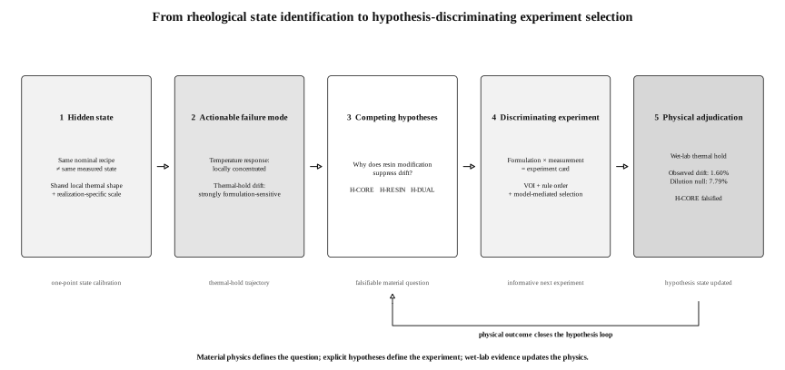
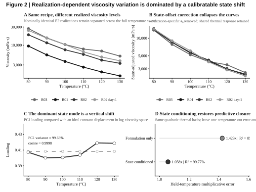
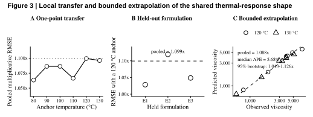
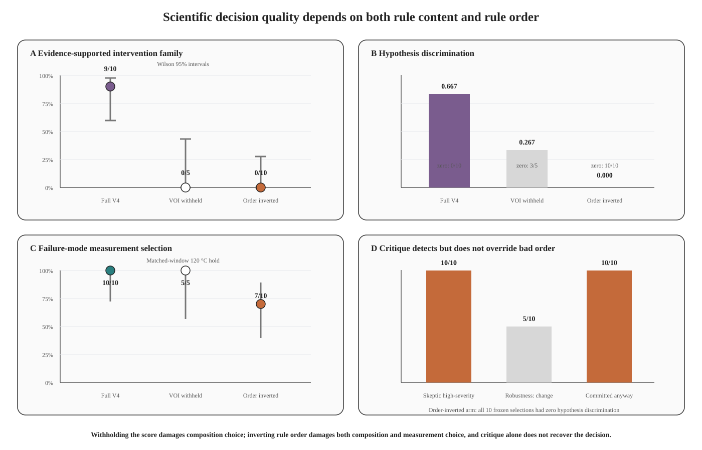
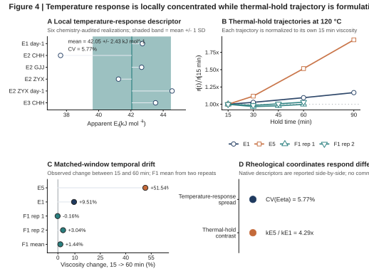

# Rheological State Identification Enables Hypothesis-Driven Experiment Selection in Reactive Polyurethane Formulation

**Junbo Tong¹, Jianming Zhao²\***

¹ Department of Chemistry, Faculty of Science, National University of Singapore, 3 Science Drive 3, Singapore 117543, Singapore  
² Ningbo Yinjun Technology, Ningbo, Zhejiang, China  

\*Corresponding author: Jianming Zhao

## Abstract

Reactive polyurethane hot-melt adhesives can occupy different rheological states even at fixed nominal formulation, making sparse formulation data difficult to interpret and act on. Here we show that realization-to-realization viscosity variation is largely captured by a calibratable state coordinate on a shared local thermal response, while thermal-hold drift emerges as the formulation-sensitive failure mode. A resin-modified validation formulation showed 1.60% mean absolute drift, far below the 7.79% proportional-dilution prediction, motivating competing explanations for stabilization. We therefore converted the material question into a hypothesis-discriminating experiment-selection problem in which formulation and measurement choices are evaluated together. A rule-grounded Agent selected informative experiments, whereas removing the value-of-information score or inverting rule order degraded informativeness even when the critic detected the defect. The study thus closes one loop from rheological-state identification, through falsifiable hypotheses and experiment selection, to physical adjudication.

**Keywords:** reactive polyurethane hot-melt adhesive; state-conditioned rheology; thermal-hold stability; experiment selection; decision rules

---

## 1. Introduction

Reactive polyurethane hot-melt adhesives combine melt processing with subsequent chemical curing, so the rheology experienced during application is inseparable from the material history that precedes it. During melting, pumping, coating or dispensing, the adhesive must remain sufficiently fluid for processing while preserving the reactivity required for later cure and bond development [@Cui2002CrystallineStructure; @Cui2003CureKinetics; @OrgilesCalpena2016CO2HMPUR; @Blasco2022VegetablePolyols; @MoyanoVallejo2024GreenStrength]. A useful processing window is therefore defined not by a single viscosity value, but by how viscosity responds to both temperature and time at temperature.

Polyurethane-prepolymer viscosity depends on soft-segment chemistry, molecular weight, stoichiometry, temperature and reaction progress [@Sebenik2007SoftSegment; @ParutaTuarez2014SystemicRheology; @Ruan2019BioPolyols; @Liu2020PPCPUR; @Pugar2025PURViscosityML]. Reaction temperature can alter molecular-weight distributions and side reactions, while reactive-blend miscibility can evolve as conversion proceeds [@Heintz2003ReactionTemperature; @Duffy2005ReactiveBlendMiscibility]. In formulation datasets, however, nominal composition is usually recorded more completely than reaction history, thermal residence, sample age, moisture exposure or mixing trajectory. Separate preparations of the same recipe may therefore be assigned one composition label even when they occupy different rheological states.

This distinction matters because repeated preparations can differ in two fundamentally different ways. Their viscosity-temperature curves may change shape, implying a change in thermal response, or they may remain nearly parallel while shifting in viscosity level, implying a lower-dimensional realization effect. The latter case is experimentally useful: instead of treating preparation-to-preparation variation only as noise, the displacement can be represented as a state coordinate and calibrated directly. Recent work on polyurethane prepolymers has shown that temperature-dependent viscosity can be captured with physically interpretable curve representations and chemistry-aware machine-learning models, while also emphasizing that extrapolation is strongest within represented chemical domains [@Pugar2025PURViscosityML]. What remains unresolved is whether a narrow reactive-PUR family contains a transferable local thermal shape once realization state is separated from nominal formulation.

A second challenge is that temperature response does not determine stability during thermal residence. A formulation may exhibit an acceptable instantaneous viscosity and still undergo substantial viscosity growth while held at processing temperature. Previous HMPUR studies show that changes in soft-segment chemistry and polymeric modifiers can alter melt viscosity, viscoelastic response, open time, green strength and thermal performance by different amounts [@Jung2008AcrylicModification; @Sun2016PEDA; @Sun2022PolycarbonatePolyester; @Sun2022PolycarbonateSebacicPUR; @MoyanoVallejo2024GreenStrength]. This suggests that temperature sensitivity and thermal-hold stability should be treated as distinct, differently tunable rheological coordinates rather than collapsed into one scalar target.

The sparse-data regime also changes the appropriate role of artificial intelligence. Five local formulations are sufficient to expose strong physical structure, but not to support a credible black-box predictor for untested modifier chemistry. In this setting, the useful computational task is experiment selection under explicit evidence and uncertainty. Self-driving laboratories and tool-grounded chemistry agents have shown how computation, literature knowledge and algorithmic decision-making can be combined to guide experiments [@Hase2019SelfDrivingLabs; @Roch2018ChemOS; @Burger2020MobileRoboticChemist; @MacLeod2020SelfDrivingLab; @Kusne2020ClosedLoopMaterials; @Stach2021AutonomousExperimentation; @Szymanski2023AutonomousLab; @Boiko2023Coscientist; @Bran2024ChemCrow]. For formulation science, however, the decision layer should remain downstream of experimentally established material structure.

Here we treat sparse reactive-PUR formulation as one closed scientific loop rather than as separate materials and AI problems. We first identify a low-dimensional rheological state structure in repeated realizations, then use thermal-hold measurements to determine which coordinate is actually formulation-sensitive and therefore worth intervening on. That experimentally resolved failure mode is converted into competing formulation-level hypotheses, and the next computational task becomes explicit: select the experiment that can best distinguish those hypotheses. The 73-node formulation lattice is therefore crossed with four measurement plans to create 292 experiment cards, which are ranked by deterministic scientific rules before model-mediated selection. Controlled score-withholding and rule-order ablations test whether experiment informativeness survives when those rules are weakened, and the held-out wet-lab result closes the loop by physically adjudicating the surviving hypothesis.

**Figure 1. One closed loop from rheological state identification to physical hypothesis adjudication.** Repeated experiments first reveal a calibratable realization-dependent viscosity state and a separate thermal-hold failure coordinate. That failure mode is converted into competing formulation-level hypotheses, which define what the next experiment must discriminate. Formulation candidates and measurement plans are paired into experiment cards, deterministic scientific rules rank their informativeness, and the Agent selects within that declared decision geometry. Controlled ablations test the rule layer, after which the held-out wet-lab result physically adjudicates the surviving material hypothesis.

---

## 2. Results and Discussion

### 2.1 Repeated realizations reveal a hidden rheological state within one nominal formulation

The local design comprised five PUR formulations based on PPG2000, STEPANPOL PDP-70 and 4,4'-MDI. E1–E3 used a 50/50 PPG2000/PDP-70 polyol ratio while varying the reported NCO:OH ratio from 1.70 to 1.90. E4 and E5 retained NCO:OH = 1.80 and changed the PPG2000/PDP-70 ratio to 60/40 and 40/60, respectively. Complete 80–130 °C temperature sweeps were available for E1–E3 across multiple experimental realizations.

Nominal formulation identity did not uniquely determine absolute viscosity. Three E2 realizations gave viscosity values of 9462, 18780 and 27350 mPa·s at 80 °C, and 1955, 4017 and 6977 mPa·s at 120 °C. The corresponding maximum-to-minimum ratios were 2.89× and 3.57×, with the spread remaining approximately 2.80–3.57× across the full measured temperature range.

The persistence of this separation across temperature is inconsistent with an isolated measurement outlier. Instead, the E2 curves are displaced systematically in viscosity level. Nominal composition therefore identifies the chemical recipe but does not fully identify the rheological state represented by a particular measurement realization.

### 2.2 A single state coordinate captures most realization variability

We next tested whether the realization dependence reflected arbitrary curve changes or a lower-dimensional displacement. To compare formulation-only and state-conditioned descriptions on the same thermal basis, temperature was represented by the centered inverse-temperature coordinate

$$
z(T)=10^3\left(\frac{1}{T}-\frac{1}{T_{\mathrm{ref}}}\right),
\qquad
T_{\mathrm{ref}}=393.15~\mathrm{K},
$$

with $T$ expressed in kelvin. The formulation-only model used a formulation-specific intercept and a shared quadratic thermal response,

$$
\ln \eta_{fr}(T)
=
\mu_f
+
\beta_1 z(T)
+
\beta_2 z(T)^2
+
\varepsilon_{frT},
$$

whereas the state-conditioned model replaced the formulation intercept with a realization-specific viscosity-scale intercept,

$$
\ln \eta_{fr}(T)
=
a_{fr}
+
\beta_1 z(T)
+
\beta_2 z(T)^2
+
\varepsilon_{frT}.
$$

Here $f$ denotes nominal formulation and $r$ a measured realization within that formulation. The fitted $a_{fr}$ locates the realized viscosity level directly; conceptually it contains both the formulation baseline and the realization-specific displacement, $a_{fr}=\mu_f+\delta_{fr}$.

After chemistry-aware curation, the primary dataset contained six complete realizations of E1–E3 measured at six temperatures per realization (80, 90, 100, 110, 120 and 130 °C), giving 36 temperature–viscosity observations in total. One E1 curve carrying phosphoric-acid context was excluded from the primary model because the additive condition was not encoded in the compact formulation definition and was retained only for sensitivity analysis.

With the same quadratic inverse-temperature response in both models, the formulation-only representation explained 85.53% of the variation in log viscosity, whereas the state-conditioned representation explained 99.77%. The same advantage was observed in prediction: leave-one-temperature-out multiplicative error decreased from 1.423× to 1.058×. The state effect was not created by the quadratic term: with a linear thermal response in both models, $R^2$ increased from 0.8519 to 0.9943.

A model-free singular-value decomposition gave the same geometric result. After centering the log-viscosity matrix by temperature, the first between-realization mode explained 99.63% of the variance. Its loading vector had a cosine similarity of 0.9998 to a constant vector, showing that the dominant mode is almost indistinguishable from a uniform vertical displacement in log-viscosity space.

Together, the regression and decomposition results establish a simple local representation: realizations share a similar thermal-response shape but occupy different viscosity levels. We therefore treat the fitted intercept $a_{fr}$ as a realized viscosity-scale coordinate: it places each measured realization on the shared thermal-response shape while leaving the underlying contribution of reaction time, moisture, mixing history, sample age and related process-state variables unresolved.

**Figure 2. Realization-dependent viscosity variation is dominated by a calibratable state shift.** (A) Temperature-dependent viscosity of four E2 realizations, showing persistent realization-to-realization offsets across 80–130 °C. (B) Removal of the realization-specific viscosity-scale intercept $a_{fr}$ collapses the E2 curves onto the shared thermal response. (C) The first between-realization singular mode explains 99.63% of the variance and has a cosine similarity of 0.9998 to an ideal constant vertical shift. (D) Using the same quadratic inverse-temperature response in both models, state conditioning increases fitted $R^2$ from 85.53% to 99.77% and reduces leave-one-temperature-out multiplicative error from 1.423× to 1.058×.

### 2.3 One measurement locates an unseen realization on the shared thermal response

A useful state coordinate should reduce characterization burden. We therefore asked whether a shared thermal-response shape learned from other nominal formulations could be transferred to an unseen formulation using only one viscosity measurement.

In leave-one-formulation-out analysis, all realizations of one formulation were removed before fitting the shared response $g(T)=\beta_1z(T)+\beta_2z(T)^2$. For each held realization, a single viscosity value at anchor temperature $T_0$ was then used to estimate

$$
\hat a_{fr}=\ln \eta_{fr}(T_0)-\hat g(T_0),
$$

after which the remaining temperatures were reconstructed from $\widehat{\ln\eta}_{fr}(T)=\hat a_{fr}+\hat g(T)$.

Using 120 °C as the anchor, multiplicative reconstruction errors were approximately 1.028× for held E1, 1.119× for held E2 and 1.049× for held E3. The pooled error was 1.099×, and pooled performance across the available anchor temperatures remained approximately 1.06–1.10×.

We then withheld both the target formulation and the high-temperature prediction region. The shared response was fitted only to the other formulations at temperatures up to 110 °C; one 110 °C measurement located each unseen realization, and the model predicted 120 and 130 °C. Across 12 held predictions from six realizations, pooled multiplicative RMSE was 1.088×, with errors of 1.087× at 120 °C and 1.089× at 130 °C. Median absolute percentage error was 5.68%, and a 10,000-replicate realization-level cluster bootstrap gave a 95% interval of 1.043–1.126× for the pooled multiplicative RMSE.

This test is deliberately local. The extrapolation spans only 10–20 °C beyond the fitting range and remains inside the audited E1–E3 chemistry neighborhood. Within that boundary, however, the result establishes an experimentally useful separation between learning a family-level thermal response and locating the state of a newly measured realization. Once the local shape has been established, one viscosity measurement can provide the state calibration needed to reconstruct the remaining temperature response.

**Figure 3. One-point rheological state calibration transfers the shared local thermal response.** (A) Pooled leave-one-formulation-out reconstruction error across anchor temperatures. (B) Formulation-specific reconstruction error using a 120 °C anchor, with pooled error of 1.099×. (C) Strict formulation-and-temperature holdout in which the shared response is fitted only to other formulations at temperatures up to 110 °C and one 110 °C measurement is used to predict 120 and 130 °C; pooled multiplicative RMSE is 1.088×, median absolute percentage error is 5.68%, and the 10,000-replicate realization-level cluster bootstrap gives a 95% interval of 1.043–1.126×.

### 2.4 Thermal response and thermal-hold stability form distinct design coordinates

State calibration does not capture viscosity evolution at fixed temperature. To compare these two responses, we first summarized the local temperature dependence by regressing $\ln \eta$ against $1/T$. The apparent temperature-response descriptor $E_\eta$ had a mean of approximately 42.05 kJ mol$^{-1}$, a standard deviation of 2.43 kJ mol$^{-1}$ and a coefficient of variation of 5.77% across the chemistry-audited sweeps. This quantity is used only as a rheological descriptor and is not interpreted as a chemical reaction activation energy.

The 120 °C thermal-hold response varied much more strongly across the measured formulation contrast. E1 increased from 708.7 mPa·s at 15 min to 776.1 mPa·s at 60 min and 828.1 mPa·s at 90 min, whereas E5 increased from 2210 to 3349 and 4267 mPa·s over the same times. The directly observed 15–60 min viscosity increases were 9.51% for E1 and 51.54% for E5. A descriptive model,

$$
\ln \eta(t)=\ln \eta_0+k_{\mathrm{drift}}t,
$$

gave $k_{\mathrm{drift}}\approx0.125~\mathrm{h}^{-1}$ for E1 and $0.537~\mathrm{h}^{-1}$ for E5, a 4.29-fold difference.

The E1–E5 contrast is interpreted at the formulation level because composition and stoichiometry change together. Temperature-sweep and thermal-hold measurements are therefore used as complementary rheological coordinates rather than as a matched covariance design. Across the measured design, temporal viscosity evolution spans a much wider contrast than the local temperature-response descriptor. The measured rheological state is therefore usefully represented by three coordinates,

$$
\mathbf{R}_{\mathrm{rheo}}=
\{\eta_{\mathrm{ref}},S_T,S_t\},
$$

where $\eta_{\mathrm{ref}}$ locates the realized viscosity level, $S_T$ describes local temperature response and $S_t$ describes the isothermal time trajectory. These coordinates are not claimed to be universally independent or orthogonal; they are experimentally distinguishable and differently sensitive within the present formulation space. This distinction identifies the actionable failure mode for the rest of the study: once instantaneous viscosity level and local temperature response can be represented separately, the unresolved formulation problem becomes how to suppress the thermal-hold trajectory without treating static viscosity as the sole design target.

### 2.5 External evidence converts the failure mode into testable intervention hypotheses

The state-conditioned thermal response defines a family-level relation within the validated local chemistry domain. The external evidence base contains 39 dense polyurethane-prepolymer temperature-viscosity curves comprising 4559 measurements. Reanalysis gave a median $R^2$ of approximately 0.9967 for $\ln \eta$ versus $1/T$, with 37 of 39 curves at $R^2\geq0.98$, but the corresponding apparent temperature-response descriptors span approximately 34.7–94.2 kJ mol$^{-1}$. The local value near 42 kJ mol$^{-1}$ therefore lies inside a much broader chemistry-dependent range [@Pugar2025PURViscosityML].

The same evidence base provides chemical directions beyond the original E1–E5 design. Because the original design does not include a resin-modification axis, external PUR evidence supplies intervention priors for acrylic-like resins, tackifier-like components and related modifiers. Published PUR studies show that acrylic, organoclay-containing and related polymeric modifiers can alter melt viscosity, viscoelastic response, set behavior, green strength and adhesive performance [@Jeong2007Organoclay; @Jung2008AcrylicModification; @Kim2008AcrylicCopolymerMMT; @Cho2009AcrylicNanocomposite; @Kim2009MolecularWeightOrganoclay; @Ruan2021PolyacrylatePURHMA]. Broader studies further show that modifier loading and soft-segment chemistry redistribute trade-offs among rheology, open time, mechanical response, hydrolytic resistance and thermal behavior [@Ruan2019BioPolyols; @Liu2020PPCPUR; @OrgilesCalpena2016CO2HMPUR; @Blasco2022VegetablePolyols; @Sun2016PEDA; @Sun2022PolycarbonatePolyester; @Sun2022PolycarbonateSebacicPUR; @MoyanoVallejo2024GreenStrength; @Xiao2025HighTemperaturePUR; @Fang2026FDCAPURHMA].

These external records are used as formulation priors rather than as direct predictors of local performance. Modifier fractions are treated quantitatively only when their denominator basis is sufficiently clear; ambiguous records remain directional evidence. Their role is therefore not to nominate a final recipe, but to convert the experimentally observed failure mode into chemically plausible intervention hypotheses that can be distinguished by a subsequent experiment.

### 2.6 Competing hypotheses define what the next experiment must discriminate

Once thermal-hold drift had been identified as the actionable coordinate and resin modification had emerged as an evidence-supported intervention direction, the scientific question changed from recipe search to hypothesis discrimination. The local data were sufficient to define what remained unresolved, but not to justify a black-box composition-to-drift predictor for untested modifier chemistry. We therefore formalized the next experiment around competing formulation-level explanations of stabilization rather than numerical optimization of an unsupported surrogate.

Three formulation-level hypotheses were registered before model-mediated experiment selection. H-CORE attributes drift to the reactive core alone and predicts proportional dilution of the E1 reference drift. H-RESIN predicts that resin modification suppresses drift beyond dilution. H-DUAL assigns different roles to the acrylic and tackifier axes and predicts that low drift requires the tackifier-containing dual-axis intervention. These hypotheses are deliberately formulation-level: none asserts a chain-resolved molecular pathway.

The 73-node formulation lattice inherited from the outcome-blind V3 reconstruction was crossed with four measurement plans, giving 292 experiment cards. The measurement plans comprised a matched-window 120 °C thermal hold, a repeatability check, a one-point anchor and a temperature sweep. Only the matched-window hold directly observes the registered mechanism contrast, so it is the only plan with non-zero hypothesis discrimination under the frozen registry.

The deterministic value-of-information (VOI) tool scores each card from six explicit components,

$$
\mathrm{VOI}
=
w_{\mathrm{hyp}}D_{\mathrm{hyp}}
+w_{\mathrm{unc}}R_{\mathrm{unc}}
+w_{\mathrm{dec}}R_{\mathrm{dec}}
+w_{\mathrm{int}}I_{\mathrm{meas}}
-w_{\mathrm{ext}}X_{\mathrm{risk}}
-w_{\mathrm{proc}}P_{\mathrm{risk}},
$$

where the terms represent hypothesis discrimination, uncertainty reduction, decision relevance, measurement interpretability, extrapolation risk and process-state risk. The score is a deterministic decision rule, not a posterior probability. No held-out validation composition or outcome enters any component, weight or tie-break. Weight perturbation over each term from 0.5× to 1.5× preserved the same five-card top set, the intervention family and the 120 °C hold measurement.

### 2.7 Rule-grounded selection recovers discriminating experiments

The hypothesis registry and experiment-card representation now made decision quality testable: a useful selection had to choose not merely a plausible formulation, but a composition-measurement pair capable of separating the open material hypotheses. A confirmatory series of 10 runs was evaluated under a fixed model, endpoint, evidence contract, candidate lattice, hypothesis registry, measurement catalog, prompts and deterministic VOI implementation. All 10 runs completed, with zero abstentions and zero Judge output-contract repairs.

The measurement decision was unanimous: 10/10 runs selected the matched-window 120 °C hold. Nine of ten runs selected a dual-axis resin-modified composition from the deterministic tied top set, and one selected an acrylic-only discriminating probe outside that set. Thus, 9/10 selections belonged to the evidence-supported dual-axis family, with a two-sided 95% Wilson interval of [0.596, 0.982]. Mean selected post-hoc VOI was 0.6850, and no run selected an experiment with zero registered-hypothesis discrimination.

The deterministic layer was genuinely indifferent among five top-scoring dual-axis cards spanning 15-25 wt% acrylic at 5 wt% tackifier. A coded minimum-burden tie-break baseline selected the same card as the Agent in 9/10 confirmatory runs. The remaining run gave up 0.075 of VOI to choose an acrylic-only probe that separated a hypothesis pair left entangled by the dual-axis hold. This result defines a narrow model-layer contribution while leaving the dominant decision geometry attributable to explicit scientific policy.

### 2.8 Controlled ablations show that rule content and rule order determine experiment informativeness

We next tested whether the confirmatory behavior depended on the deterministic rule layer rather than on the language model alone. In the score-withheld arm, the model, endpoint, all five stage prompts, hypothesis registry, measurement catalog, evidence profile, structural firewall, 73-node lattice and 292-card inventory were held fixed; only the deterministic VOI score, component vector, ranking, stability sweep and tool-generated acceptance/falsification criteria were removed.

The measurement plan survived this ablation: all 5/5 score-withheld runs still selected the 120 °C hold, because the registered failure mode remained visible. The composition choice did not. This robustness is specific to withholding the score: under the inverted rule order described below, the matched-window hold was retained in only 7 of 10 runs, so the two manipulations damage different parts of the decision. Evidence-supported dual-axis selection fell from 9/10 in the full rule-grounded architecture to 0/5, with non-overlapping 95% Wilson intervals [0.596, 0.982] and [0.000, 0.435]. Three of five runs reverted to reactive-core-only compositions that by construction separate no registered hypothesis, and mean hypothesis discrimination fell from 0.667 to 0.267.

A second arm changed only the lexicographic order applied to the same rule components. The canonical sufficiency-first order prioritized intervention coverage, hypothesis discrimination, decision relevance and then modifier burden. The inverted minimality-first order prioritized burden before sufficiency. This change was enough to make the deterministic rank-1 card a reactive-core-only hold with zero hypothesis discrimination. Across ten runs, 10/10 selected the reactive-core family and 10/10 therefore selected zero-discrimination experiments; mean hypothesis discrimination was 0.000 and evidence-supported family selection was 0/10 (95% Wilson [0.000, 0.278]).

The critique stages did not rescue the inverted policy. In all ten order-inverted runs, the Skeptic raised a high-severity objection identifying that the selected composition contained no modifiers, collapsed the three registered predictions to the same 9.51% reference response and could not discriminate the hypotheses. The Proposer also stated the defect, and the Robustness Adjudicator recommended changing the experiment in five runs. All ten runs nevertheless committed to the rule-prioritized experiment. A working critic therefore diagnosed the scientific failure but did not override the upstream decision order.

**Table 1. Controlled decision-rule ablation under fixed evidence and model contracts.**

| Decision condition | Runs | Evidence-supported family | Zero-discrimination selections | Mean hypothesis discrimination |
|---|---:|---:|---:|---:|
| Full rule-grounded architecture | 10 | 9/10 | 0/10 | 0.667 |
| VOI score withheld | 5 | 0/5 | 3/5 | 0.267 |
| Rule order inverted | 10 | 0/10 | 10/10 | 0.000 |

**Figure 4. Scientific decision quality depends on both rule content and rule order.** (A) Evidence-supported intervention-family recovery falls from 9/10 in the full rule-grounded architecture to 0/5 when the VOI score is withheld and 0/10 when rule order is inverted; error bars are two-sided 95% Wilson intervals. (B) Mean hypothesis discrimination of the frozen selected experiment decreases from 0.667 to 0.267 and then 0.000, while zero-discrimination selections increase from 0/10 to 3/5 and 10/10. (C) Composition choice and measurement choice are damaged differently by the two manipulations: the matched-window 120 °C hold is selected in 10/10 full-architecture runs and 5/5 score-withheld runs, but in only 7/10 order-inverted runs, so withholding the score leaves the measurement intact whereas inverting the order does not. (D) In the minimality-first arm, the Skeptic raised a high-severity objection in 10/10 runs and the Robustness Adjudicator recommended changing the experiment in 5/10, yet all 10/10 frozen decisions committed and all ten selected zero-discrimination experiments.

These controlled comparisons change the interpretation of the Agent result. The main methodological finding is not that multi-agent deliberation alone improves scientific judgment. Under a fixed evidence contract, explicit rule content determines whether the composition can answer the open question, and rule order determines whether a formally valid rule is applied in a scientifically useful sequence. Critique remains diagnostic unless the architecture gives it authority to alter the decision.

### 2.9 Wet-lab adjudication closes the hypothesis loop

The decision loop was closed by returning to the material system and testing the hypothesis against the held-out validation result. The completed validation formulation contained PPG2000, PDP-70, AC1920, TK100 and MDI at source-reported parts of 39.60, 39.60, 17.00, 5.00 and 20.19, respectively. Two 120 °C thermal-hold repeat runs changed from 1230 to 1228 mPa·s and from 1281 to 1320 mPa·s between 15 and 60 min, corresponding to -0.16% and +3.04% drift. The mean absolute drift was therefore 1.60%, while the replicate-mean trajectory changed by +1.47%.

The original E1 and E5 references changed by +9.51% and +51.54% over the same matched interval. Relative to E1, the best original local reference, the validation formulation reduced mean absolute drift by approximately 83%.

The registered hypothesis set enables a direct null-model adjudication. The source-reported reactive-core components account for 99.39 of 121.39 parts in the validation formulation, giving a reactive mass fraction of approximately 0.819. H-CORE therefore predicts a 15-60 min drift of approximately $9.51\%\times0.819=7.79\%$ under proportional dilution. The measured 1.60% lies far below this prediction. H-CORE is therefore falsified by the frozen acceptance rule, while H-RESIN survives. H-DUAL remains unresolved by the dual-axis validation composition because distinguishing it from H-RESIN requires an acrylic-only measurement.

This result is stronger than simply showing that the validation formulation is stable. The experiment separates a measured formulation effect from a simple dilution null and closes one branch of the registered mechanism space without claiming a molecularly resolved pathway.

**Figure 5. Temperature response is locally concentrated while thermal-hold trajectory is formulation-sensitive.** (A) Apparent temperature-response descriptor $E_\eta$ across six chemistry-audited realizations (mean 42.05 ± 2.43 kJ mol⁻¹; CV 5.77%). (B) Normalized 120 °C thermal-hold trajectories for E1, E5 and two resin-modified validation repeats. (C) Matched 15-60 min viscosity changes show 9.51% drift for E1, 51.54% for E5 and a mean absolute drift of 1.60% across the two validation repeats. (D) Native descriptors are shown side-by-side to emphasize the contrast between concentrated temperature response and the 4.29-fold E5/E1 drift-rate difference; no common effect-size scale is implied.

### 2.10 Physical-state identification and experiment selection form one closed scientific workflow

The material and computational results are most naturally read as one sequence. Repeated realization data first reveal that nominal formulation does not uniquely specify the measured rheological state. State calibration then removes the dominant viscosity-scale displacement, allowing thermal response and thermal-hold trajectory to be treated as experimentally distinguishable coordinates. Because the latter is far more formulation-sensitive, it becomes the actionable failure mode rather than a secondary characterization metric.

That physical diagnosis determines what the computational system must do. External evidence supplies plausible intervention directions, the hypothesis registry translates those directions into competing explanations, and the measurement catalog determines which observations can separate them. Experiment selection is therefore a continuation of the materials problem: the Agent is useful only after the material question has been rewritten as a set of falsifiable hypotheses and explicit rules for experiment informativeness.

The controlled ablations establish the necessity of this coupling. The full rule-grounded architecture avoided zero-discrimination selections, while score withholding and rule-order inversion progressively destroyed the ability to choose informative composition-measurement pairs. The failure of the inverted policy despite correct verbal criticism shows that scientific reasoning cannot be reduced to critique quality alone; the decision architecture must give priority to experiments capable of changing the hypothesis state.

The wet-lab result then returns the workflow to physics. The observed 1.60% mean absolute drift falls far below the 7.79% proportional-dilution prediction, eliminating the reactive-core-only explanation and retaining resin-associated stabilization at the formulation level. Thus the study closes a single loop: **identify the hidden material state, isolate the actionable failure mode, formulate competing hypotheses, select a discriminating experiment, and physically adjudicate the result.**
---

## 3. Materials and Methods

### 3.1 Local formulation design

The original formulation space contained five reactive PUR compositions based on PPG2000, STEPANPOL PDP-70 and 4,4'-MDI. E1–E3 used a 50/50 PPG2000/PDP-70 polyol ratio with reported NCO:OH values of 1.70, 1.80 and 1.90. E4 and E5 retained NCO:OH = 1.80 while using PPG2000/PDP-70 ratios of 60/40 and 40/60. Formulation records are stored in the versioned repository data tables.

The validation formulation contained PPG2000, PDP-70, AC1920, TK100 and MDI on a source-reported parts basis. Because the source record did not provide a verified NCO:OH value for this formulation, no stoichiometric ratio was reconstructed.

For sample preparation, the polyol components were charged first, stirred and vacuum-dehydrated at approximately 130 °C for 1 h. 4,4'-MDI was then added, followed by stirring under vacuum at approximately 120 °C for about 1 h 20 min.

### 3.2 Temperature-sweep data and chemistry audit

Temperature-sweep viscosity was measured from 80 to 130 °C in 10 °C increments using an RV-SSR-H high-temperature rotational viscometer (Shanghai Fangrui Instrument Co., Ltd.) equipped with an NKY-25 viscosity-heater unit and a No. 27 spindle. The instrument output was recorded in mPa·s. Rotation speed was not fixed; it was adjusted to maintain the instrument torque at approximately 40–60%. At each set temperature, the sample was equilibrated for 15 min before the viscosity value displayed by the instrument was recorded.

Viscosity measurements were performed on prepared sample material rather than by an in-reactor sensor. The repeatability protocol used the same mother sample across the temperatures within a sweep, so the temperature points do not represent independent resyntheses.

Run identifiers were retained for provenance. Project metadata confirms that GJJ, ZYX and CHH are realization labels associated with the same operator rather than different operator identities. Here, a realization denotes a complete measured temperature–viscosity curve/run. Distinct run labels are therefore treated as rheological measurement realizations; the available source record does not establish that they are independent synthesis batches. Day-1 retests are retained as separately observed rheological states without assigning an unverified batch relationship.

One E1 temperature curve was labelled with phosphoric-acid context. Because the additive condition was not represented in the compact formulation table and its exact amount was not encoded, this curve was excluded from the chemistry-audited primary state analysis and retained for sensitivity analysis. The primary temperature-sweep dataset therefore contained 36 observations from six complete realizations of three nominal formulations.

### 3.3 State-conditioned temperature-response models

Viscosity was log-transformed before model fitting. Temperature was encoded as

$$
z(T)=10^3\left(\frac{1}{T}-\frac{1}{T_{\mathrm{ref}}}\right),
\qquad
T_{\mathrm{ref}}=393.15~\mathrm{K},
$$

where $T$ is absolute temperature. The factor $10^3$ is a numerical scaling convention and does not change the fitted thermal shape.

For the primary same-order comparison, the formulation-only model was

$$
\ln \eta_{fr}(T)
=
\mu_f
+
\beta_1 z(T)
+
\beta_2 z(T)^2
+
\varepsilon_{frT},
$$

and the state-conditioned model was

$$
\ln \eta_{fr}(T)
=
a_{fr}
+
\beta_1 z(T)
+
\beta_2 z(T)^2
+
\varepsilon_{frT}.
$$

The state-conditioned model estimates one intercept $a_{fr}$ for each measured realization. This intercept is the directly fitted realized viscosity-scale coordinate; conceptually, $a_{fr}=\mu_f+\delta_{fr}$ separates the nominal formulation baseline $\mu_f$ from a realization-specific displacement $\delta_{fr}$ without requiring the two contributions to be estimated separately.

Prediction error was evaluated in log-viscosity space,

$$
\mathrm{RMSE}_{\log}
=
\sqrt{
\frac{1}{N}
\sum_{i=1}^{N}
\left(\ln\hat\eta_i-\ln\eta_i\right)^2
},
$$

and reported as a multiplicative error factor,

$$
\mathrm{RMSE}_{\times}
=
\exp\left(\mathrm{RMSE}_{\log}\right).
$$

Held-temperature validation removed all observations at one temperature, fitted the model on the remaining temperatures and predicted the held temperature. The headline formulation-only and state-conditioned comparison used the same quadratic thermal-response basis in both models.

### 3.4 Model-free dimensionality analysis

For the six chemistry-audited complete curves, a matrix of log viscosity was assembled with realizations as rows and temperatures as columns. Each temperature column was centered across realizations before singular-value decomposition.

The fraction of between-realization variance explained by the first singular mode was calculated from the corresponding singular value. To test whether this mode represented a uniform log-viscosity displacement, its loading vector was compared with a constant vector using cosine similarity.

### 3.5 One-point state calibration

Transfer across nominal formulations was evaluated by leave-one-formulation-out analysis. For each fold, all realizations of one formulation were excluded from fitting the shared thermal shape. The remaining formulations were used to estimate $g(T)$. One viscosity value from each held realization at anchor temperature $T_0$ was then used to estimate

$$
\hat a_{fr}=\ln \eta_{fr}(T_0)-\hat g(T_0).
$$

For the quadratic shared response used here,

$$
\widehat{\ln\eta}_{fr}(T)
=
\ln\eta_{fr}(T_0)
+
\hat\beta_1\left[z(T)-z(T_0)\right]
+
\hat\beta_2\left[z(T)^2-z(T_0)^2\right].
$$

The remaining temperatures were reconstructed from this calibrated response and performance was summarized in multiplicative-error space.

A stricter formulation-and-temperature holdout removed one formulation entirely and fitted the shared thermal response only on the other formulations at temperatures $\leq110~^\circ\mathrm{C}$. A single 110 °C anchor was provided for each unseen realization, and predictions were generated at 120 and 130 °C. Pooled log-RMSE, multiplicative RMSE, absolute percentage error and a 10,000-replicate realization-level cluster bootstrap were calculated.

### 3.6 Thermal-hold measurements

Original E1 and E5 samples were held at 120 °C and measured at 15, 30, 60 and 90 min. The validation formulation was measured in two repeat runs at 15, 30, 45 and 60 min. For the thermal-hold protocol, $t=0$ was defined as the time at which the sample reached 120 °C. The material was stirred during the hold and kept sealed under vacuum. Viscosity was determined by sampling the prepared material for viscometer measurement rather than by continuous in-situ sensing.

The primary matched stability comparison used the common 15–60 min interval,

$$
SI_{15\rightarrow60}
=
\frac{\eta_{60}-\eta_{15}}{\eta_{15}}.
$$

No 90 min validation value was extrapolated or imputed. For E1 and E5, an apparent logarithmic drift descriptor was estimated from

$$
k_{\mathrm{drift}}=\frac{d\ln\eta}{dt}.
$$

This value is an operational rheological descriptor and is not interpreted as a chemical kinetic rate constant.

### 3.7 Apparent temperature-response descriptor

For each chemistry-audited complete realization, $\ln \eta$ was regressed against $1/T$ with $T$ in kelvin. The apparent temperature-response descriptor was calculated as

$$
E_\eta
=
R\frac{\mathrm{d}\ln\eta}{\mathrm{d}(1/T)},
$$

using $R=8.314462618~\mathrm{J\,mol^{-1}\,K^{-1}}$. $E_\eta$ is reported only as a descriptor of the local temperature-viscosity response and is not interpreted as a chemical reaction activation energy.

### 3.8 External PUR evidence base

The external evidence layer contains literature, patent, material, formulation, measurement and dense viscosity-curve records with explicit provenance. The dense prepolymer set comprises 39 temperature-viscosity curves and 4559 individual measurements.

External formulation records containing acrylic-like or tackifier-like components were used to define chemically plausible candidate regions. Numeric modifier fractions were treated as anchors only when the denominator basis was sufficiently clear. Records with unresolved fraction definitions were retained as directional evidence. External records were not used as direct predictors of local validation performance.

### 3.9 Scientific decision architecture

The computational decision layer operated downstream of the rheological analysis. Its decision object was an experiment card defined as one formulation candidate paired with one measurement plan. Crossing the fixed 73-node formulation lattice with four measurement plans produced 292 cards. The held-out validation formulation and its measured outcome were excluded from the decision-time payload.

Three formulation-level hypotheses defined the unresolved scientific question. H-CORE predicts that matched-window viscosity drift scales with the reactive mass fraction of the E1 reference; H-RESIN predicts suppression beyond proportional dilution; and H-DUAL predicts that low drift requires the tackifier-containing dual-axis intervention and is therefore separable from H-RESIN only with an acrylic-only composition. The measurement catalog contained a matched-window 120 °C thermal hold, a repeatability assessment, a one-point anchor and a temperature sweep.

Each card received a deterministic value-of-information score combining hypothesis discrimination, uncertainty reduction, decision relevance, measurement interpretability, extrapolation risk and process-state risk, with base weights of 0.30, 0.20, 0.25, 0.10, 0.10 and 0.05, respectively. The score is a decision heuristic rather than a calibrated posterior quantity. Decision stability was assessed by independently scaling each weight from 0.5× to 1.5× while holding all other inputs fixed.

The language-model workflow retained the same five decision stages used in the predecessor architecture: Planner, Proposer, Skeptic, Robustness Adjudicator and Judge, with deterministic tools supplying the candidate inventory, evidence summaries and rule calculations. The final recommendation was frozen before the held-out result was exposed.

### 3.10 Confirmatory series and controlled ablations

The the full rule-grounded architecture confirmatory series comprised 10 declared runs under one fixed decision contract. Model endpoint, prompts, evidence profile, hypothesis registry, measurement catalog, formulation lattice, experiment-card inventory and deterministic scoring implementation were held fixed across runs. Attempted, completed, abstained and committed outputs were tracked separately.

Two controlled ablations isolated the effect of the deterministic rule layer. In the score-withheld arm ($N=5$), the model, prompts, evidence contract, hypothesis registry, measurement catalog and all 292 cards were unchanged, while the deterministic score, component vector, ranking, stability analysis and tool-generated acceptance criteria were removed. In the rule-order arm ($N=10$), the same rule components were retained but their lexicographic priority changed from coverage → discrimination → relevance → burden to burden → coverage → discrimination → relevance.

Two-sided 95% Wilson score intervals were used for reported run proportions. The computational arms are interpreted as controlled decision-architecture experiments rather than as independent material replicates.

### 3.11 Post-freeze adjudication and statistical scope

Post-freeze adjudication was separated from decision generation. For each committed run, the selected experiment, rationale and decision criteria were serialized before the held-out formulation and wet-lab measurements were loaded. The adjudication step then compared the observed mean absolute 15–60 min drift with the H-CORE proportional-dilution prediction derived from the source-reported reactive mass fraction.

Material-level claims are based on the five-formulation local design, six chemistry-audited complete temperature-sweep realizations and the matched thermal-hold validation measurements. Agent-series proportions quantify reproducibility of decisions under fixed computational contracts rather than frequencies in a material population. Full run-level records, manifests, hashes, stability sweeps and adjudication artifacts are reported in the Supplementary Information and versioned repository.
---

## 4. Conclusions

This study reframes sparse reactive-PUR formulation as a continuous path from material-state identification to hypothesis-driven experiment selection. Nominally identical realizations occupied different viscosity levels, but most of that variation could be represented as a scale displacement on a shared local thermal response. One-point calibration therefore locates an unseen realization on that response, while thermal-hold measurements expose a second coordinate that is much more formulation-sensitive.

That distinction turns rheology into a decision problem. Once thermal-hold drift is recognized as the actionable failure mode, external chemistry evidence can be used to formulate competing intervention hypotheses rather than to guess a final recipe directly. The resulting experiment-selection problem asks which composition-measurement pair can most strongly distinguish those hypotheses.

The rule-grounded Agent succeeds only within that physically defined problem. Full V4 selected discriminating experiments, whereas withholding the VOI score or inverting rule order produced progressively less informative decisions. The order-inverted system still recognized its own defect through the Skeptic, demonstrating that critique competence does not substitute for correctly ordered scientific decision rules.

The final wet-lab comparison closes the loop: the resin-modified validation formulation showed 1.60% mean absolute 15–60 min drift, far below the 7.79% proportional-dilution prediction. The result rejects a reactive-core-only explanation and supports resin-associated stabilization at the formulation level. The central contribution is therefore neither a standalone rheology model nor a standalone AI Agent, but a single scientific workflow in which experimentally resolved material states are converted into falsifiable hypotheses, informative experiments and physical adjudication.
---

## 5. Competing Interests

The authors declare no competing interests.

---

## 6. Data and Code Availability

Versioned local formulation tables, chemistry-audited temperature-sweep data, thermal-hold records, statistical analysis scripts, hypothesis registry, measurement catalog, deterministic VOI implementation, frozen V4 confirmatory runs, controlled ablation runs and post-freeze adjudication artifacts are available in the public project repository at https://github.com/stloendays/PUR-NEW. The audited V3 manuscript state remains preserved under the Git ref `manuscript-v3-audited-20260919`; V4 decision artifacts are versioned under `results/agent_v4_voi/` and linked to their frozen input hashes. External data with separate licensing or provenance constraints should be redistributed only in accordance with their source terms.

