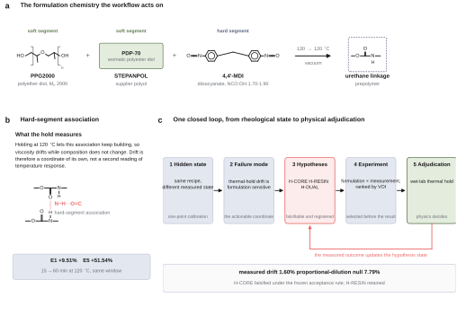
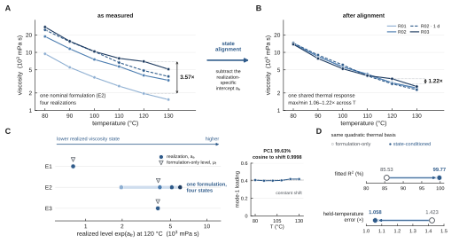
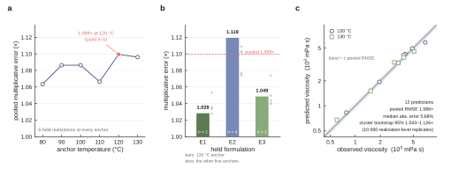
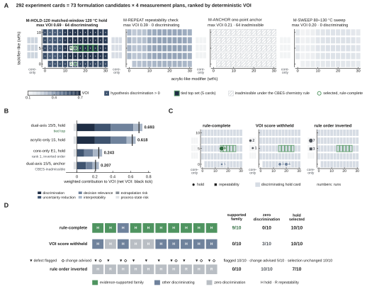
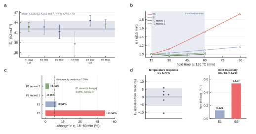

# Rheological State Identification Guides Hypothesis-Driven Experiment Selection in Reactive Polyurethane Hot-Melt Adhesives

**Junbo Tong¹, Jianming Zhao²\***

¹ Department of Chemistry, Faculty of Science, National University of Singapore, 3 Science Drive 3, Singapore 117543, Singapore  
² Ningbo Yinjun Technology, Ningbo, Zhejiang, China  

\*Corresponding author: Jianming Zhao

## Abstract

Reactive polyurethane hot-melt adhesives are compared by nominal formulation, yet preparation and measurement history place nominally identical materials in different rheological states. In the audited PPG2000/PDP-70/MDI system, between-realization variation was a shift in viscosity level on a shared local temperature response, so one viscosity measurement reduced same-formulation 120–130 °C reconstruction error from 1.824× to 1.086×. The same level-shift structure recurred within external polyurethane-prepolymer families and in 14 families of solid-polymer-electrolyte conductivity curves. Thermal-hold drift instead varied strongly with formulation and became the design target. We converted these regularities, their chemistry transfer limits and external formulation priors into explicit rules that rank formulation–measurement experiments by their power to discriminate competing stabilization hypotheses. Rule ablations removed informative selection under two base models, and a prospectively selected resin-modified formulation drifted 1.60% against a 7.79% dilution prediction, rejecting the reactive-core-only hypothesis (probability 0.010). The next discriminating experiment is registered with its decision rule.

**Keywords:** reactive polyurethane hot-melt adhesive; rheological state; thermal-hold stability; experiment selection; value of information

---

## 1. Introduction

Reactive polyurethane hot-melt adhesives couple melt processing with subsequent chemical curing: during melting, pumping, coating and dispensing they must stay fluid enough to process while retaining the reactivity required for cure and bond development [@Cui2002CrystallineStructure; @Cui2003CureKinetics; @OrgilesCalpena2016CO2HMPUR; @Blasco2022VegetablePolyols; @MoyanoVallejo2024GreenStrength]. Their processing window is therefore governed by how viscosity evolves with both temperature and thermal residence. Prepolymer viscosity depends on soft-segment chemistry, molecular weight, stoichiometry, temperature and reaction progress [@Sebenik2007SoftSegment; @ParutaTuarez2014SystemicRheology; @Ruan2019BioPolyols; @Liu2020PPCPUR; @Pugar2025PURViscosityML], and reaction temperature and conversion can alter molecular-weight distributions, side reactions and blend miscibility [@Heintz2003ReactionTemperature; @Duffy2005ReactiveBlendMiscibility]. Formulation records capture nominal composition far more completely than the history that produces a measured sample. We call one measured rheological trajectory of a nominal formulation, under its particular preparation, storage and measurement history, an experimental realization.

The first question is whether differences between realizations are unstructured noise or a low-dimensional state. If realizations preserve the shape of the viscosity–temperature response and differ mainly in level, a state coordinate can align measurements that otherwise appear inconsistent. Physically interpretable curve representations and chemistry-aware machine learning describe prepolymer viscosity well, with the strongest extrapolation inside represented chemical domains [@Pugar2025PURViscosityML]. Whether a narrow reactive-PUR family retains a transferable local thermal response once the realized state is separated from nominal formulation has not been established.

Thermal residence raises a second problem. A formulation can have an acceptable instantaneous viscosity yet keep thickening at processing temperature, and soft-segment chemistry and polymeric modifiers affect melt viscosity, viscoelastic response, open time, green strength and thermal performance to different extents [@Jung2008AcrylicModification; @Sun2016PEDA; @Sun2022PolycarbonatePolyester; @Sun2022PolycarbonateSebacicPUR; @MoyanoVallejo2024GreenStrength]. Temperature response and thermal-hold stability may therefore be different coordinates of processing behaviour.

Once measurements sit on a common state representation and the actionable failure mode is isolated, the task changes from fitting a recipe–property relation to deciding what to measure next. Self-driving laboratories and tool-using chemistry agents couple computation, literature knowledge and experimental decisions [@Hase2019SelfDrivingLabs; @Roch2018ChemOS; @Burger2020MobileRoboticChemist; @MacLeod2020SelfDrivingLab; @Kusne2020ClosedLoopMaterials; @Stach2021AutonomousExperimentation; @Szymanski2023AutonomousLab; @Boiko2023Coscientist; @Bran2024ChemCrow]. Here the evidence hierarchy is explicit: physical measurements define the material state and failure mode, external evidence defines plausible interventions and transfer limits, deterministic rules define the admissible experiment space, model-mediated selection operates within it, and wet-lab measurement adjudicates. The central question is whether experimentally established materials knowledge can be converted into the next discriminating experiment.

**Figure 1. Experimental realization to physical hypothesis adjudication.** (A) Local formulation chemistry. PPG2000 and 4,4′-MDI are drawn explicitly; STEPANPOL PDP-70 is shown as a labelled aromatic polyester-polyol block rather than as a single discrete molecular structure. (B) Repeated realizations define the rheological state, reusable local temperature response and thermal-hold failure coordinate. These physical results are combined with transfer limits, external priors, registered hypotheses and measurement semantics to define the experiment space. Deterministic rules rank 292 formulation × measurement cards, model-mediated selection operates within that space, and wet-lab measurement provides the physical adjudication. The lower strip gives the order of authority.

---

## 2. Results and Discussion

### 2.1 Nominal formulation does not fix the rheological state

The local design comprised five PUR formulations based on PPG2000, STEPANPOL PDP-70 and 4,4′-MDI (Methods). Across three primary E2 realizations (R01–R03), viscosity ranged from 9462 to 27350 mPa·s at 80 °C and from 1955 to 6977 mPa·s at 120 °C, and a 2.80–3.57× spread persisted across 80–130 °C (Fig. 2A). Nominal composition specifies the recipe, not the rheological state realized in a particular experiment.

To test whether this dependence is a low-dimensional state shift, we compared a formulation-only model, with a formulation intercept and a shared quadratic response in the centred inverse temperature $z(T)$ (Methods), against a state-conditioned model that replaces the formulation intercept with a realization-specific intercept,

$$
\ln \eta_{fr}(T)=a_{fr}+\beta_1 z(T)+\beta_2 z(T)^2+\varepsilon_{frT},
$$

where $f$ indexes nominal formulation and $r$ realization. On the chemistry-audited primary dataset of six complete E1–E3 realizations (36 observations), state conditioning raised the explained log-viscosity variation from 85.53% to 99.77% and lowered leave-one-temperature-out error from 1.423× to 1.058× (Fig. 2D). The gain does not come from the thermal basis: with linear responses in both models, $R^2$ rose from 0.8519 to 0.9943. The quadratic term was supported ($F=40.78$, $p=6.51\times10^{-7}$) and a cubic term was not ($F=0.43$, $p=0.518$); the quadratic form performed on par with a Vogel–Fulcher–Tammann form (ΔAICc = 0.5; strict-holdout error 1.088× versus 1.081×) and better than Arrhenius (1.168×) or cubic (1.115×) forms.

A model-free decomposition recovered the same geometry. The first between-realization singular mode of the temperature-centred log-viscosity matrix explained 99.63% of the variance, and its loading had a cosine similarity of 0.9998 to a constant vector, the signature of a uniform vertical shift (Fig. 2B,C). A hierarchical Bayesian version of the model placed the between-realization state spread at τ = 0.59 (95% credible interval 0.30–1.57) in ln η, 19-fold (6–64) larger than residual scatter. A defined phosphoric-acid perturbation of E1 kept the same shape: its apparent temperature-response descriptor was 40.77 kJ mol⁻¹, and the primary shape with a curve-specific intercept reproduced the curve within 1.034×. The fitted $a_{fr}$ is therefore a realized viscosity-scale coordinate that locates each experiment on the shared response, without being assigned to any single process variable.

**Figure 2. Nominal formulation does not define the realized rheological state.** (A) Four E2 realizations show a 2.80–3.57× viscosity spread across 80–130 °C. (B) Subtracting the realization-specific intercept $a_{fr}$ collapses the curves onto a common temperature response (maximum/minimum 1.06–1.22×). (C) $exp(a_{fr})$ locates each realization at $T_{\mathrm{ref}}=120$ °C; four E2 realizations occupy distinct states despite one nominal composition. The inset shows the first between-realization singular mode (99.63% variance; cosine similarity 0.9998 to a constant shift). (D) With the same quadratic thermal basis, state conditioning increases fitted $R^2$ from 85.53% to 99.77% and lowers held-temperature multiplicative error from 1.423× to 1.058×.

### 2.2 One measurement locates an unseen realization

The state coordinate carries information that formulation identity does not. Holding out each E2 realization in turn, a formulation-only model predicted the held realization at 120 and 130 °C with a pooled multiplicative RMSE of 1.824×; one 110 °C viscosity from the held realization on the same shared shape reduced the error to 1.086×, an 86.2% reduction in log-RMSE (realization-level bootstrap 75.0–97.3%) (Fig. 3B).

The shape also transferred across formulations once the state was supplied. With all realizations of one formulation excluded from fitting $g(T)=\beta_1z(T)+\beta_2z(T)^2$, a single anchor at $T_0$ set the held realization's level, $\hat a_{fr}=\ln\eta_{fr}(T_0)-\hat g(T_0)$, and pooled reconstruction error was 1.06–1.10× across the six anchor temperatures. A stricter test also withheld the high-temperature region: the shape was fitted to the other formulations at ≤110 °C, one 110 °C anchor located each unseen realization, and 120 and 130 °C were predicted. Over 12 predictions the pooled error was 1.088× (95% interval 1.043–1.126×; median absolute error 5.68%) (Fig. 3A,C,D). Conditioning the hierarchical model on the same anchor reproduced these errors with calibrated uncertainty: nominal 80% and 95% predictive intervals covered 82% and 92% of 180 held-out predictions.

Family-level data therefore establish the reusable response, and one in-domain measurement locates a new realization. The shortcut holds within the audited E1–E3 chemistry over 10–20 °C; after a meaningful chemistry shift, the temperature response is measured directly before an anchor is reused.

**Figure 3. One viscosity anchor locates the realized rheological state.** (A) In a strict formulation-and-temperature holdout, the shared thermal shape is learned from other formulations at temperatures ≤110 °C; one 110 °C anchor fixes the held realization level before predicting 120 and 130 °C. (B) For held E2 realizations, formulation identity alone gives 1.824× pooled multiplicative RMSE, whereas one state anchor reduces it to 1.086×. (C) Measured versus predicted viscosity for all 12 strict-holdout predictions; pooled multiplicative RMSE is 1.088× and median absolute percentage error is 5.68%. (D) Realization-level bootstrap distribution of pooled error (95% interval 1.043–1.126×) together with leave-one-formulation-out error across anchor temperatures.

### 2.3 Thermal-hold drift is the actionable formulation coordinate

One-point calibration locates a realization on the temperature response but says nothing about change during thermal residence. The local temperature response was concentrated: the apparent descriptor $E_\eta$ averaged 42.05 ± 2.43 kJ mol⁻¹ (CV 5.77%), and realization-specific slopes did not improve on a shared slope ($F_{5,24}=1.26$, $p=0.314$). Thermal-hold behaviour varied far more with formulation. Between 15 and 60 min at 120 °C, E1 rose by 9.51% (708.7 to 776.1 mPa·s) and E5 by 51.54% (2210 to 3349 mPa·s), and their log-viscosity drift rates over 15–90 min, 0.125 and 0.537 h⁻¹, differed 4.29-fold. Because composition and stoichiometry change together between E1 and E5, the contrast is interpreted at the formulation level. Viscosity level $\eta_{\mathrm{ref}}$, temperature response $S_T$ and isothermal trajectory $S_t$ are thus experimentally distinguishable coordinates that respond differently to formulation, and once level and temperature response are accounted for, the design problem is suppression of thermal-hold drift.

### 2.4 Chemistry bounds transfer and supplies intervention directions

The concentrated local response is not universal. Across 39 external prepolymer temperature–viscosity curves (4559 measurements), apparent $E_\eta$ spans 34.7–94.2 kJ mol⁻¹, although 37 curves have $R^2\geq0.98$ for $\ln\eta$ versus $1/T$ [@Pugar2025PURViscosityML]. A ridge model predicting each curve's $E_\eta$ from prepolymer molecular weight, polyol polarity, an isocyanate descriptor, NCO content and polyol $T_g$ transferred when a whole isocyanate family was withheld ($R^2=0.910$) but failed when a whole polyol family was withheld ($R^2=-1.456$); a minimal $T_g$ + NCO model showed the same asymmetry ($R^2=0.851$ versus 0.033).

The same boundary appeared in the calibration task itself. Within each external polyol family, a curve-specific level on a shared quadratic response explained 99.6–99.9% of log-viscosity variation, against 25–38% for a single family level. One 60 °C anchor reconstructed held curves within 1.078× (95% interval 1.046–1.112×) with the shape from the same polyol and isocyanate and within 1.069× (1.038–1.104×) from the same polyol with another isocyanate, matching the local 1.06–1.10×, whereas a shape from a different polyol family gave 1.221× (1.186–1.257×). Polyol-family change is therefore the empirical boundary for reusing the local thermal prior, and a resin-modified formulation is characterized across temperature before the shortcut is reused.

The E1–E5 design identifies the failure coordinate but does not sample a resin-modification axis, so external evidence supplied the intervention directions. Acrylic-like resins, tackifier-like components and related modifiers alter melt viscosity, viscoelastic response, set behaviour, green strength and adhesive performance [@Jeong2007Organoclay; @Jung2008AcrylicModification; @Kim2008AcrylicCopolymerMMT; @Cho2009AcrylicNanocomposite; @Kim2009MolecularWeightOrganoclay; @Ruan2021PolyacrylatePURHMA], and modifier loading and soft-segment chemistry redistribute trade-offs among rheology, open time, mechanical response and thermal behaviour [@Ruan2019BioPolyols; @Liu2020PPCPUR; @OrgilesCalpena2016CO2HMPUR; @Blasco2022VegetablePolyols; @Sun2016PEDA; @Sun2022PolycarbonatePolyester; @Sun2022PolycarbonateSebacicPUR; @MoyanoVallejo2024GreenStrength; @Xiao2025HighTemperaturePUR; @Fang2026FDCAPURHMA]. These records serve as formulation priors that define testable intervention hypotheses rather than as predictors of local performance.

### 2.5 Competing hypotheses turn stabilization into experiment selection

With drift identified as the actionable coordinate and resin modification as a plausible intervention, the problem became hypothesis discrimination rather than recipe search; sparse local data do not justify a composition-to-drift predictor for untested modifier chemistry. Three formulation-level hypotheses were registered before experiment selection. H-CORE attributes drift to the reactive core alone and predicts proportional dilution of the E1 reference drift; H-RESIN predicts suppression beyond dilution by resin modification; H-DUAL predicts that low drift requires the tackifier-containing dual-axis intervention.

Crossing a 73-node formulation lattice with four measurement plans (a matched-window 120 °C hold, a repeatability check, a one-point anchor and a temperature sweep) gave 292 experiment cards. Only matched-window holds on modifier-containing candidates make distinct predictions under the registered hypotheses, so informativeness is a property of the formulation–measurement pair. A deterministic value-of-information (VOI) score ranks each card,

$$
\mathrm{VOI}
=
w_{\mathrm{hyp}}D_{\mathrm{hyp}}
+w_{\mathrm{unc}}R_{\mathrm{unc}}
+w_{\mathrm{dec}}R_{\mathrm{dec}}
+w_{\mathrm{int}}I_{\mathrm{meas}}
-w_{\mathrm{ext}}X_{\mathrm{risk}}
-w_{\mathrm{proc}}P_{\mathrm{risk}},
$$

whose terms are hypothesis discrimination, uncertainty reduction, decision relevance, measurement interpretability, extrapolation risk and process-state risk. No validation composition or outcome enters any component, weight or tie-break. The five-card top set was unchanged under every single-weight perturbation from 0.5× to 1.5×, in all 100,000 joint 0.5–1.5× re-weightings and in ≥99.5% of Dirichlet draws centred on the nominal weights. Replacing the discrimination term by a formal Bayesian expected information gain selected the 15 wt% acrylic-like/5 wt% tackifier-like hold card uniquely in all 40 prior, noise and likelihood settings tested.

### 2.6 Rule content and chemistry applicability govern decision quality

Under the complete rules, all 10 confirmatory runs committed to the matched-window 120 °C hold. Nine selected one of the five equal-VOI dual-axis cards (15–25 wt% acrylic-like at 5 wt% tackifier-like), giving 9/10 evidence-supported selections (95% Wilson interval [0.596, 0.982]); the tenth selected an acrylic-only hold that separates H-RESIN from H-DUAL, and none had zero discrimination. A deterministic minimum-burden tie-break and the expected-information-gain score both single out the card chosen in nine runs, so the useful decision structure came from the explicit experiment geometry, with the model resolving choices inside the admissible top set.

Two controlled perturbations showed that decision quality followed the rules rather than critique language (Fig. 4). Withholding the VOI score, with model, evidence, hypotheses and the 292-card inventory fixed, kept the 120 °C hold in all 10 runs but dropped evidence-supported dual-axis selection from 9/10 to 0/10 (Wilson interval 0–0.28) and mean hypothesis discrimination from 0.667 to 0.467. Moving modifier burden ahead of intervention coverage and hypothesis discrimination made a reactive-core-only experiment rank 1; all 10 runs selected it, giving 10/10 zero-discrimination experiments. The critique stage flagged the defect in all 10 of those runs, yet the frozen selections did not change: critique diagnoses, but cannot compensate for a rule that prioritizes the wrong objective.

**Figure 4. Explicit scientific rules shape experiment informativeness.** (A) The 292 experiment cards formed by 73 formulations × 4 measurement plans. Tiles are coloured by deterministic VOI; dots mark non-zero hypothesis discrimination, green outlines the five-card tied top set, hatching chemistry-inadmissible one-point anchors, and rings rule-complete selections. (B) VOI-component contributions for representative cards. (C) Selection locations under the rule-complete, score-withheld and rule-order-inverted conditions. (D) Run-level outcomes: rule-complete selection gives 9/10 evidence-supported-family and 0/10 zero-discrimination experiments; score withholding gives 0/10 and 3/10; rule-order inversion gives 0/10 and 10/10, respectively. Critique identified the defect under inverted ordering but did not change the frozen choice. VOI, ranking and the tied top set are deterministic; the final selections are model-mediated.

Chemistry applicability, enforced through chemistry-bounded experiment selection (CBES; Methods), acts differently. For the thermal-hold question, enforcing the chemistry boundary removed 64 unsupported one-point-anchor cards without changing the selected measurement (10/10 direct holds under advice and under enforcement), because the hold measures the failure coordinate itself. For a processing-window question in resin-modified chemistry, a one-point anchor outscored a direct sweep (0.7392 versus 0.6875) although its shared-shape assumption had not been validated after the chemistry shift. With the applicability audit available as advice, all 10 runs rejected the shortcut and chose a direct 80–130 °C sweep; hard enforcement produced the same choice in all 9 valid commitments while making the shortcut unavailable by construction.

The decision results did not depend on the base model. Re-executing the full comparison matrix with a second base model (10 replicates per condition, byte-identical replay inputs) left the deterministic layer unchanged and reproduced both ablations: withholding the score lowered mean discrimination from 0.667 to 0.083, and with rule order inverted all 9 valid selections had zero discrimination. At the proposal stage the two models chose the same measurement in every valid run: the matched-window hold for the drift question (9/9 rule-complete; 16/16 under CBES) and the direct sweep for the processing-window question (19/19). The second model's robustness stage more often revised toward the acrylic-only hold or a replicated-preparation check, and requests outside the declared inventory were rejected at the freeze stage (Supplementary Note 21).

### 2.7 Wet-lab adjudication rejects the reactive-core-only explanation

The validation formulation was selected from pre-result evidence, and the recommendation and its registered decision criterion were frozen before the formulation was prepared and measured. It contained PPG2000, PDP-70, AC1920, TK100 and MDI at source-reported parts of 39.60, 39.60, 17.00, 5.00 and 20.19. Between 15 and 60 min at 120 °C, two repeats changed from 1230 to 1228 mPa·s and from 1281 to 1320 mPa·s (−0.16% and +3.04%), a mean absolute drift of 1.60%, against +9.51% for E1 and +51.54% for E5 (Fig. 5).

The registered hypotheses give a direct null-model test. The reactive core accounts for 99.39 of 121.39 parts (fraction 0.819), so H-CORE predicts $9.51\%\times0.819=7.79\%$ drift under proportional dilution, and H-RESIN was registered to receive support below half of that prediction, 3.89%. The observed 1.60% rejects H-CORE and satisfies the H-RESIN criterion. Hold-drift repeatability was estimated independently from point scatter within the measured hold trajectories and from the two validation repeats (0.023 and 0.022 in ln η). Propagating it together with the uncertainty of the E1 reference drift and of the reactive fraction, H-CORE would produce a mean absolute drift as low as 1.60% with probability 0.010, and this probability stayed below 0.05 with repeatability inflated up to eightfold. H-DUAL remains open, because separating it from H-RESIN requires an acrylic-only hold.

**Figure 5. Rheological coordinates and physical adjudication of the registered hypotheses.** (A) Temperature-response and thermal-hold coordinates are shown separately because they were not measured jointly across the full formulation set. The local $E_\eta$ distribution (42.05 ± 2.43 kJ mol⁻¹) is shown against 39 external polyurethane-prepolymer curves, while E1, E5 and the two validation repeats define the measured hold-drift range. (B) Normalized 120 °C hold trajectories and the H-CORE dilution prediction at 60 min; the E5/E1 log-viscosity drift-rate ratio over 15–90 min is 4.29. (C) H-CORE predicts 7.79% 15–60 min drift; the two validation repeats give a mean absolute drift of 1.60%, below the registered H-RESIN support threshold of 3.89%. (D) H-CORE is rejected, H-RESIN satisfies its registered support criterion, and H-DUAL remains unresolved pending an acrylic-only hold.

### 2.8 The next discriminating experiment is registered

The workflow specifies its next round, with frozen decision rules and their simulated operating characteristics, before any of it is measured (Supplementary Note 23). The decisive contrast is an acrylic-only matched-window hold (15 wt% acrylic-like modifier, no tackifier-like modifier, reactive fraction 0.850). Under the frozen registry, H-CORE and H-DUAL both predict 8.08% 15–60 min drift, whereas H-RESIN predicts drift below 4.04%, half the dilution prediction, and the mean absolute drift of the repeats is compared with 4.04%. Simulated with the measured hold repeatability, three acrylic-only repeats and three E1 reference holds (the existing one and two new) support H-RESIN with probability 0.023 when H-DUAL is true and 0.90 when resin modification suppresses drift as strongly as in the validation formulation (Supplementary Table S16).

Two direct sweeps of the validation formulation test whether the local thermal shape survives resin modification. Support (≤1.10× full-curve error with the E1–E3 shape and a free level; ≤1.13× from a 110 °C anchor) and contradiction (≥1.20×) zones and a compatible $E_\eta$ interval of 37.2–46.9 kJ mol⁻¹ are fixed in advance. When the shape transfers, these criteria classify a single sweep correctly in 86–96% of simulations, and a 10 kJ mol⁻¹ change in $E_\eta$ falls outside the interval in 98% (Supplementary Table S17). Independent E1 and E3 preparations tighten realization-level repeatability under the same criteria. Each outcome is informative: transfer extends one-point calibration to resin-modified chemistry, and a shape change directly confirms the applicability rule that required a sweep.

### 2.9 The state-shift structure extends beyond polyurethanes

The level-shift geometry is not specific to reactive PUR. The ionic conductivity of solid polymer electrolytes is also measured as a curve against temperature, and electrolytes that share one polymer host differ in salt, salt concentration and molecular weight. We applied the external calibration test to an open conductivity database [@Bradford2023PolymerElectrolyte], using the 323 curves from the 14 polymer hosts with at least eight curves on a common temperature window (Methods). The first between-curve mode carried a median 99.1% of between-curve variance (range 76.0–99.7%), with a median cosine of 0.989 to a uniform shift. A curve-specific level on the host's shared quadratic response explained 93–99% of ln σ variation, against 6–80% for a single host level (Supplementary Note 22). One conductivity measurement set a held curve's level well enough to predict the next 20 °C within 1.68× (95% interval 1.57–1.81×; 90.0% of 1292 predictions within 2×), whereas host identity alone gave 12.0×.

The decision layer is equally general in form. Its ingredients are a state coordinate that makes realizations comparable, a failure coordinate distinct from that state, an empirically bounded transfer domain, registered competing hypotheses, and formulation–measurement cards ranked by explicit rules. None of these is specific to polyurethane chemistry. Any formulation problem in which preparation history shifts a property curve and the application-relevant condition is costly to measure has the same structure: family data supply the shape, one measurement supplies the state, and explicit rules decide which measurement resolves the remaining hypothesis.

---

## 3. Materials and Methods

### 3.1 Local formulation design

The local formulation space contained five reactive PUR compositions based on PPG2000, STEPANPOL PDP-70 and 4,4'-MDI. E1–E3 used a 50/50 PPG2000/PDP-70 polyol ratio with reported NCO:OH values of 1.70, 1.80 and 1.90, whereas E4 and E5 retained NCO:OH = 1.80 and used PPG2000/PDP-70 ratios of 60/40 and 40/60. Complete 80–130 °C temperature sweeps were available for E1–E3 across multiple experimental realizations. The resin-modified validation formulation contained PPG2000, PDP-70, AC1920, TK100 and MDI on a source-reported parts basis and had an NCO:OH equivalent ratio of 1.82.

For sample preparation, the polyol components were charged first, stirred and vacuum-dehydrated at approximately 130 °C for 1 h. 4,4'-MDI was then added, and the mixture was stirred under vacuum at approximately 120 °C for a further 1 h 20 min.

### 3.2 Temperature-sweep data and chemistry audit

Temperature-sweep viscosity was measured from 80 to 130 °C in 10 °C increments using an RV-SSR-H high-temperature rotational viscometer (Shanghai Fangrui Instrument Co., Ltd.) equipped with an NKY-25 heater unit and a No. 27 spindle. Viscosity was recorded in mPa·s. Rotation speed was adjusted to maintain approximately 40–60% instrument torque, and each sample was equilibrated for 15 min at the target temperature before recording. Measurements were made on prepared sample material rather than with an in-reactor sensor; within a sweep, the same mother sample was measured across temperatures, so individual temperature points are not independent resyntheses.

R01, R02 and R03 are anonymized realization codes that distinguish observed rheological runs; they are opaque identifiers and do not encode operator identity. A realization denotes one observed temperature–viscosity curve of a nominal formulation under its particular preparation, storage and measurement history; distinct codes are not assumed to be independent synthesis batches, and day-1 retests are retained as separately observed rheological states.

One E1 temperature curve was prepared with 0.025 mmol H3PO4 delivered as a 0.1 mol L−1 standard solution (0.25 mL) during dehydration. Because this deliberately changed the chemical condition relative to nominal E1, the curve was excluded from the chemistry-audited same-composition analysis and evaluated separately as a perturbation check. The primary temperature-sweep dataset therefore comprised 36 observations from six complete realizations of three nominal formulations.

### 3.3 State-conditioned temperature-response models

Viscosity was log-transformed before model fitting. Temperature was encoded as

$$
z(T)=10^3\left(\frac{1}{T}-\frac{1}{T_{\mathrm{ref}}}\right),
\qquad
T_{\mathrm{ref}}=393.15~\mathrm{K},
$$

where $T$ is absolute temperature. The formulation-only model was

$$
\ln \eta_{fr}(T)
=
\mu_f
+
\beta_1 z(T)
+
\beta_2 z(T)^2
+
\varepsilon_{frT},
$$

and the state-conditioned model replaced $\mu_f$ by one intercept $a_{fr}$ per measured realization. Conceptually, $a_{fr}=\mu_f+\delta_{fr}$ combines the nominal formulation baseline with a realization-specific displacement without requiring the two to be estimated separately. Prediction error was evaluated as the root-mean-square error of $\ln\eta$ and reported as the multiplicative factor $\mathrm{RMSE}_{\times}=\exp(\mathrm{RMSE}_{\log})$. Held-temperature validation removed all observations at one temperature, fitted the remaining temperatures and predicted the held one; the headline comparison used the same quadratic basis in both models.

A hierarchical Bayesian version of the state-conditioned model nested the realization intercepts in formulation means, $a_{fr}\sim\mathcal{N}(\mu_f,\tau^2)$, and gave each realization a partially pooled residual scale, $\log\sigma_r\sim\mathcal{N}(\lambda,\omega^2)$, with weakly informative priors. It was sampled by Metropolis-within-Gibbs (four chains; $\hat R\le1.01$). For one-anchor prediction, the anchor entered the likelihood of the held realization's intercept, and the held realization's residual scale was drawn from its population distribution. Alternative thermal bases (Arrhenius, cubic in $z$, Vogel–Fulcher–Tammann with shared $B$ and $T_0$, and its Williams–Landel–Ferry reparameterization) were compared on the same tasks.

### 3.4 Model-free dimensionality analysis

For the six chemistry-audited complete curves, a matrix of log viscosity was assembled with realizations as rows and temperatures as columns, and each temperature column was centred across realizations before singular-value decomposition. The fraction of between-realization variance in the first mode was calculated from its singular value, and its loading vector was compared with a constant vector by cosine similarity to test for a uniform log-viscosity displacement.

### 3.5 One-point state calibration

Transfer across nominal formulations was evaluated by leave-one-formulation-out analysis. In each fold, all realizations of one formulation were excluded while the remaining formulations estimated the shared thermal shape $g(T)$. A single viscosity at anchor temperature $T_0$ then gave $\hat a_{fr}=\ln \eta_{fr}(T_0)-\hat g(T_0)$, and for the quadratic shared response

$$
\widehat{\ln\eta}_{fr}(T)
=
\ln\eta_{fr}(T_0)
+
\hat\beta_1\left[z(T)-z(T_0)\right]
+
\hat\beta_2\left[z(T)^2-z(T_0)^2\right].
$$

The stricter formulation-and-temperature holdout removed one formulation entirely and fitted the shared response only to the remaining formulations at temperatures no higher than 110 °C. Each unseen realization was located by a single 110 °C anchor and predicted at 120 and 130 °C. Performance was summarized by pooled log-RMSE, multiplicative RMSE, absolute percentage error and a 10,000-replicate realization-level cluster bootstrap.

### 3.6 Thermal-hold measurements

E1 and E5 were held at 120 °C and measured at 15, 30, 60 and 90 min. The validation formulation was measured in two repeat runs at 15, 30, 45 and 60 min. For all thermal-hold measurements, $t=0$ was the time at which the sample reached 120 °C; the material was stirred during the hold and kept sealed under vacuum, and viscosity was measured on sampled material rather than by continuous in-situ sensing. The matched stability comparison used the common 15–60 min interval, $SI_{15\rightarrow60}=(\eta_{60}-\eta_{15})/\eta_{15}$; no 90 min validation value was extrapolated or imputed. For E1 and E5, an apparent drift descriptor $k_{\mathrm{drift}}=d\ln\eta/dt$ was estimated from $\ln \eta(t)=\ln \eta_0+k_{\mathrm{drift}}t$; it is an operational rheological descriptor, not a chemical rate constant.

### 3.7 Apparent temperature-response descriptor

For each chemistry-audited complete realization, $\ln \eta$ was regressed against $1/T$ with $T$ in kelvin, and the apparent temperature-response descriptor was calculated as $E_\eta=R\,\mathrm{d}\ln\eta/\mathrm{d}(1/T)$ with $R=8.314462618$ J mol⁻¹ K⁻¹. $E_\eta$ describes the local temperature–viscosity response and is not interpreted as a chemical reaction activation energy.

### 3.8 External evidence and transfer analyses

The external evidence layer contains literature, patent, material, formulation, measurement and dense viscosity-curve records with explicit provenance. The dense prepolymer subset comprises 39 temperature–viscosity curves and 4559 individual measurements from the public Pugar dataset [@Pugar2025PURViscosityML].

For the chemistry-family transfer analysis, each complete formulation curve contributed a single target, its apparent $E_\eta$, so temperature points from one formulation were never split across training and test sets. Curves with $R^2\geq0.98$ formed the primary analysis; the two lower-fit curves were retained for sensitivity analysis only. Two ridge-regression baselines ($\alpha=1$) were evaluated: a minimal model with polyol $T_g$ and NCO content, and a literature-informed model with prepolymer molecular weight, polyol topological polar surface area, an isocyanate structural descriptor, NCO content and polyol $T_g$. Generalization was assessed by leaving out entire isocyanate families and entire polyol families. Descriptor associations were treated as descriptive because several polyol features co-vary with family identity.

The external one-point calibration test placed each curve on a common 42.5–77.5 °C grid (2.5 °C steps, within each curve's measured range) by a per-curve quadratic smooth of $\ln\eta$ against $z(T)$ with $T_{\mathrm{ref}}=333.15$ K (median residual 0.003 in $\ln\eta$). For each held curve, the shared shape was estimated from (a) other curves of the same polyol and isocyanate, (b) the same polyol with a different isocyanate, (c) a different polyol family with the same isocyanate, or (d) all other curves. A single anchor then set the held curve's level, and the remaining grid temperatures were predicted. Pooled multiplicative errors used a 10,000-replicate curve-level cluster bootstrap (seed 20261003). The strict analogue fitted the shape at $T\le57.5$ °C and predicted 10 and 20 °C above the anchor.

The solid-polymer-electrolyte test used the conductivity database of Bradford et al. [@Bradford2023PolymerElectrolyte] (MIT licence), restricted to neat polymer–salt electrolytes without a second component or inorganic filler, with temperatures rounded to 0.5 °C and curves of at least five temperatures spanning at least 30 °C (710 curves, 141 polymer hosts). For each host, the common window on a 5 °C grid, at least 30 °C wide and covered by the most curves, was selected, and each covering curve with at least four measured points inside it was smoothed by its own quadratic in $z(T)$ (interpolation only). Hosts with at least eight such curves were analysed (14 hosts, 323 curves). The singular-value and nested shape-model analyses followed the polyurethane test. For the anchor test, each curve was held out in turn, the shared quadratic shape was fitted to the host's other curves with curve-specific levels, the held curve's warmest grid value set its level, and its colder grid values were predicted. Intervals are 10,000-replicate curve-level cluster bootstraps (seed 20261008).

External formulation records containing acrylic-like or tackifier-like components were separately used to define chemically plausible candidate regions. Numeric modifier fractions were treated as anchors only when the denominator basis was clear; records with unresolved fraction definitions remained directional evidence. The temperature-response datasets were not used as thermal-hold stability labels, and no external data stream was used as a predictor of the held-out local validation outcome.

### 3.9 Scientific decision architecture

The computational layer operated downstream of the rheological analysis. Each decision object paired one formulation candidate with one measurement plan. Crossing the fixed 73-node formulation lattice with four measurements produced 292 experiment cards; the held-out validation composition and outcome were excluded from the decision-time evidence. We refer to this formulation–measurement architecture as **Rule-Grounded Experiment Selection (RGES)** and to its chemistry-applicability extension as **Chemistry-Bounded Experiment Selection (CBES)**.

The registered drift hypotheses were H-CORE, proportional dilution of the E1 reference drift; H-RESIN, suppression beyond dilution by resin modification; and H-DUAL, a requirement for the tackifier-containing dual-axis intervention to reach the low-drift regime. The measurement catalog comprised a matched-window 120 °C hold, a repeatability assessment, a one-point viscosity anchor and an 80–130 °C temperature sweep.

Each card received a deterministic value-of-information score with weights 0.30, 0.20, 0.25, 0.10, 0.10 and 0.05 on hypothesis discrimination, uncertainty reduction, decision relevance, measurement interpretability, extrapolation risk and process-state risk. The score is a transparent decision heuristic rather than a calibrated posterior quantity. Weight stability was tested by varying each weight from 0.5× to 1.5× and by joint random re-weighting of all six terms (100,000 draws each from uniform 0.5–1.5× multipliers and from Dirichlet distributions centred on the nominal weights) with Sobol variance decomposition. As a formal counterpart of the discrimination term, the expected information gain about {H-CORE, H-RESIN, H-DUAL} was computed for every card from the registered hypothesis predictions and the declared hold-measurement resolution, across uniform and alternative priors and a range of noise levels. The validation formulation and its outcome entered no prior, likelihood or weight. Chemistry applicability was evaluated separately: one-point state calibration was admissible only where transfer of the shared temperature response had been established, whereas direct measurements of thermal hold, repeatability or temperature response did not depend on that transferred assumption.

The model-mediated layer comprised Planner, Proposer, Skeptic, Robustness Adjudicator and Judge stages. Every stage of the primary decision series used one language model, GPT-5.6-Luna (model identifier `gpt-5.6-luna`); the cross-model replication used GPT-5.6-Sol (`gpt-5.6-sol`). Both were accessed through an OpenAI-compatible API whose endpoint does not accept a sampling-temperature setting, so repeated runs are independent stochastic realizations of one fixed decision contract. Deterministic tools supplied the candidate inventory, evidence summaries, hypothesis registry, measurement semantics, VOI ranking and chemistry-applicability information. The selected experiment and its decision criterion were frozen before the held-out wet-lab result was exposed.

### 3.10 Controlled decision tests and physical adjudication

The rule-complete RGES series comprised 10 declared runs under one fixed decision contract. Two controlled perturbations isolated the effect of scientific policy: a score-withheld arm ($N=10$) removed deterministic VOI outputs while keeping the model, evidence, hypotheses, measurement catalog and 292-card inventory fixed; a rule-order arm ($N=10$) retained the same rule content but moved modifier burden ahead of intervention coverage, hypothesis discrimination and decision relevance. CBES was tested separately for thermal-hold stabilization, where enforcement changed only whether chemistry-inadmissible cards remained selectable, and for processing-window viscosity, where a one-point anchor offered lower measurement burden but depended on unverified temperature-response transfer after resin modification. These conditions were analysed separately and not pooled.

For cross-model replication, every RGES and CBES condition was re-executed with the second base model, 10 replicates per condition, in interleaved order, from replay environments whose pinned inputs (evidence state, candidate set, hypothesis registry, measurement catalog, prompts and decision code) were byte-identical to the original series. Stage-level attribution compared the Proposer's experiment with the frozen final selection in each run.

Physical adjudication remained separate from decision generation. The validation formulation was selected and frozen before it was prepared and measured, so the wet-lab result constitutes a prospective test of the recommendation. The RGES and CBES series re-execute this decision from the same pre-result evidence contract; their frozen selections were compared with the 120 °C thermal-hold measurements only after each decision record was closed. The observed mean absolute 15–60 min drift was compared with the H-CORE proportional-dilution prediction and with the registered H-RESIN support criterion.

The follow-up round of Section 2.8 fixes its predictions, thresholds and verdict classes before measurement; its operating characteristics were simulated as described in Supplementary Note 23 (seed 20261004). Full prompts, arm definitions, attempted/completed/committed counts, run-level selections, hashes and adjudication records are provided in the Supplementary Information and versioned repository.

### 3.11 Statistical analysis

For the temperature-sweep analyses, the experimental realization was treated as the independent material-level unit. Multiple temperatures measured within the same realization were treated as repeated observations on one rheological trajectory rather than as independent replicates. Unless otherwise stated, summary values written as mean ± value denote mean ± 1 standard deviation across realizations; standard errors and confidence intervals are identified explicitly when used.

Viscosity regression errors were evaluated in log-viscosity space and, where appropriate, converted to multiplicative RMSE as $\exp(\mathrm{RMSE}_{\log})$. Cluster bootstraps resampled complete held realizations with replacement so that all target temperatures from one realization remained together. The strict formulation-and-temperature extrapolation used 10,000 bootstrap resamples with seed 20260918, and the same-formulation state-anchor analysis used 10,000 resamples with seed 20260923.

Nested-model $F$ tests were used for a small set of targeted structural comparisons, including shared linear versus quadratic thermal response and shared versus realization-specific local thermal slopes. Because the temperature points within a realization are repeated observations, these $p$ values are interpreted as model-comparison diagnostics rather than population-level evidence. No multiplicity correction was applied because the tests addressed pre-specified, distinct structural questions rather than a parallel discovery screen. The two resin-modified thermal-hold repeats are reported descriptively and are not used to support a population-level significance claim. The registered H-CORE comparison was additionally evaluated by Monte Carlo simulation (10⁶ draws, seed 20261003). Hold-drift repeatability was estimated from residual scatter of $\ln\eta$ about a linear time trend within each measured hold trajectory and, independently, from the two validation repeats. The larger estimate was used, together with its scaled-inverse-χ² sampling uncertainty, the uncertainty of the single E1 reference drift and a ±0.03 range in reactive fraction.

Computational decision-series statistics were analysed separately from material replicates. One run under a fixed computational contract was the unit for run-level proportions; attempted, completed, committed, failed and abstained runs were tracked separately, and two-sided 95% Wilson intervals were used where binomial proportions are reported. Software dependency requirements are declared in `pyproject.toml`, and analysis scripts and machine-readable outputs are versioned with the manuscript.

---

## 4. Conclusions

Nominal composition does not fix the rheological state of reactive PUR. Within the audited chemistry, between-realization variation is a shift in viscosity level on a shared temperature response, so one in-domain measurement locates a new realization; the same structure recurs within external polyurethane-prepolymer families and polymer-electrolyte hosts, and polyol-family change bounds its transfer. Thermal-hold drift follows a different formulation dependence and defines the design target. Converting these findings into registered hypotheses and explicit rules over formulation–measurement experiments produced informative selections under two base models, and the prospectively selected resin-modified formulation drifted 1.60% against a 7.79% dilution prediction, rejecting the reactive-core-only explanation and satisfying the registered H-RESIN criterion. The acrylic-only hold that separates the remaining hypotheses is registered with its decision rule, so the next experiment, like the last, is fixed before it is measured.

---

## 5. Competing Interests

The authors declare no competing interests.

---

## 6. Data and Code Availability

Versioned local formulation tables, chemistry-audited temperature-sweep data, thermal-hold records, statistical analysis scripts, hypothesis registries, measurement catalogs, deterministic decision rules, frozen computational series, controlled ablations and post-freeze adjudication artifacts are available in the public project repository at https://github.com/stloendays/PUR-NEW. Reader-facing aggregate summaries for the Candidate-Recovery Benchmark (CRB), Rule-Grounded Experiment Selection (RGES) and Chemistry-Bounded Experiment Selection (CBES) are indexed in `docs/decision_architecture_provenance.md`; full historical run manifests and hashes remain preserved in repository provenance. The cross-model replication, hierarchical state model, external one-point calibration test, expected-information-gain and weight-sensitivity analyses, and H-CORE uncertainty propagation are provided with their scripts and machine-readable outputs under `analysis/results/upgrades_20261003/`. The solid-polymer-electrolyte test is provided under `analysis/results/generality_20261008/`, with the curve subset of the Bradford et al. database and its MIT licence under `data/external/bradford2023_spe/`. The registered follow-up plan, its pre-result addendum and the simulated operating characteristics are under `experiments/supplementary_20261004/` and `analysis/results/upgrades_20261003/preregistration_addendum/`. The figures are generated by the scripts under `analysis/figures_composite/`, which read the repository tables and the per-panel tables in `analysis/figures_origin/data/`; each figure is provided as SVG, PDF and PNG. Python dependency requirements are declared in `pyproject.toml`, and the bootstrap seeds used for the reported realization-level resampling analyses are fixed in the corresponding versioned analysis scripts. External data with separate licensing or provenance constraints should be redistributed only in accordance with their source terms.
